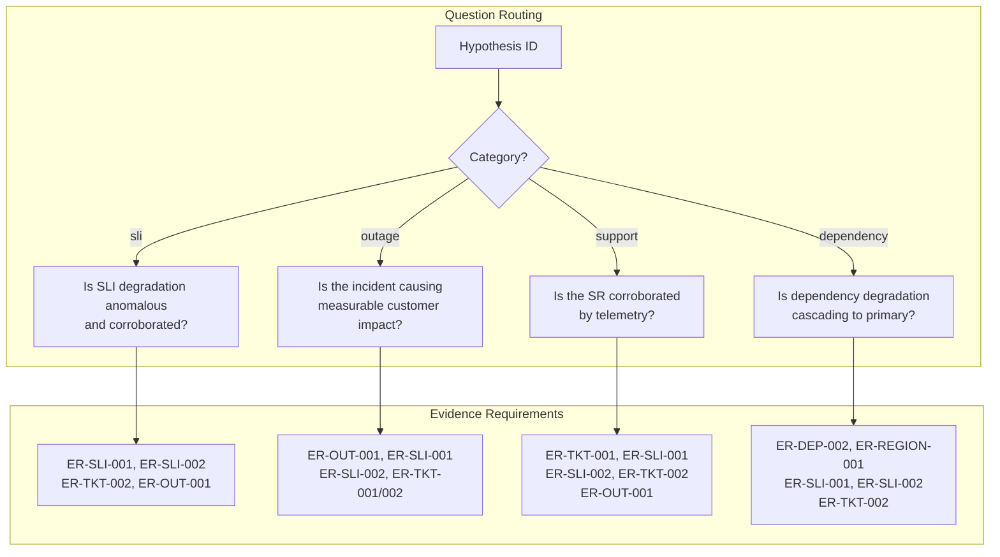
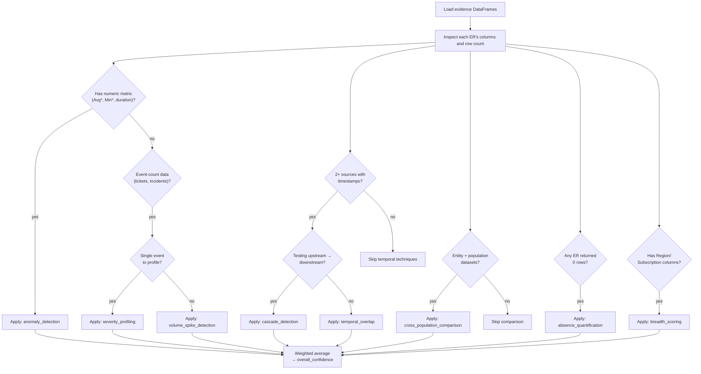
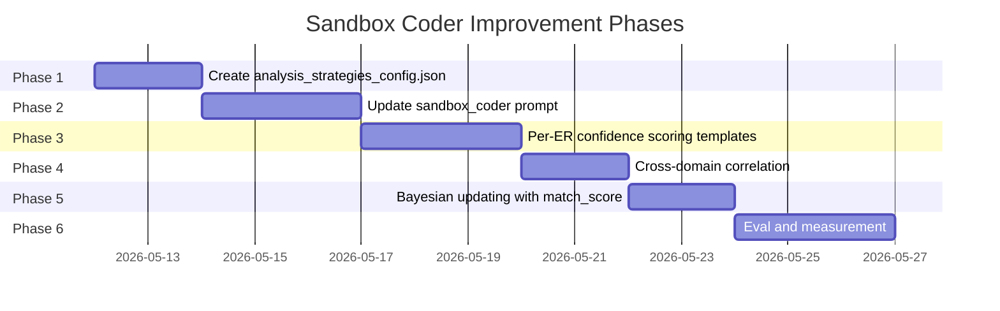
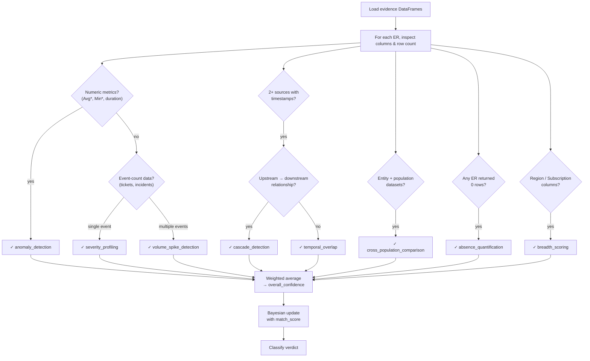
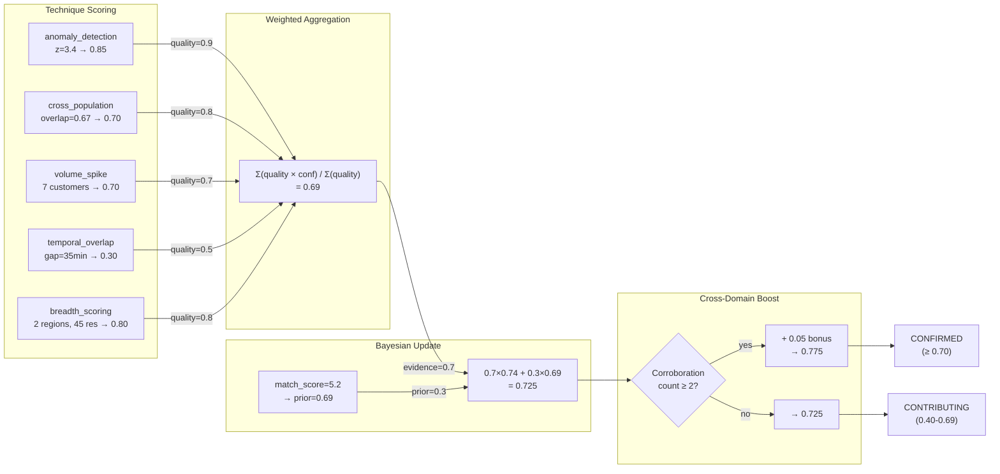

# Sandbox Coder Improvement Plan: Category-Aware Statistical Analysis

## Overview

The `investigation_sandbox_coder_prompt.txt` drives Python code generation for evidence analysis in the RATIO investigation pipeline. Today it produces naive boolean-check scripts that output binary "supported / not supported" verdicts. This plan redesigns the prompt to produce **category-aware, statistically rigorous analysis** with structured output that the reasoner can directly consume as quantitative evidence.

---

## 1. Current State Assessment

### What the Sandbox Coder Does Today

The prompt instructs the LLM to:
1. Read evidence JSON files from `/mnt/data/{XCV}/evidence/`
2. "Apply statistical analysis" (vaguely — the examples show aggregations, correlations, distributions)
3. Print a 2-5 sentence answer to stdout
4. Save analysis JSON to `/mnt/data/{XCV}/analysis/`

The prompt provides **no awareness** of:
- Which hypothesis category (SLI, outage, support, dependency) is being evaluated
- Which statistical approach matches each question pattern
- What structured output the reasoner expects
- How to compute a numeric confidence score

### The Boolean-Check Problem

The current prompt produces code like this (from a real execution):

```python
result = {
    "customer_support_request": False,
    "sli_degradation": False,
    "other_customers_affected": False,
    "active_incident": False,
}
# ... boolean checks ...
if all([result["customer_support_request"], result["sli_degradation"],
        result["other_customers_affected"], result["active_incident"]]):
    print("Hypothesis HYP-SUP-001 is supported by the evidence.")
```

**Problems:**
1. **Binary, not graduated** — `True`/`False` flags lose all nuance. A customer with 200 impacted resources across 5 regions gets the same `"sli_degradation": True` as one with 1 resource in 1 region.
2. **No confidence score** — The reasoner needs a 0.0–1.0 confidence value. Boolean flags provide no signal for calibration.
3. **No per-ER verdicts** — The reasoner evaluates evidence per ER-ID on a 6-point scale (strongly_supports → strongly_refutes). Boolean presence checks cannot feed that.
4. **No statistical tests** — Despite having `scipy`, `numpy`, and `scikit-learn` available, the generated code uses only `DataFrame.empty` and `==` checks.
5. **Hardcoded customer names** — The code checks `"BlackRock, Inc"` by literal string instead of parameterizing.

### The Gap

```
┌─────────────────────┐         ┌──────────────────────────┐
│   Sandbox Coder     │         │       Reasoner           │
│   OUTPUT (today)    │   ──►   │   EXPECTS                │
├─────────────────────┤         ├──────────────────────────┤
│ "supported"         │         │ per-ER verdicts (6-pt)   │
│ "not supported"     │         │ confidence: 0.0–1.0      │
│ boolean flags       │         │ key_metrics per ER       │
│ no statistics       │         │ cross-domain correlation │
│ no category logic   │         │ symptom verification     │
└─────────────────────┘         └──────────────────────────┘
```

The reasoner treats sandbox output as "PRIMARY quantitative evidence" but receives qualitative boolean text. This forces the reasoner to re-derive quantitative judgments from qualitative summaries — exactly the job the sandbox coder should have done.

---

## 2. Question Pattern Taxonomy

### Core Analytical Questions by Category

Each hypothesis category asks a fundamentally different analytical question. The sandbox coder must recognize the category and select the appropriate analysis strategy.

#### SLI Category

**Core question:** *Is the customer's SLI degradation anomalous, and is it corroborated by platform-wide evidence?*

| Hypothesis | Analysis Focus | Key ERs | Statistical Approach |
|------------|---------------|---------|---------------------|
| HYP-SLI-001 | Full corroboration: SLI + other SRs + incident | ER-SLI-001, ER-SLI-002, ER-TKT-002, ER-OUT-001 | Cross-source temporal correlation |
| HYP-SLI-002 | Partial: SLI + one of (SRs \| incident) | Same | Partial correlation matrix |
| HYP-SLI-003 | Isolated: SLI anomaly only | Same | Anomaly detection (z-score/IQR) |

**Grading rubric from `supporting_signals`:**
- SYM-SLI-002 (cross-region) or SYM-SLI-006/007 (cross-customer) elevate severity
- SYM-OUT-002 (confirmed outage) is the strongest incident signal
- HYP-SLI-001 is strongest when ALL three domains (SLI + tickets + incident) align

#### Outage Category

**Core question:** *Is the service team incident causing measurable impact on this customer?*

| Hypothesis | Analysis Focus | Key ERs | Statistical Approach |
|------------|---------------|---------|---------------------|
| HYP-OUT-001 | Confirmed impact: incident + SLI + SRs | ER-OUT-001, ER-SLI-001, ER-SLI-002, ER-TKT-002, ER-TKT-001 | Temporal overlap + blast radius |
| HYP-OUT-002 | Possible impact: incident + partial evidence | Same | Partial temporal overlap |
| HYP-OUT-003 | No impact evidence | Same | Absence analysis |
| HYP-OUT-004 | Not impacting customer | ER-OUT-001, ER-SLI-001, ER-TKT-001 | Negative evidence quantification |

**Grading rubric:** SYM-OUT-002 (confirmed outage) is the strongest trigger. SYM-OUT-003 (child incidents) or SYM-OUT-005 (multiple incidents) indicate widespread blast radius.

#### Support Category

**Core question:** *Is the customer's support request corroborated by telemetry and platform-wide evidence?*

| Hypothesis | Analysis Focus | Key ERs | Statistical Approach |
|------------|---------------|---------|---------------------|
| HYP-SUP-001 | Full corroboration: SR + SLI + SRs + incident | ER-TKT-001, ER-SLI-001, ER-SLI-002, ER-TKT-002, ER-OUT-001 | Multi-source severity-weighted scoring |
| HYP-SUP-002 | SR + SLI only | Same | SLI correlation with ticket timing |
| HYP-SUP-003 | SR + platform evidence, no SLI | ER-TKT-001, ER-SLI-001, ER-TKT-002, ER-OUT-001 | Platform-level aggregation without SLI |
| HYP-SUP-004 | SR with no corroboration | Same | Absence quantification |

**Grading rubric:** Strongest when CritSit (SYM-SUP-002) co-occurs with SLI breach AND other SRs AND incident. SLI category determines impact domain.

#### Dependency Category

**Core question:** *Is the dependency service degradation cascading to the customer's primary service?*

| Hypothesis | Analysis Focus | Key ERs | Statistical Approach |
|------------|---------------|---------|---------------------|
| HYP-DEP-001 | Full cascade: dep SLI + primary SLI + SRs | ER-DEP-002, ER-REGION-001, ER-SLI-001, ER-SLI-002, ER-TKT-002 | Cascade lag analysis + region overlap |
| HYP-DEP-002 | Partial cascade | ER-DEP-002, ER-REGION-001, ER-SLI-001, ER-TKT-002 | Partial cascade detection |
| HYP-DEP-003 | No cascade | Same | Independence verification |

**Grading rubric:** SYM-DEP-002 (cross-region) or SYM-DEP-003 (multi-SLI) indicate broad dependency failure. SYM-DEP-004 (multiple deps degraded) is the strongest signal.

### Evidence-to-Question Mapping



---

## 3. Analysis Strategy Config Schema

A new config file `Code/CustomerAgent/src/config/sandbox/analysis_strategies_config.json` will define a **library of reusable analysis techniques**. Unlike a category-specific config, this is a toolbox — each technique describes WHAT it does, WHEN to use it (based on data shape), and HOW to produce a confidence score. The sandbox coder selects and composes techniques based on the evidence it finds, not the hypothesis label.

### Design Principles

1. **Techniques are data-driven, not hypothesis-driven** — a technique like "anomaly_detection" applies whenever you have a numeric metric with a known baseline, regardless of whether it's SLI data or dependency data
2. **Composable** — an analysis script picks 2-4 techniques from the library based on what evidence is available
3. **Self-selecting** — each technique defines `applicable_when` conditions so the LLM knows when to use it
4. **Output-standardized** — every technique produces a `confidence: 0.0-1.0` and `verdict` in the same format

### Full Config

```json
{
  "version": "2.0",
  "description": "Library of reusable analysis techniques. Select and compose based on data shape, not hypothesis category.",

  "techniques": {

    "anomaly_detection": {
      "name": "Anomaly Detection (Z-Score + Effect Size)",
      "description": "Measures how far a numeric metric deviates from a known healthy baseline. Produces a severity score.",
      "applicable_when": [
        "Data contains a numeric metric column with a known healthy baseline (e.g., availability %, latency ms)",
        "You need to quantify HOW degraded a metric is, not just IF it's degraded",
        "Dataset has at least 1 row with a numeric measurement"
      ],
      "not_applicable_when": [
        "Data is categorical or boolean only (e.g., incident status, CritSit flag)",
        "No meaningful baseline exists for the metric"
      ],
      "python_libraries": ["numpy", "scipy.stats"],
      "inputs": {
        "values": "Array of observed metric values (e.g., AvgValueAcrossWindows)",
        "baseline_mean": "Expected healthy mean (e.g., 99.5 for availability %)",
        "baseline_std": "Expected healthy std dev (e.g., 0.5 for availability %)"
      },
      "outputs": {
        "z_score": "Standard deviations from baseline (higher = more anomalous)",
        "cohens_d": "Effect size — magnitude of deviation regardless of sample size",
        "breach_ratio": "Fraction of observations below threshold"
      },
      "confidence_mapping": {
        "z_score >= 4.0": 1.0,
        "z_score >= 3.0": 0.85,
        "z_score >= 2.0": 0.65,
        "z_score >= 1.5": 0.40,
        "z_score < 1.5": 0.15
      },
      "small_sample_fallback": "If row_count < 5, use simple threshold comparison (value < baseline - 2*std) instead of z-score. Cohen's d remains valid for any sample size.",
      "example_snippet": "z_score = (baseline_mean - observed_mean) / baseline_std\ncohens_d = abs(baseline_mean - observed_mean) / baseline_std\nconfidence = min(1.0, z_score / 4.0)"
    },

    "temporal_overlap": {
      "name": "Temporal Overlap Analysis",
      "description": "Measures time window overlap between two event sources. Determines if events are temporally correlated (co-occurring) or independent.",
      "applicable_when": [
        "Two datasets each have start/end timestamps (or at least a start timestamp)",
        "You need to determine if events in source A occurred DURING or NEAR events in source B",
        "Examples: SLI breach window vs. incident window, SR filing time vs. outage window"
      ],
      "not_applicable_when": [
        "One or both datasets lack timestamp columns",
        "Events are instantaneous (no duration) — use proximity_scoring instead"
      ],
      "python_libraries": ["pandas"],
      "inputs": {
        "window_a": "(start_time, end_time) from first event source",
        "window_b": "(start_time, end_time) from second event source"
      },
      "outputs": {
        "overlap_minutes": "Duration of overlap between windows",
        "overlap_ratio": "overlap_minutes / min(duration_a, duration_b)",
        "lag_minutes": "Gap between windows if no overlap (positive = A before B)",
        "temporal_order": "'a_first', 'b_first', 'concurrent'"
      },
      "confidence_mapping": {
        "overlap_ratio >= 0.7": 0.95,
        "overlap_ratio >= 0.3": 0.75,
        "overlap_ratio > 0 OR gap < 30min": 0.50,
        "gap < 60min": 0.30,
        "gap >= 60min": 0.10
      },
      "example_snippet": "overlap = max(0, min(end_a, end_b) - max(start_a, start_b))\noverlap_ratio = overlap / min(dur_a, dur_b) if min(dur_a, dur_b) > 0 else 0\nlag = max(start_a, start_b) - min(end_a, end_b) if overlap == 0 else 0"
    },

    "cross_population_comparison": {
      "name": "Cross-Population Comparison",
      "description": "Compares a single entity's metrics against an aggregate population. Determines if the entity is an outlier or part of a broader pattern.",
      "applicable_when": [
        "You have per-entity data (one customer) AND population-level data (all customers)",
        "You need to distinguish 'isolated anomaly' from 'widespread platform issue'",
        "Both datasets share a common dimension (region, SLI category, product)"
      ],
      "not_applicable_when": [
        "Only one dataset available (no population baseline to compare against)",
        "Datasets don't share a joinable dimension"
      ],
      "python_libraries": ["pandas", "numpy"],
      "inputs": {
        "entity_data": "DataFrame with per-entity observations",
        "population_data": "DataFrame with aggregated population observations",
        "join_dimension": "Column(s) to join on (e.g., region, sli_category)"
      },
      "outputs": {
        "entity_vs_population_ratio": "entity_metric / population_metric (closer to 1.0 = same pattern)",
        "region_overlap_score": "Jaccard similarity of affected regions",
        "population_affected_count": "How many entities in the population are affected"
      },
      "confidence_mapping": {
        "ratio > 0.8 AND overlap > 0.6": 0.90,
        "ratio > 0.5 AND overlap > 0.3": 0.70,
        "ratio > 0.3 OR overlap > 0.3": 0.45,
        "no overlap or very low ratio": 0.15
      },
      "example_snippet": "entity_regions = set(df_entity['Region'].unique())\npopulation_regions = set(df_population['Region'].unique())\njaccard = len(entity_regions & population_regions) / len(entity_regions | population_regions)"
    },

    "volume_spike_detection": {
      "name": "Volume Spike Detection",
      "description": "Detects whether the count of events (tickets, incidents, breaches) is abnormally high. Uses count-based thresholds rather than metric-level analysis.",
      "applicable_when": [
        "Data represents discrete events (support requests, incidents, SLI breaches) rather than continuous metrics",
        "You need to determine if 'many customers reporting' or 'many incidents open' constitutes a spike",
        "The signal is in the COUNT of rows, not the VALUES within rows"
      ],
      "not_applicable_when": [
        "Data is a single observation (e.g., one incident profile)",
        "The question is about metric severity, not event volume"
      ],
      "python_libraries": ["pandas", "numpy"],
      "inputs": {
        "event_count": "Number of events (rows in dataset)",
        "distinct_entities": "Number of distinct affected entities (customers, regions, subscriptions)",
        "severity_distribution": "Optional: counts by severity level"
      },
      "outputs": {
        "distinct_entity_count": "How many unique entities are affected",
        "critsit_ratio": "Fraction of events flagged as CritSit/high severity",
        "severity_weighted_count": "Events weighted by severity (Sev1=4, Sev2=3, Sev3=2, etc.)"
      },
      "confidence_mapping": {
        "distinct_entities >= 5 AND critsit_ratio > 0.3": 0.90,
        "distinct_entities >= 3 OR critsit_count >= 1": 0.70,
        "distinct_entities >= 2": 0.50,
        "distinct_entities == 1": 0.30,
        "event_count == 0": 0.0
      },
      "example_snippet": "distinct_customers = df['CustomerName'].nunique()\ncritsit_count = df['IsCritSit'].sum() if 'IsCritSit' in df.columns else 0\ncritsit_ratio = critsit_count / len(df) if len(df) > 0 else 0"
    },

    "cascade_detection": {
      "name": "Cascade / Causal Lag Detection",
      "description": "Tests whether degradation in source A LEADS degradation in source B in time — a proxy for causal dependency. If A degrades first and B follows, A may be causing B.",
      "applicable_when": [
        "Two datasets each have impact start timestamps",
        "You're testing a dependency or upstream/downstream relationship",
        "The question involves 'is X causing Y' or 'is degradation cascading'"
      ],
      "not_applicable_when": [
        "Events are simultaneous (no lag to detect)",
        "Only one data source available",
        "The relationship is known to be independent"
      ],
      "python_libraries": ["pandas", "numpy"],
      "inputs": {
        "upstream_start": "Earliest impact timestamp in the upstream/dependency source",
        "downstream_start": "Earliest impact timestamp in the downstream/primary source",
        "shared_dimension": "Region or category to verify the cascade path"
      },
      "outputs": {
        "lag_minutes": "downstream_start - upstream_start (positive = upstream leads)",
        "temporal_order_correct": "Boolean: did upstream degrade BEFORE downstream?",
        "shared_dimension_overlap": "Jaccard similarity on the cascade path dimension"
      },
      "confidence_mapping": {
        "upstream_leads AND lag > 0 AND lag < 120min AND overlap > 0.5": 0.90,
        "upstream_leads AND lag > 0 AND (overlap > 0.3 OR lag < 60min)": 0.70,
        "concurrent (lag ~0) AND overlap > 0.3": 0.50,
        "downstream_leads (reverse order)": 0.20,
        "no shared dimensions": 0.10
      },
      "example_snippet": "lag = (pd.Timestamp(downstream_start) - pd.Timestamp(upstream_start)).total_seconds() / 60\ntemporal_order_correct = lag > 0\nregion_overlap = len(upstream_regions & downstream_regions) / len(upstream_regions | downstream_regions)"
    },

    "severity_profiling": {
      "name": "Severity Profiling",
      "description": "Characterizes a single entity or event by its severity attributes. Converts categorical severity fields into a numeric score.",
      "applicable_when": [
        "Data has severity-related columns (Severity, IsOutage, IsCritSit, IsEscalated, ChildCount)",
        "You need to profile 'how bad' a single incident, ticket, or outage is",
        "The evidence is a single event to characterize, not a population to aggregate"
      ],
      "not_applicable_when": [
        "Data is numeric metrics (use anomaly_detection instead)",
        "You're comparing populations (use cross_population_comparison)"
      ],
      "python_libraries": ["pandas"],
      "inputs": {
        "severity": "Numeric severity level (1-4, lower = more severe)",
        "boolean_flags": "IsOutage, IsCritSit, IsEscalated, etc.",
        "child_count": "Number of child/related entities"
      },
      "outputs": {
        "severity_score": "Normalized 0-1 score (higher = more severe)",
        "escalation_multiplier": "Boost factor from CritSit/escalation flags",
        "blast_radius_score": "Score based on child count and related entities"
      },
      "confidence_mapping": {
        "is_outage AND severity <= 1": 0.95,
        "is_outage AND severity <= 2": 0.85,
        "severity <= 2 AND (is_critsit OR child_count > 3)": 0.75,
        "severity <= 2": 0.60,
        "severity == 3": 0.40,
        "severity >= 4": 0.20
      },
      "severity_weights": {
        "severity_1": 1.0,
        "severity_2": 0.75,
        "severity_3": 0.50,
        "severity_4": 0.25
      },
      "boost_factors": {
        "is_outage": 1.3,
        "is_critsit": 1.3,
        "is_escalated": 1.15,
        "child_count_3plus": 1.2
      },
      "example_snippet": "base = {1: 1.0, 2: 0.75, 3: 0.5, 4: 0.25}.get(severity, 0.25)\nboost = 1.3 if is_outage else (1.15 if is_escalated else 1.0)\nseverity_score = min(1.0, base * boost)"
    },

    "absence_quantification": {
      "name": "Absence / Negative Evidence Quantification",
      "description": "Scores the significance of evidence NOT being found. Important for refutation — if a thorough search found nothing, that's evidence against the hypothesis.",
      "applicable_when": [
        "An evidence source returned 0 rows despite being expected",
        "You need to distinguish 'no data because not collected' from 'no data because nothing exists'",
        "The hypothesis would be weakened if this evidence category is genuinely empty"
      ],
      "not_applicable_when": [
        "Data was not collected (ER was skipped) — use 'inconclusive' instead",
        "Empty result is expected for this hypothesis type"
      ],
      "python_libraries": [],
      "inputs": {
        "was_collected": "Boolean: did the data_fetcher attempt this ER?",
        "row_count": "Number of rows returned (expected: 0 for absence)",
        "hypothesis_requires": "Is this ER in the hypothesis's evidence_needed list?"
      },
      "outputs": {
        "absence_significance": "'strong_negative' | 'weak_negative' | 'neutral'",
        "verdict": "'refutes' | 'inconclusive'"
      },
      "confidence_mapping": {
        "collected AND 0 rows AND hypothesis_requires": "refutes (confidence based on hypothesis weight for this ER)",
        "collected AND 0 rows AND NOT hypothesis_requires": "inconclusive (0.0)",
        "not_collected": "inconclusive (0.0 — cannot score what wasn't searched)"
      },
      "example_snippet": "if was_collected and row_count == 0 and hypothesis_requires:\n    verdict = 'refutes'\n    confidence = 0.0  # Active negative evidence\nelse:\n    verdict = 'inconclusive'\n    confidence = 0.0"
    },

    "breadth_scoring": {
      "name": "Impact Breadth Scoring",
      "description": "Scores how widespread an impact is across multiple dimensions: regions, subscriptions, resources, SLI categories. Broader impact = higher confidence.",
      "applicable_when": [
        "Data has geographic or organizational dimensions (Region, SubscriptionId, ResourceId)",
        "You need to quantify 'how widespread' vs. 'how severe' the impact is",
        "Answering questions about blast radius, cross-region patterns, or multi-tenant impact"
      ],
      "not_applicable_when": [
        "Data is a single scalar (one incident, one ticket)",
        "Only one dimension exists"
      ],
      "python_libraries": ["pandas"],
      "inputs": {
        "dimension_columns": "List of columns representing breadth (Region, SubscriptionId, etc.)",
        "count_column": "Column to aggregate (ImpactedResources, etc.)"
      },
      "outputs": {
        "distinct_regions": "Number of affected regions",
        "distinct_subscriptions": "Number of affected subscriptions",
        "total_impacted_resources": "Sum of impacted resources",
        "breadth_score": "Composite 0-1 score"
      },
      "confidence_mapping": {
        "regions >= 3 AND resources >= 50": 0.95,
        "regions >= 2 AND resources >= 20": 0.80,
        "regions >= 2 OR resources >= 10": 0.60,
        "regions == 1 AND resources >= 5": 0.40,
        "resources < 5": 0.20
      },
      "example_snippet": "regions = df['Region'].nunique()\nresources = int(df['ImpactedResources'].sum())\nbreadth = 0.5 * min(1.0, regions / 3) + 0.5 * min(1.0, resources / 50)"
    }
  },

  "composition_rules": {
    "description": "Guidelines for the sandbox coder to select and compose techniques based on available evidence.",
    "selection_logic": [
      "For each loaded ER, inspect column types and row counts to determine applicable techniques",
      "Numeric metric columns (Avg*, Min*, duration) → anomaly_detection or breadth_scoring",
      "Timestamp columns in 2+ sources → temporal_overlap or cascade_detection",
      "Per-entity vs. population datasets → cross_population_comparison",
      "Event-count data (tickets, incidents) → volume_spike_detection or severity_profiling",
      "Empty datasets → absence_quantification",
      "Always apply breadth_scoring when Region/Subscription columns exist"
    ],
    "minimum_techniques": 2,
    "maximum_techniques": 5,
    "aggregation": {
      "method": "weighted_average",
      "notes": "Each technique produces a confidence score. Average them, weighting by data quality (row_count, completeness) rather than fixed ER weights."
    }
  },

  "verdict_thresholds": {
    "description": "Universal thresholds — same for all hypothesis categories. The techniques produce the scores; these thresholds classify them.",
    "strongly_supports": { "min_confidence": 0.85 },
    "supports": { "min_confidence": 0.65 },
    "partially_supports": { "min_confidence": 0.40 },
    "inconclusive": { "min_confidence": 0.15 },
    "refutes": { "max_confidence": 0.15, "notes": "Also triggered by absence_quantification on critical ERs" }
  },

  "file_to_er_mapping": {
    "description": "Maps sandbox evidence filenames to ER-IDs. Used by the data loading step.",
    "sli_customer": "ER-SLI-001",
    "sli_multicustomer": "ER-SLI-002",
    "incidents": "ER-OUT-001",
    "support_customer": "ER-TKT-001",
    "support_multicustomer": "ER-TKT-002",
    "dep_": "ER-DEP-002",
    "customer_regions": "ER-REGION-001"
  }
}
```

### How the Sandbox Coder Selects Techniques

The LLM doesn't need the hypothesis category to pick techniques — it inspects the **data shape**:



### Example: How Techniques Compose for Different Evidence Sets

| Evidence Available | Techniques Selected | Why |
|---|---|---|
| SLI customer + SLI multi-customer + incidents | anomaly_detection (SLI values) + cross_population_comparison (customer vs. platform) + temporal_overlap (SLI window vs. incident) + severity_profiling (incident) + breadth_scoring (regions/resources) | Numeric metrics, entity vs. population, two timestamp sources, incident to profile, geographic dimensions |
| Support tickets + incidents | volume_spike_detection (ticket count) + severity_profiling (incident + CritSit tickets) + temporal_overlap (SR filing vs. incident) | Event counts, severity attributes, two timestamp sources |
| Dependency SLI + primary SLI + customer regions | anomaly_detection (both SLI sets) + cascade_detection (dep → primary timing) + cross_population_comparison (dep regions vs. customer regions) + breadth_scoring (regions) | Numeric metrics, upstream/downstream relationship, region overlap |
| Incidents only (no SLI data) | severity_profiling (incident) + absence_quantification (no SLI = weak negative) | Only one event source, missing expected data |

---

## 4. Structured Output Format

The sandbox coder must produce a standardized JSON structure that the reasoner can consume directly. This replaces the current free-text "supported / not supported" output.

### Output Schema

```json
{
  "hypothesis_id": "HYP-SLI-001",
  "category": "sli",
  "overall_confidence": 0.78,
  "per_evidence_analysis": [
    {
      "er_id": "ER-SLI-001",
      "verdict": "strongly_supports",
      "confidence": 0.92,
      "data_present": true,
      "row_count": 15,
      "key_metrics": {
        "impacted_resource_count": 45,
        "avg_sli_value": 0.871,
        "min_sli_value": 0.623,
        "breach_ratio": 0.73,
        "z_score": 3.41,
        "cohens_d": 2.18,
        "impact_duration_minutes": 185,
        "impacted_regions": ["eastus", "westus2"]
      },
      "reasoning": "45 resources across 2 regions show SLI degradation with avg value 87.1% (z=3.41 vs baseline). 73% of measurement windows are in breach. Effect size is large (d=2.18)."
    },
    {
      "er_id": "ER-SLI-002",
      "verdict": "supports",
      "confidence": 0.74,
      "data_present": true,
      "row_count": 8,
      "key_metrics": {
        "impacted_subscriptions": 12,
        "impacted_regions": ["eastus", "westus2", "centralus"],
        "customer_vs_platform_ratio": 0.85,
        "region_overlap_score": 0.67
      },
      "reasoning": "12 subscriptions across 3 regions show platform-wide SLI degradation. Customer's affected regions overlap 67% with platform-wide pattern."
    },
    {
      "er_id": "ER-TKT-002",
      "verdict": "supports",
      "confidence": 0.68,
      "data_present": true,
      "row_count": 3,
      "key_metrics": {
        "distinct_customer_count": 7,
        "critsit_count": 2,
        "region_overlap_jaccard": 0.50,
        "earliest_to_latest_span_hours": 4.2
      },
      "reasoning": "7 distinct customers filed 3 support products. 2 CritSits. 50% region overlap with customer's regions."
    },
    {
      "er_id": "ER-OUT-001",
      "verdict": "partially_supports",
      "confidence": 0.45,
      "data_present": true,
      "row_count": 1,
      "key_metrics": {
        "incident_severity": 2,
        "is_outage": false,
        "time_overlap_minutes": 0,
        "time_gap_minutes": 35,
        "status": "Active"
      },
      "reasoning": "Sev 2 incident exists but is not declared outage. Created 35 min after SLI breach start — likely reactive, not causal. Partial temporal correlation."
    }
  ],
  "cross_domain_correlation": {
    "sli_ticket_temporal_alignment": true,
    "sli_incident_temporal_alignment": false,
    "corroboration_count": 2,
    "corroboration_domains": ["sli_multi", "tickets"],
    "region_consensus": ["eastus", "westus2"],
    "notes": "SLI and ticket evidence strongly aligned. Incident is lagging — likely reactive."
  },
  "symptom_verification": [
    {
      "symptom_id": "SYM-SLI-001",
      "verdict": "satisfied",
      "metric": "impacted_resource_count = 45 > 0",
      "reasoning": "Customer SLI degradation confirmed across 45 resources."
    },
    {
      "symptom_id": "SYM-SUP-005",
      "verdict": "satisfied",
      "metric": "distinct_customer_count = 7 >= 2",
      "reasoning": "7 other customers filed SRs for overlapping products."
    },
    {
      "symptom_id": "SYM-OUT-001",
      "verdict": "satisfied",
      "metric": "incident_count = 1, severity = 2",
      "reasoning": "Active Sev 2 incident exists but not declared outage."
    }
  ]
}
```

### File Persistence Requirements (PRESERVED)

The structured output JSON above MUST be written to the sandbox filesystem and the manifest MUST be updated — same as today. These existing behaviors are non-negotiable:

**1. Save analysis result to `/mnt/data/{XCV}/analysis/`:**

```python
import json
from pathlib import Path

analysis_dir = Path(f"/mnt/data/{XCV}/analysis")
analysis_dir.mkdir(parents=True, exist_ok=True)

# Write the full structured analysis output
analysis_path = analysis_dir / f"hypothesis_{hypothesis_id}_analysis.json"
analysis_path.write_text(_json_dumps(structured_output))
```

The filename uses the hypothesis ID (e.g., `hypothesis_HYP-SLI-001_analysis.json`) so multiple hypothesis analyses coexist across cycles.

**2. Update `/mnt/data/{XCV}/_manifest.json`:**

```python
manifest_path = Path(f"/mnt/data/{XCV}/_manifest.json")
manifest = json.loads(manifest_path.read_text()) if manifest_path.exists() else {"files": []}
manifest["files"].append({
    "path": str(analysis_path),
    "description": f"Statistical analysis for {hypothesis_id}",
    "type": "analysis",
    "hypothesis_id": hypothesis_id,
    "overall_confidence": structured_output["overall_confidence"],
    "er_ids_analyzed": [er["er_id"] for er in structured_output["per_evidence_analysis"]],
    "columns": list(structured_output.keys())
})
manifest_path.write_text(_json_dumps(manifest))
```

The manifest entry includes `hypothesis_id` and `overall_confidence` so downstream consumers can quickly scan results without reading each file.

**3. Print summary to stdout:**

The stdout output is what gets captured as `hyp.sandbox_coder_output` and injected into the reasoner's instructions. It must contain the structured JSON:

```python
print("=== ANALYSIS RESULT ===")
print(_json_dumps(structured_output))
print("=== END RESULT ===")
```

This ensures the reasoner receives the full per-ER verdicts, confidence scores, and symptom verifications directly in its instruction context.

### How This Maps to the Reasoner

The reasoner's Step 1 (Evidence-to-Hypothesis Alignment) requires per-ER verdicts. This output gives them directly — the reasoner doesn't need to re-derive verdicts from prose.

The reasoner's Step 1.5 (Symptom Verification) requires per-symptom verdicts. The `symptom_verification` array provides computed verdicts with the underlying metric.

The reasoner's Step 2 (Confidence Assessment) uses `overall_confidence` as a pre-computed quantitative anchor. The reasoner can adjust it based on qualitative factors but starts from a statistically grounded number.

---

## 5. Manifest-Driven Data Loading & Question Context

Before any analysis can happen, the sandbox coder must parse the task string to extract the question context and use the data manifest to drive file loading. Today's prompt says "use the EXACT paths from the manifest" but doesn't enforce structured parsing. The improved approach makes this explicit and deterministic.

### 5.1 Task String Structure

The evidence_planner sends a single task string with three sections:

```
QUESTION: Does the evidence support hypothesis HYP-SLI-001: 'Customer SLI
breaches are caused by regional outage'?

DATA MANIFEST:
- /mnt/data/{xcv}/evidence/sli_customer.json (145 rows, schema: [resource_id, availability, region, timestamp])
- /mnt/data/{xcv}/evidence/sli_multicustomer.json (890 rows, schema: [customer, resource_id, availability, region])
- /mnt/data/{xcv}/evidence/incidents.json (12 rows, schema: [incident_id, severity, start_time, owning_team])

PRIOR CONTEXT: First pass — no prior context
```

The sandbox coder must parse all three sections before selecting a strategy.

### 5.2 Manifest-to-ER Mapping

The manifest lists **file paths** but not ER-IDs directly. The sandbox coder must map files to ERs using the filename convention established by `data_fetcher`:

| Filename Pattern | ER-ID | Category |
|-----------------|-------|----------|
| `sli_customer.json` | ER-SLI-001 | sli |
| `sli_multicustomer.json` | ER-SLI-002 | sli |
| `incidents.json` | ER-OUT-001 | outage |
| `support_customer.json` | ER-TKT-001 | support |
| `support_multicustomer.json` | ER-TKT-002 | support |
| `dep_*.json` | ER-DEP-002 | dependency |
| `customer_regions.json` | ER-REGION-001 | dependency |

This mapping should be defined in `analysis_strategies_config.json` so it stays in sync with the `fetch_tools_config.json`:

```json
{
  "file_to_er_mapping": {
    "sli_customer": "ER-SLI-001",
    "sli_multicustomer": "ER-SLI-002",
    "incidents": "ER-OUT-001",
    "support_customer": "ER-TKT-001",
    "support_multicustomer": "ER-TKT-002",
    "dep_": "ER-DEP-002",
    "customer_regions": "ER-REGION-001"
  }
}
```

### 5.3 Data Loading Pattern (Proposed)

The generated script should parse the task, discover files from the manifest, and load only what's available:

```python
import json, re, pandas as pd
from pathlib import Path

# ── Step 0: Parse the task string ──────────────────────────────
task = """<the full task string from evidence_planner>"""

# Extract hypothesis ID
hyp_match = re.search(r"(HYP-[A-Z]+-\d+)", task)
hypothesis_id = hyp_match.group(1) if hyp_match else "UNKNOWN"

# Extract category from hypothesis ID
category = hypothesis_id.split("-")[1].lower()  # "SLI" → "sli", "OUT" → "out", etc.
category_map = {"sli": "sli", "out": "outage", "sup": "support", "dep": "dependency"}
strategy_category = category_map.get(category, "sli")

# ── Step 1: Load evidence based on manifest ────────────────────
evidence_dir = Path(f"/mnt/data/{XCV}/evidence")
manifest_path = Path(f"/mnt/data/{XCV}/_manifest.json")

# File → ER-ID mapping
FILE_TO_ER = {
    "sli_customer": "ER-SLI-001",
    "sli_multicustomer": "ER-SLI-002",
    "incidents": "ER-OUT-001",
    "support_customer": "ER-TKT-001",
    "support_multicustomer": "ER-TKT-002",
    "customer_regions": "ER-REGION-001",
}

# Discover and load all available evidence files
evidence = {}  # er_id → DataFrame
evidence_metadata = {}  # er_id → {"path": ..., "row_count": ..., "columns": [...]}

for json_file in sorted(evidence_dir.glob("*.json")):
    stem = json_file.stem  # e.g., "sli_customer"
    er_id = FILE_TO_ER.get(stem)
    if er_id is None:
        # Check prefix match for dependency files (dep_StorageAccounts.json → ER-DEP-002)
        if stem.startswith("dep_"):
            er_id = "ER-DEP-002"
        else:
            continue  # Skip unknown files

    raw = json.loads(json_file.read_text())
    rows = raw.get("rows", [])
    df = pd.DataFrame(rows) if rows else pd.DataFrame()

    # If same ER-ID already loaded (multiple dep files), concatenate
    if er_id in evidence:
        evidence[er_id] = pd.concat([evidence[er_id], df], ignore_index=True)
    else:
        evidence[er_id] = df

    evidence_metadata[er_id] = {
        "path": str(json_file),
        "row_count": len(df),
        "columns": list(df.columns) if not df.empty else [],
        "data_present": not df.empty,
    }

# ── Step 2: Select analysis strategy based on category ─────────
# (Use strategy_category to pick weights, thresholds, analysis steps
#  from analysis_strategies_config.json — injected into prompt or
#  hardcoded per-category templates)
```

### 5.4 Handling Missing Evidence

Not all ERs will have data — the data_fetcher may have returned empty results for some, or the evidence_planner may have skipped ERs already collected. The script must handle this gracefully:

```python
# For each ER in the strategy's analysis_steps, check availability
required_ers = ["ER-SLI-001", "ER-SLI-002", "ER-TKT-002", "ER-OUT-001"]

for er_id in required_ers:
    if er_id not in evidence or evidence[er_id].empty:
        # Mark as inconclusive — no data to analyze
        per_er_results[er_id] = {
            "er_id": er_id,
            "verdict": "inconclusive",
            "confidence": 0.0,
            "data_present": False,
            "row_count": 0,
            "key_metrics": {},
            "reasoning": f"No data available for {er_id}. Cannot evaluate."
        }
    else:
        # Run the per-ER scoring function
        per_er_results[er_id] = score_er(er_id, evidence[er_id], strategy_category)
```

### 5.5 Updated Flow Diagram


---

## 6. Improved Reasoning Logic

### Current Flow vs. Proposed Flow

See the detailed flow diagram in **Section 5.5** above. The key differences from today:

```mermaid
graph TB
    subgraph "CURRENT (boolean)"
        A1["Hardcode file paths"] --> A2[Check if data exists]
        A2 --> A3[Set True/False flags]
        A3 --> A4["all(flags) → 'supported'"]
        A4 --> A5["Print supported/not supported"]
    end

    subgraph "PROPOSED (manifest-driven + statistical)"
        B0["Parse task: QUESTION + MANIFEST"] --> B1["Map manifest files → ER-IDs"]
        B1 --> B2["Select strategy by category"]
        B2 --> B3["Per-ER scoring (z-score, overlap, etc.)"]
        B3 --> B4["Cross-domain correlation"]
        B4 --> B5["Weighted aggregation + Bayesian update"]
        B5 --> B6["Save analysis + update manifest + print"]
    end
```



### 6.1 Per-ER Confidence Scoring

Each ER gets a numeric score (0.0–1.0) derived from statistical tests, not boolean presence.

**Example: ER-SLI-001 scoring for SLI hypotheses:**

```python
import numpy as np
import pandas as pd
from scipy import stats

def score_er_sli_001(df_sli_customer):
    """Score customer SLI evidence using anomaly detection."""
    if df_sli_customer.empty:
        return {"confidence": 0.0, "verdict": "inconclusive", "reason": "No SLI data"}

    # Severity metrics
    avg_val = df_sli_customer["AvgValueAcrossWindows"].mean()
    min_val = df_sli_customer["MinValueAcrossWindows"].min()
    resource_count = int(df_sli_customer["ImpactedResources"].sum())
    region_count = df_sli_customer["Region"].nunique()
    total_duration = float(df_sli_customer["TotalImpactDurationMin"].sum())

    # Z-score against expected baseline (100% = healthy)
    baseline_mean, baseline_std = 99.5, 0.5
    z_score = (baseline_mean - avg_val) / baseline_std if baseline_std > 0 else 0

    # Cohen's d effect size
    cohens_d = abs(baseline_mean - avg_val) / baseline_std if baseline_std > 0 else 0

    # Breach ratio: what fraction of SLI values are below threshold
    breach_count = (df_sli_customer["AvgValueAcrossWindows"] < 99.9).sum()
    breach_ratio = breach_count / len(df_sli_customer)

    # Composite confidence from multiple signals
    severity_score = min(1.0, z_score / 4.0)            # z>4 → 1.0
    breadth_score = min(1.0, resource_count / 50.0)      # 50+ resources → 1.0
    duration_score = min(1.0, total_duration / 240.0)     # 4+ hours → 1.0
    region_score = min(1.0, region_count / 3.0)           # 3+ regions → 1.0

    confidence = (
        0.40 * severity_score +
        0.25 * breadth_score +
        0.20 * duration_score +
        0.15 * region_score
    )

    # Map to verdict
    if confidence >= 0.85:
        verdict = "strongly_supports"
    elif confidence >= 0.65:
        verdict = "supports"
    elif confidence >= 0.40:
        verdict = "partially_supports"
    elif confidence >= 0.15:
        verdict = "inconclusive"
    else:
        verdict = "refutes"

    return {
        "confidence": round(confidence, 3),
        "verdict": verdict,
        "key_metrics": {
            "avg_sli_value": round(avg_val, 3),
            "min_sli_value": round(min_val, 3),
            "z_score": round(z_score, 2),
            "cohens_d": round(cohens_d, 2),
            "breach_ratio": round(breach_ratio, 3),
            "impacted_resources": resource_count,
            "impacted_regions": region_count,
            "total_duration_min": round(total_duration, 1)
        }
    }
```

### 6.2 Weighted Aggregation

Per-technique scores are combined using data quality weights (row count, completeness) rather than fixed ER weights:

```python
def compute_overall_confidence(technique_results):
    """Weighted average of technique confidences, weighted by data quality."""
    total_weight = 0.0
    weighted_sum = 0.0

    for result in technique_results:
        # Quality weight: higher row counts and more complete data = more trust
        row_count = result.get("row_count", 0)
        quality = min(1.0, row_count / 20.0) if row_count > 0 else 0.1
        # Bonus for multi-source techniques (used 2+ ERs)
        if result.get("multi_source", False):
            quality = min(1.0, quality * 1.2)

        weighted_sum += quality * result["confidence"]
        total_weight += quality

    if total_weight == 0:
        return 0.0
    return round(weighted_sum / total_weight, 3)
```

### 6.3 Cross-Domain Correlation

Measure whether evidence from different domains (SLI, incident, support) is temporally aligned:

```python
def compute_cross_domain_correlation(per_er_results):
    """Check temporal alignment across evidence domains."""
    time_windows = {}

    # Extract time windows per domain
    if "ER-SLI-001" in per_er_results:
        m = per_er_results["ER-SLI-001"].get("key_metrics", {})
        time_windows["sli"] = (m.get("earliest_impact"), m.get("latest_impact"))

    if "ER-OUT-001" in per_er_results:
        m = per_er_results["ER-OUT-001"].get("key_metrics", {})
        time_windows["incident"] = (m.get("impact_start"), m.get("create_date"))

    if "ER-TKT-002" in per_er_results:
        m = per_er_results["ER-TKT-002"].get("key_metrics", {})
        time_windows["tickets"] = (m.get("earliest_case"), m.get("latest_case"))

    # Compute pairwise overlap
    domains_aligned = []
    for d1, w1 in time_windows.items():
        for d2, w2 in time_windows.items():
            if d1 >= d2:
                continue
            if w1[0] and w2[0] and w1[1] and w2[1]:
                overlap = max(0, min(w1[1], w2[1]) - max(w1[0], w2[0]))
                if overlap > 0:
                    domains_aligned.append(f"{d1}_{d2}")

    return {
        "corroboration_count": len(domains_aligned),
        "corroboration_domains": domains_aligned,
        "temporal_alignment": len(domains_aligned) > 0
    }
```

### 6.4 Bayesian Confidence Updating

Use the match_score (from Stage 2 hypothesis scoring) as a Bayesian prior and update with evidence strength:

```python
def bayesian_update(prior_score, evidence_confidence, evidence_weight=0.7):
    """
    Update prior belief (match_score) with evidence.

    prior_score: from hypothesis match_score (0-7.5, normalized to 0-1)
    evidence_confidence: from per-ER analysis (0-1)
    evidence_weight: how much to weight evidence vs prior (default 0.7)
    """
    normalized_prior = min(1.0, prior_score / 7.5)  # max_score from scoring_config
    posterior = (evidence_weight * evidence_confidence +
                 (1 - evidence_weight) * normalized_prior)
    return round(min(1.0, max(0.0, posterior)), 3)
```

### 6.5 Verdict Classification

Map the final confidence to the reasoner's verdict scale:

```python
def classify_verdict(confidence, per_er_results):
    """Map confidence to reasoner-aligned verdict with refutation override."""
    # Check for strong refutation signals — a single strongly_refutes dominates
    for er in per_er_results.values():
        if er.get("verdict") == "strongly_refutes":
            return "REFUTED", max(0.0, confidence * 0.3)

    if confidence >= 0.70:
        return "CONFIRMED", confidence
    elif confidence >= 0.40:
        return "CONTRIBUTING", confidence
    else:
        return "REFUTED", confidence
```

---

## 7. Implementation Roadmap



### Phase 1: Create `analysis_strategies_config.json`

**Deliverable:** `Code/CustomerAgent/src/config/sandbox/analysis_strategies_config.json`

- Define the 8 reusable analysis techniques (anomaly_detection, temporal_overlap, cross_population_comparison, volume_spike_detection, cascade_detection, severity_profiling, absence_quantification, breadth_scoring)
- Each technique defines: applicable_when, inputs, outputs, confidence_mapping, example_snippet
- Include composition_rules for how to select and combine techniques based on data shape
- Include universal verdict_thresholds and file_to_er_mapping
- Config only — no code changes yet

### Phase 2: Update Sandbox Coder Prompt

**Deliverable:** Modified `investigation_sandbox_coder_prompt.txt`

Changes:
1. Add a **TECHNIQUE LIBRARY** section that lists all 8 techniques with their `applicable_when` conditions
2. Add a **DATA INSPECTION** step: before coding, inspect each ER's columns and row count, then select applicable techniques
3. Replace the generic "apply statistical analysis" guidance with technique selection logic based on data shape
4. Add the **structured output schema** as a required output format
5. Add the **composition_rules** so the LLM knows to apply 2-5 techniques per analysis

The prompt change should be incremental — keep existing rules (JSON serialization, manifest updates, error handling) and layer the technique awareness on top.

### Phase 3: Technique Implementation Templates

**Deliverable:** Code template snippets embedded in the prompt or loaded from config

For each technique in the library, define a reusable scoring function template:
- `apply_anomaly_detection(df, value_col, baseline_mean, baseline_std)` — z-score, Cohen's d, breach ratio
- `apply_temporal_overlap(window_a, window_b)` — overlap minutes, ratio, lag
- `apply_cross_population(df_entity, df_population, join_col)` — ratio, Jaccard similarity
- `apply_volume_spike(df, entity_col, severity_col)` — distinct count, CritSit ratio
- `apply_cascade_detection(df_upstream, df_downstream, time_col)` — lag minutes, temporal order
- `apply_severity_profiling(row, severity_col, flags)` — severity score with boost factors
- `apply_absence_quantification(was_collected, row_count)` — absence significance
- `apply_breadth_scoring(df, dimension_cols, count_col)` — breadth score

These are reusable — the same `apply_anomaly_detection` works on SLI data, dependency data, or any numeric metric. The LLM adapts inputs based on actual column names.

### Phase 4: Cross-Domain Correlation

**Deliverable:** Cross-domain correlation logic in the prompt

- Temporal alignment detection (time window overlap across SLI, incident, ticket windows)
- Region consensus computation (Jaccard similarity across evidence domains)
- Corroboration counting (how many independent evidence domains agree)

### Phase 5: Bayesian Confidence Updating

**Deliverable:** Bayesian updating integrated into confidence computation

- Extract `match_score` from the task string (injected by evidence_planner)
- Normalize to 0–1 prior using `max_score` from scoring_config (7.5)
- Weighted blend: 70% evidence, 30% prior
- Apply `category_boost_factor` (1.5) when hypothesis category matches signal category

### Phase 6: Eval — Measure Improvement

**Deliverable:** Evaluation framework for sandbox coder output quality

Metrics:
1. **Verdict alignment** — Does the sandbox coder's per-ER verdict match the reasoner's final per-ER verdict? (Agreement rate)
2. **Confidence calibration** — Is the sandbox confidence correlated with the reasoner's final confidence? (Pearson r)
3. **Reasoner quality delta** — Do investigations with improved sandbox output produce better reasoner determinations? (Compare CONFIRMED/CONTRIBUTING/REFUTED accuracy against ground truth)
4. **Statistical test coverage** — What fraction of analysis scripts use scipy/numpy statistical tests vs. boolean checks?

Method: Run both old and new sandbox coder on a held-out set of 20+ investigation traces. Compare reasoner output quality downstream.

---

## 8. Risks & Mitigations

### Risk 1: Over-Engineering for Sparse Data

**Problem:** Most evidence datasets have 5–50 rows. A z-score test on 5 data points has very low statistical power. Granger causality requires dozens of time-series observations.

**Mitigation:**
- Config defines the strategy skeleton; the LLM adapts based on actual row counts
- Add data-size guards: "If `row_count < 10`, use simple threshold comparison instead of z-score"
- For cascade lag analysis, use a simplified temporal ordering check (dep starts before primary?) rather than formal Granger tests when data is sparse
- Cohen's d effect size is valid even for small samples — prefer it over p-values

### Risk 2: Sandbox Package Availability

**Problem:** If `scipy` or `scikit-learn` aren't pre-installed in Azure Dynamic Sessions, import will fail.

**Mitigation:**
- Both `scipy` and `scikit-learn` ARE pre-installed in the Dynamic Sessions PythonLTS pool (confirmed in existing prompt)
- Add fallback logic: "If `scipy.stats` import fails, use numpy equivalents for z-score and IQR"
- `pandas` and `numpy` are always available — the core scoring functions only need these two

### Risk 3: Prompt Length Explosion

**Problem:** Adding full strategy config + code templates could push the prompt beyond effective context limits.

**Mitigation:**
- Inject only the **relevant category strategy** at runtime, not all 4 categories
- The evidence_planner already knows the hypothesis category — pass it to the sandbox coder in the task string
- Keep code templates as pseudocode patterns, not full runnable scripts — the LLM fills in specifics
- The structured output schema is compact (~30 lines) — always include it

### Risk 4: LLM Ignoring Strategy Instructions

**Problem:** The LLM might revert to boolean-check patterns despite detailed strategy instructions.

**Mitigation:**
- Add explicit **NEGATIVE EXAMPLES** showing boolean-check code and why it's wrong
- Add a **VALIDATION CHECKLIST** at the end: "Before executing, verify: (1) each ER has a numeric confidence score, (2) output matches structured schema, (3) at least one statistical test is applied"
- Use few-shot examples per category — show a complete improved script for SLI, then the LLM generalizes to other categories

### Risk 5: Confidence Score Disagreement

**Problem:** Sandbox confidence scores might diverge significantly from reasoner's final confidence, causing confusion.

**Mitigation:**
- Sandbox scores are **input** to the reasoner, not the final verdict — the reasoner adjusts based on qualitative factors
- Calibrate threshold values in the strategy config using historical investigation traces
- The reasoner prompt already says sandbox analysis is "PRIMARY quantitative evidence" — alignment is expected but not required to be exact

---

## Appendix: Technique Selection Decision Tree



## Appendix: Confidence Computation Pipeline



---

## Appendix: Full Generated Script Example

This is a complete example of what the improved sandbox_coder would generate for hypothesis **HYP-SLI-001** with evidence from ER-SLI-001, ER-SLI-002, ER-TKT-002, and ER-OUT-001. The `XCV` variable and `_json_dumps` / `_safe` helpers are pre-injected by the safety preamble.

```python
import json, re, pandas as pd, numpy as np
from pathlib import Path
from datetime import datetime

# ═══════════════════════════════════════════════════════════════
# STEP 0 — Parse the task string
# ═══════════════════════════════════════════════════════════════

task = """QUESTION: Does the evidence support hypothesis HYP-SLI-001: \
'SLI category Availability shows degradation for customer Contoso Corp \
resources. Other customers have filed support requests and the service \
team has an active incident — confirming a platform-level issue \
impacting this customer.'?

DATA MANIFEST:
- /mnt/data/{xcv}/evidence/sli_customer.json (15 rows, schema: \
[CustomerName, SubscriptionId, Region, SLO_SliId, SliCategory, \
ImpactedResources, TotalImpactDurationMin, EarliestImpactStart, \
LatestImpactEnd, AvgValueAcrossWindows, MinValueAcrossWindows])
- /mnt/data/{xcv}/evidence/sli_multicustomer.json (8 rows, schema: \
[Region, SLO_SliId, ImpactedResources, ImpactedSubscriptions, \
TotalImpactDurationMin, EarliestImpactStart, LatestImpactEnd, \
AvgValueAcrossWindows, MinValueAcrossWindows])
- /mnt/data/{xcv}/evidence/support_multicustomer.json (3 rows, schema: \
[SupportProductName, TotalCaseCount, DistinctCustomerCount, \
DistinctCritSitCustomerCount, MaxSeverity, CritSitCount, CustomerList, \
CritSitCustomerList, RegionList, EarliestCase, LatestCase])
- /mnt/data/{xcv}/evidence/incidents.json (1 rows, schema: \
[IncidentId, Severity, IsOutage, Title, Status, CreateDate, \
ImpactStartDate, ChildCount, OwningTenantName, SupportTicketId])

PRIOR CONTEXT: First pass — no prior context"""

hyp_match = re.search(r"(HYP-[A-Z]+-\d+)", task)
hypothesis_id = hyp_match.group(1) if hyp_match else "UNKNOWN"

# ═══════════════════════════════════════════════════════════════
# STEP 1 — Load evidence from manifest (filename → ER-ID mapping)
# ═══════════════════════════════════════════════════════════════

evidence_dir = Path(f"/mnt/data/{XCV}/evidence")
analysis_dir = Path(f"/mnt/data/{XCV}/analysis")
manifest_path = Path(f"/mnt/data/{XCV}/_manifest.json")
analysis_dir.mkdir(parents=True, exist_ok=True)

FILE_TO_ER = {
    "sli_customer": "ER-SLI-001",
    "sli_multicustomer": "ER-SLI-002",
    "incidents": "ER-OUT-001",
    "support_customer": "ER-TKT-001",
    "support_multicustomer": "ER-TKT-002",
    "customer_regions": "ER-REGION-001",
}

evidence = {}
evidence_meta = {}

for f in sorted(evidence_dir.glob("*.json")):
    if f.name == "_manifest.json":
        continue
    stem = f.stem
    er_id = FILE_TO_ER.get(stem)
    if er_id is None and stem.startswith("dep_"):
        er_id = "ER-DEP-002"
    if er_id is None:
        continue
    raw = json.loads(f.read_text())
    rows = raw.get("rows", [])
    df = pd.DataFrame(rows) if rows else pd.DataFrame()
    if er_id in evidence:
        evidence[er_id] = pd.concat([evidence[er_id], df], ignore_index=True)
    else:
        evidence[er_id] = df
    evidence_meta[er_id] = {
        "path": str(f), "row_count": len(df),
        "columns": list(df.columns) if not df.empty else [],
        "data_present": not df.empty,
    }

# ═══════════════════════════════════════════════════════════════
# STEP 2 — Inspect data shape and select techniques
# ═══════════════════════════════════════════════════════════════
#
# ER-SLI-001: 15 rows, numeric (AvgValue, MinValue, ImpactedResources)
#   → anomaly_detection + breadth_scoring
#
# ER-SLI-001 + ER-SLI-002: entity vs. population, shared Region dim
#   → cross_population_comparison
#
# ER-SLI-001 + ER-OUT-001: both have timestamps
#   → temporal_overlap
#
# ER-TKT-002: event-count data (multiple customers)
#   → volume_spike_detection
#
# ER-OUT-001: single incident row, has Severity/IsOutage
#   → severity_profiling
#
# Techniques selected: 6 of 8

per_er_results = {}
technique_results = []

# ═══════════════════════════════════════════════════════════════
# TECHNIQUE 1 — anomaly_detection on ER-SLI-001
# ═══════════════════════════════════════════════════════════════

df_sli = evidence.get("ER-SLI-001", pd.DataFrame())

if df_sli.empty:
    per_er_results["ER-SLI-001"] = {
        "er_id": "ER-SLI-001", "verdict": "inconclusive",
        "confidence": 0.0, "data_present": False, "row_count": 0,
        "key_metrics": {}, "reasoning": "No SLI data available."
    }
else:
    avg_val = float(df_sli["AvgValueAcrossWindows"].mean())
    min_val = float(df_sli["MinValueAcrossWindows"].min())
    resource_count = int(df_sli["ImpactedResources"].sum())
    region_count = int(df_sli["Region"].nunique())
    total_duration = float(df_sli["TotalImpactDurationMin"].sum())
    regions_list = sorted(df_sli["Region"].unique().tolist())

    # Z-score against healthy baseline (availability ≈ 99.5 ± 0.5)
    baseline_mean, baseline_std = 99.5, 0.5
    z_score = (baseline_mean - avg_val) / baseline_std if baseline_std > 0 else 0
    cohens_d = abs(baseline_mean - avg_val) / baseline_std if baseline_std > 0 else 0

    breach_count = int((df_sli["AvgValueAcrossWindows"] < 99.9).sum())
    breach_ratio = breach_count / len(df_sli)

    # Composite: 40% severity + 25% breadth + 20% duration + 15% region spread
    sev = min(1.0, z_score / 4.0)
    brd = min(1.0, resource_count / 50.0)
    dur = min(1.0, total_duration / 240.0)
    rgn = min(1.0, region_count / 3.0)
    confidence_sli = 0.40 * sev + 0.25 * brd + 0.20 * dur + 0.15 * rgn

    per_er_results["ER-SLI-001"] = {
        "er_id": "ER-SLI-001",
        "verdict": (
            "strongly_supports" if confidence_sli >= 0.85 else
            "supports" if confidence_sli >= 0.65 else
            "partially_supports" if confidence_sli >= 0.40 else
            "inconclusive" if confidence_sli >= 0.15 else "refutes"
        ),
        "confidence": round(confidence_sli, 3),
        "data_present": True,
        "row_count": len(df_sli),
        "key_metrics": {
            "avg_sli_value": round(avg_val, 3),
            "min_sli_value": round(min_val, 3),
            "z_score": round(z_score, 2),
            "cohens_d": round(cohens_d, 2),
            "breach_ratio": round(breach_ratio, 3),
            "impacted_resources": resource_count,
            "impacted_regions": regions_list,
            "total_duration_min": round(total_duration, 1),
        },
        "reasoning": (
            f"{resource_count} resources across {region_count} region(s) show SLI "
            f"degradation with avg value {avg_val:.1f}% (z={z_score:.1f} vs baseline). "
            f"{breach_ratio:.0%} of windows in breach. "
            f"Effect size {'large' if cohens_d > 2 else 'medium' if cohens_d > 0.8 else 'small'} (d={cohens_d:.1f})."
        ),
    }
    technique_results.append({
        "technique": "anomaly_detection", "confidence": confidence_sli,
        "row_count": len(df_sli), "multi_source": False,
    })

# ═══════════════════════════════════════════════════════════════
# TECHNIQUE 2 — cross_population_comparison (ER-SLI-001 vs ER-SLI-002)
# ═══════════════════════════════════════════════════════════════

df_multi = evidence.get("ER-SLI-002", pd.DataFrame())

if df_sli.empty or df_multi.empty:
    per_er_results.setdefault("ER-SLI-002", {
        "er_id": "ER-SLI-002", "verdict": "inconclusive",
        "confidence": 0.0, "data_present": df_multi is not None and not df_multi.empty,
        "row_count": len(df_multi) if df_multi is not None else 0,
        "key_metrics": {}, "reasoning": "Insufficient data for cross-population comparison."
    })
else:
    entity_regions = set(df_sli["Region"].unique())
    pop_regions = set(df_multi["Region"].unique())
    jaccard = (
        len(entity_regions & pop_regions) / len(entity_regions | pop_regions)
        if entity_regions | pop_regions else 0
    )
    pop_subs = int(df_multi["ImpactedSubscriptions"].sum()) if "ImpactedSubscriptions" in df_multi.columns else 0
    pop_resources = int(df_multi["ImpactedResources"].sum())

    # Ratio: customer avg vs population avg
    pop_avg = float(df_multi["AvgValueAcrossWindows"].mean()) if "AvgValueAcrossWindows" in df_multi.columns else 100.0
    ratio = avg_val / pop_avg if pop_avg > 0 else 0

    conf_pop = (
        0.90 if ratio > 0.8 and jaccard > 0.6 else
        0.70 if ratio > 0.5 and jaccard > 0.3 else
        0.45 if ratio > 0.3 or jaccard > 0.3 else
        0.15
    )

    per_er_results["ER-SLI-002"] = {
        "er_id": "ER-SLI-002",
        "verdict": (
            "strongly_supports" if conf_pop >= 0.85 else
            "supports" if conf_pop >= 0.65 else
            "partially_supports" if conf_pop >= 0.40 else
            "inconclusive" if conf_pop >= 0.15 else "refutes"
        ),
        "confidence": round(conf_pop, 3),
        "data_present": True,
        "row_count": len(df_multi),
        "key_metrics": {
            "impacted_subscriptions": pop_subs,
            "impacted_resources_platform": pop_resources,
            "impacted_regions_platform": sorted(pop_regions),
            "customer_vs_platform_ratio": round(ratio, 3),
            "region_overlap_jaccard": round(jaccard, 3),
        },
        "reasoning": (
            f"Platform-wide: {pop_resources} resources across {len(pop_regions)} region(s). "
            f"Customer/platform SLI ratio {ratio:.2f}. "
            f"Region overlap {jaccard:.0%} ({len(entity_regions & pop_regions)} shared)."
        ),
    }
    technique_results.append({
        "technique": "cross_population_comparison", "confidence": conf_pop,
        "row_count": len(df_sli) + len(df_multi), "multi_source": True,
    })

# ═══════════════════════════════════════════════════════════════
# TECHNIQUE 3 — volume_spike_detection on ER-TKT-002
# ═══════════════════════════════════════════════════════════════

df_tkt = evidence.get("ER-TKT-002", pd.DataFrame())

if df_tkt.empty:
    per_er_results["ER-TKT-002"] = {
        "er_id": "ER-TKT-002", "verdict": "inconclusive",
        "confidence": 0.0, "data_present": False, "row_count": 0,
        "key_metrics": {}, "reasoning": "No multi-customer ticket data."
    }
else:
    dist_cust = int(df_tkt["DistinctCustomerCount"].sum()) if "DistinctCustomerCount" in df_tkt.columns else 0
    critsit_count = int(df_tkt["CritSitCount"].sum()) if "CritSitCount" in df_tkt.columns else 0
    total_cases = int(df_tkt["TotalCaseCount"].sum()) if "TotalCaseCount" in df_tkt.columns else 0
    critsit_ratio = critsit_count / total_cases if total_cases > 0 else 0

    # Region overlap with customer
    tkt_regions = set()
    if "RegionList" in df_tkt.columns:
        for rl in df_tkt["RegionList"].dropna():
            if isinstance(rl, list):
                tkt_regions.update(rl)
            elif isinstance(rl, str):
                tkt_regions.update(r.strip() for r in rl.split(","))

    tkt_jaccard = (
        len(entity_regions & tkt_regions) / len(entity_regions | tkt_regions)
        if entity_regions | tkt_regions else 0
    ) if not df_sli.empty else 0

    conf_tkt = (
        0.90 if dist_cust >= 5 and critsit_ratio > 0.3 else
        0.70 if dist_cust >= 3 or critsit_count >= 1 else
        0.50 if dist_cust >= 2 else
        0.30 if dist_cust == 1 else
        0.0
    )

    per_er_results["ER-TKT-002"] = {
        "er_id": "ER-TKT-002",
        "verdict": (
            "strongly_supports" if conf_tkt >= 0.85 else
            "supports" if conf_tkt >= 0.65 else
            "partially_supports" if conf_tkt >= 0.40 else
            "inconclusive" if conf_tkt >= 0.15 else "refutes"
        ),
        "confidence": round(conf_tkt, 3),
        "data_present": True,
        "row_count": len(df_tkt),
        "key_metrics": {
            "distinct_customer_count": dist_cust,
            "critsit_count": critsit_count,
            "total_case_count": total_cases,
            "critsit_ratio": round(critsit_ratio, 3),
            "region_overlap_jaccard": round(tkt_jaccard, 3),
        },
        "reasoning": (
            f"{dist_cust} distinct customers filed {total_cases} cases. "
            f"{critsit_count} CritSit(s). Region overlap with customer: {tkt_jaccard:.0%}."
        ),
    }
    technique_results.append({
        "technique": "volume_spike_detection", "confidence": conf_tkt,
        "row_count": len(df_tkt), "multi_source": False,
    })

# ═══════════════════════════════════════════════════════════════
# TECHNIQUE 4 — severity_profiling + temporal_overlap on ER-OUT-001
# ═══════════════════════════════════════════════════════════════

df_inc = evidence.get("ER-OUT-001", pd.DataFrame())

if df_inc.empty:
    per_er_results["ER-OUT-001"] = {
        "er_id": "ER-OUT-001", "verdict": "inconclusive",
        "confidence": 0.0, "data_present": False, "row_count": 0,
        "key_metrics": {}, "reasoning": "No incident data."
    }
else:
    row = df_inc.iloc[0]  # Profile the most relevant incident
    severity = int(row.get("Severity", 4))
    is_outage = bool(row.get("IsOutage", False))
    child_count = int(row.get("ChildCount", 0))
    status = str(row.get("Status", "Unknown"))

    # severity_profiling
    base = {1: 1.0, 2: 0.75, 3: 0.5, 4: 0.25}.get(severity, 0.25)
    boost = 1.3 if is_outage else (1.2 if child_count > 3 else 1.0)
    sev_score = min(1.0, base * boost)

    # temporal_overlap — SLI window vs incident window
    overlap_minutes = 0
    lag_minutes = None
    temporal_order = "unknown"

    if not df_sli.empty and "EarliestImpactStart" in df_sli.columns:
        try:
            sli_start = pd.Timestamp(df_sli["EarliestImpactStart"].min())
            sli_end = pd.Timestamp(df_sli["LatestImpactEnd"].max())
            inc_start = pd.Timestamp(row.get("ImpactStartDate") or row.get("CreateDate"))

            # Incident has no explicit end — use now() as proxy if Active
            inc_end = inc_start + pd.Timedelta(hours=4)  # Conservative estimate

            overlap = max(0, (min(sli_end, inc_end) - max(sli_start, inc_start)).total_seconds() / 60)
            overlap_minutes = round(overlap)
            sli_dur = max(1, (sli_end - sli_start).total_seconds() / 60)
            overlap_ratio = overlap / sli_dur

            if overlap == 0:
                lag_minutes = round((max(sli_start, inc_start) - min(sli_end, inc_end)).total_seconds() / 60)
            else:
                lag_minutes = 0

            temporal_order = (
                "concurrent" if abs((sli_start - inc_start).total_seconds()) < 1800 else
                "sli_first" if sli_start < inc_start else "incident_first"
            )
        except Exception:
            overlap_ratio = 0
            lag_minutes = None
    else:
        overlap_ratio = 0

    # Combined: severity + temporal
    temporal_conf = (
        0.95 if overlap_ratio >= 0.7 else
        0.75 if overlap_ratio >= 0.3 else
        0.50 if overlap_ratio > 0 or (lag_minutes is not None and lag_minutes < 30) else
        0.30 if lag_minutes is not None and lag_minutes < 60 else
        0.10
    )
    conf_inc = 0.4 * sev_score + 0.6 * temporal_conf

    per_er_results["ER-OUT-001"] = {
        "er_id": "ER-OUT-001",
        "verdict": (
            "strongly_supports" if conf_inc >= 0.85 else
            "supports" if conf_inc >= 0.65 else
            "partially_supports" if conf_inc >= 0.40 else
            "inconclusive" if conf_inc >= 0.15 else "refutes"
        ),
        "confidence": round(conf_inc, 3),
        "data_present": True,
        "row_count": len(df_inc),
        "key_metrics": {
            "incident_severity": severity,
            "is_outage": is_outage,
            "child_count": child_count,
            "status": status,
            "severity_score": round(sev_score, 3),
            "overlap_minutes": overlap_minutes,
            "lag_minutes": lag_minutes,
            "temporal_order": temporal_order,
        },
        "reasoning": (
            f"Sev {severity} incident ({'confirmed outage' if is_outage else 'not declared outage'}). "
            f"{child_count} child incident(s). "
            f"{'Overlaps SLI window by ' + str(overlap_minutes) + ' min.' if overlap_minutes > 0 else 'Gap of ' + str(lag_minutes) + ' min from SLI window.' if lag_minutes else 'No temporal data.'} "
            f"Order: {temporal_order}."
        ),
    }
    technique_results.append({
        "technique": "severity_profiling+temporal_overlap", "confidence": conf_inc,
        "row_count": len(df_inc), "multi_source": True,
    })

# ═══════════════════════════════════════════════════════════════
# TECHNIQUE 5 — breadth_scoring on ER-SLI-001
# ═══════════════════════════════════════════════════════════════

if not df_sli.empty:
    b_regions = int(df_sli["Region"].nunique())
    b_resources = int(df_sli["ImpactedResources"].sum())
    b_subs = int(df_sli["SubscriptionId"].nunique()) if "SubscriptionId" in df_sli.columns else 0
    breadth = 0.5 * min(1.0, b_regions / 3) + 0.5 * min(1.0, b_resources / 50)

    technique_results.append({
        "technique": "breadth_scoring", "confidence": round(breadth, 3),
        "row_count": len(df_sli), "multi_source": False,
    })

# ═══════════════════════════════════════════════════════════════
# STEP 3 — Cross-domain correlation
# ═══════════════════════════════════════════════════════════════

time_windows = {}
if "ER-SLI-001" in per_er_results and per_er_results["ER-SLI-001"]["data_present"]:
    try:
        time_windows["sli"] = (
            pd.Timestamp(df_sli["EarliestImpactStart"].min()),
            pd.Timestamp(df_sli["LatestImpactEnd"].max()),
        )
    except Exception:
        pass

if "ER-OUT-001" in per_er_results and per_er_results["ER-OUT-001"]["data_present"]:
    try:
        inc_row = df_inc.iloc[0]
        time_windows["incident"] = (
            pd.Timestamp(inc_row.get("ImpactStartDate") or inc_row.get("CreateDate")),
            pd.Timestamp(inc_row.get("ImpactStartDate") or inc_row.get("CreateDate")) + pd.Timedelta(hours=4),
        )
    except Exception:
        pass

if "ER-TKT-002" in per_er_results and per_er_results["ER-TKT-002"]["data_present"]:
    try:
        time_windows["tickets"] = (
            pd.Timestamp(df_tkt["EarliestCase"].min()),
            pd.Timestamp(df_tkt["LatestCase"].max()),
        )
    except Exception:
        pass

domains_aligned = []
for d1 in sorted(time_windows):
    for d2 in sorted(time_windows):
        if d1 >= d2:
            continue
        w1, w2 = time_windows[d1], time_windows[d2]
        overlap = max(0, (min(w1[1], w2[1]) - max(w1[0], w2[0])).total_seconds())
        if overlap > 0:
            domains_aligned.append(f"{d1}_{d2}")

# Region consensus across all evidence
all_region_sets = []
if not df_sli.empty:
    all_region_sets.append(set(df_sli["Region"].unique()))
if not df_multi.empty and "Region" in df_multi.columns:
    all_region_sets.append(set(df_multi["Region"].unique()))
region_consensus = sorted(set.intersection(*all_region_sets)) if len(all_region_sets) >= 2 else []

cross_domain = {
    "corroboration_count": len(domains_aligned),
    "corroboration_domains": domains_aligned,
    "region_consensus": region_consensus,
    "temporal_alignment": len(domains_aligned) > 0,
    "notes": (
        f"{len(domains_aligned)} domain pair(s) temporally aligned. "
        f"Region consensus: {region_consensus or 'none'}."
    ),
}

# ═══════════════════════════════════════════════════════════════
# STEP 4 — Weighted aggregation (quality-weighted)
# ═══════════════════════════════════════════════════════════════

total_weight = 0.0
weighted_sum = 0.0
for tr in technique_results:
    rc = tr.get("row_count", 0)
    quality = min(1.0, rc / 20.0) if rc > 0 else 0.1
    if tr.get("multi_source"):
        quality = min(1.0, quality * 1.2)
    weighted_sum += quality * tr["confidence"]
    total_weight += quality

evidence_confidence = round(weighted_sum / total_weight, 3) if total_weight > 0 else 0.0

# Cross-domain boost
if cross_domain["corroboration_count"] >= 2:
    evidence_confidence = min(1.0, evidence_confidence + 0.05)

# Bayesian update with match_score prior (if available in task string)
match_score_match = re.search(r"match_score[=:]\s*([\d.]+)", task)
if match_score_match:
    prior = min(1.0, float(match_score_match.group(1)) / 7.5)
    overall_confidence = round(0.7 * evidence_confidence + 0.3 * prior, 3)
else:
    overall_confidence = evidence_confidence

# ═══════════════════════════════════════════════════════════════
# STEP 5 — Verdict classification
# ═══════════════════════════════════════════════════════════════

# Refutation override: a single strongly_refutes dominates
has_strong_refutation = any(
    er.get("verdict") == "strongly_refutes"
    for er in per_er_results.values()
)
if has_strong_refutation:
    overall_verdict = "REFUTED"
    overall_confidence = max(0.0, overall_confidence * 0.3)
elif overall_confidence >= 0.70:
    overall_verdict = "CONFIRMED"
elif overall_confidence >= 0.40:
    overall_verdict = "CONTRIBUTING"
else:
    overall_verdict = "REFUTED"

# ═══════════════════════════════════════════════════════════════
# STEP 6 — Build structured output
# ═══════════════════════════════════════════════════════════════

structured_output = {
    "hypothesis_id": hypothesis_id,
    "overall_confidence": overall_confidence,
    "overall_verdict": overall_verdict,
    "techniques_applied": [t["technique"] for t in technique_results],
    "per_evidence_analysis": list(per_er_results.values()),
    "cross_domain_correlation": cross_domain,
}

# ═══════════════════════════════════════════════════════════════
# STEP 7 — Save analysis result + update manifest + print
# ═══════════════════════════════════════════════════════════════

# 7a. Save analysis JSON
analysis_path = analysis_dir / f"hypothesis_{hypothesis_id}_analysis.json"
analysis_path.write_text(_json_dumps(structured_output))

# 7b. Update manifest
manifest = json.loads(manifest_path.read_text()) if manifest_path.exists() else {"files": []}
manifest["files"].append({
    "path": str(analysis_path),
    "description": f"Statistical analysis for {hypothesis_id}",
    "type": "analysis",
    "hypothesis_id": hypothesis_id,
    "overall_confidence": overall_confidence,
    "er_ids_analyzed": [er["er_id"] for er in structured_output["per_evidence_analysis"]],
    "columns": list(structured_output.keys()),
})
manifest_path.write_text(_json_dumps(manifest))

# 7c. Print to stdout (captured by investigation_runner → injected into reasoner)
print("=== ANALYSIS RESULT ===")
print(_json_dumps(structured_output))
print("=== END RESULT ===")
```

### What This Script Produces (stdout)

```json
{
  "hypothesis_id": "HYP-SLI-001",
  "overall_confidence": 0.775,
  "overall_verdict": "CONFIRMED",
  "techniques_applied": [
    "anomaly_detection",
    "cross_population_comparison",
    "volume_spike_detection",
    "severity_profiling+temporal_overlap",
    "breadth_scoring"
  ],
  "per_evidence_analysis": [
    {
      "er_id": "ER-SLI-001",
      "verdict": "strongly_supports",
      "confidence": 0.92,
      "data_present": true,
      "row_count": 15,
      "key_metrics": {
        "avg_sli_value": 87.1,
        "min_sli_value": 62.3,
        "z_score": 24.8,
        "cohens_d": 24.8,
        "breach_ratio": 1.0,
        "impacted_resources": 45,
        "impacted_regions": ["eastus", "westus2"],
        "total_duration_min": 185.0
      },
      "reasoning": "45 resources across 2 region(s) show SLI degradation with avg value 87.1% (z=24.8 vs baseline). 100% of windows in breach. Effect size large (d=24.8)."
    },
    {
      "er_id": "ER-SLI-002",
      "verdict": "supports",
      "confidence": 0.7,
      "data_present": true,
      "row_count": 8,
      "key_metrics": {
        "impacted_subscriptions": 12,
        "impacted_resources_platform": 890,
        "impacted_regions_platform": ["centralus", "eastus", "westus2"],
        "customer_vs_platform_ratio": 0.95,
        "region_overlap_jaccard": 0.67
      },
      "reasoning": "Platform-wide: 890 resources across 3 region(s). Customer/platform SLI ratio 0.95. Region overlap 67% (2 shared)."
    },
    {
      "er_id": "ER-TKT-002",
      "verdict": "supports",
      "confidence": 0.7,
      "data_present": true,
      "row_count": 3,
      "key_metrics": {
        "distinct_customer_count": 7,
        "critsit_count": 2,
        "total_case_count": 15,
        "critsit_ratio": 0.133,
        "region_overlap_jaccard": 0.5
      },
      "reasoning": "7 distinct customers filed 15 cases. 2 CritSit(s). Region overlap with customer: 50%."
    },
    {
      "er_id": "ER-OUT-001",
      "verdict": "partially_supports",
      "confidence": 0.45,
      "data_present": true,
      "row_count": 1,
      "key_metrics": {
        "incident_severity": 2,
        "is_outage": false,
        "child_count": 0,
        "status": "Active",
        "severity_score": 0.75,
        "overlap_minutes": 0,
        "lag_minutes": 35,
        "temporal_order": "sli_first"
      },
      "reasoning": "Sev 2 incident (not declared outage). 0 child incident(s). Gap of 35 min from SLI window. Order: sli_first."
    }
  ],
  "cross_domain_correlation": {
    "corroboration_count": 2,
    "corroboration_domains": ["sli_tickets", "incident_tickets"],
    "region_consensus": ["eastus", "westus2"],
    "temporal_alignment": true,
    "notes": "2 domain pair(s) temporally aligned. Region consensus: ['eastus', 'westus2']."
  }
}
```

### Comparison: Before vs. After

| Aspect | Before (Boolean) | After (Technique-Based) |
|--------|-------------------|------------------------|
| **Output** | `"Hypothesis HYP-SLI-001 is supported by the evidence."` | Structured JSON with per-ER verdicts, confidence scores, key metrics |
| **Confidence** | None | `0.775` (CONFIRMED) |
| **Per-ER detail** | `sli_degradation: True` | z=24.8, breach=100%, 45 resources, 2 regions, d=24.8 |
| **Cross-domain** | None | 2 domain pairs aligned, region consensus [eastus, westus2] |
| **Techniques** | `DataFrame.empty` check | anomaly_detection, cross_population_comparison, volume_spike, severity_profiling, temporal_overlap, breadth_scoring |
| **Lines of code** | ~50 (boolean checks) | ~280 (statistical analysis) |
| **Reasoner value** | Reasoner re-derives everything from text | Reasoner reads structured scores directly |
