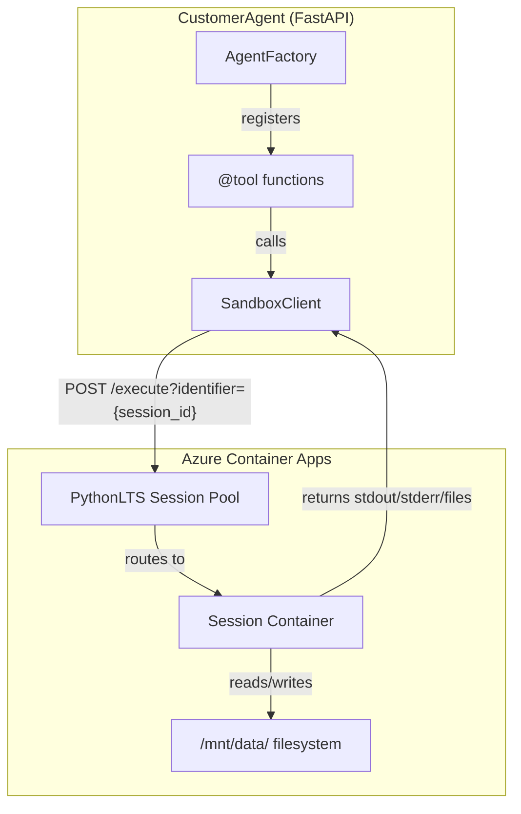
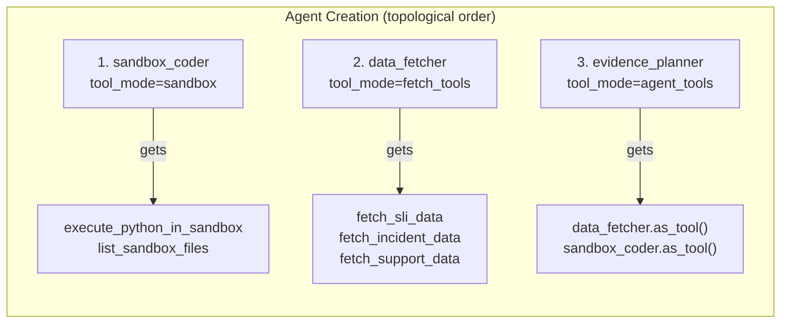
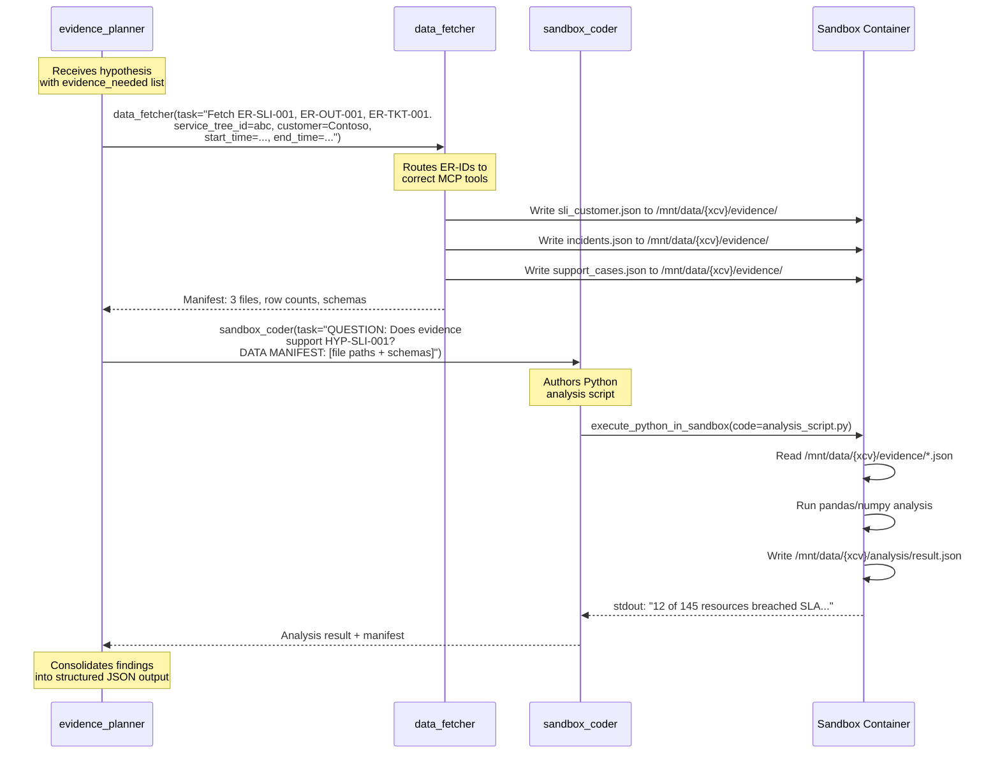
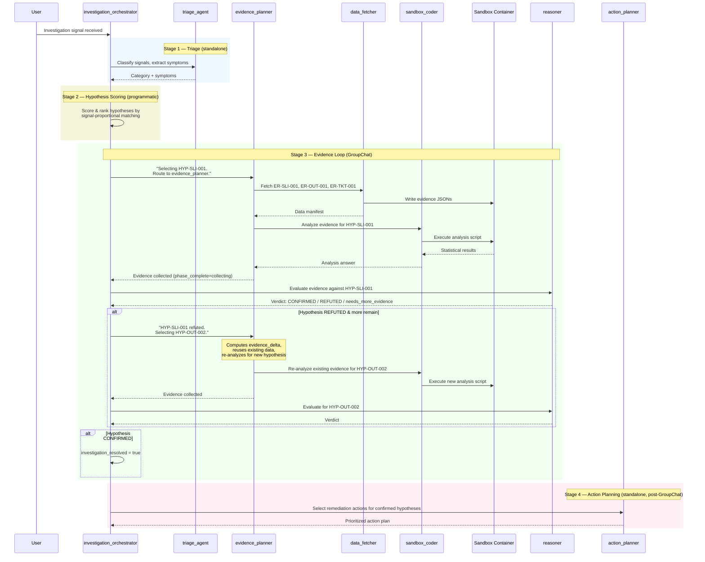
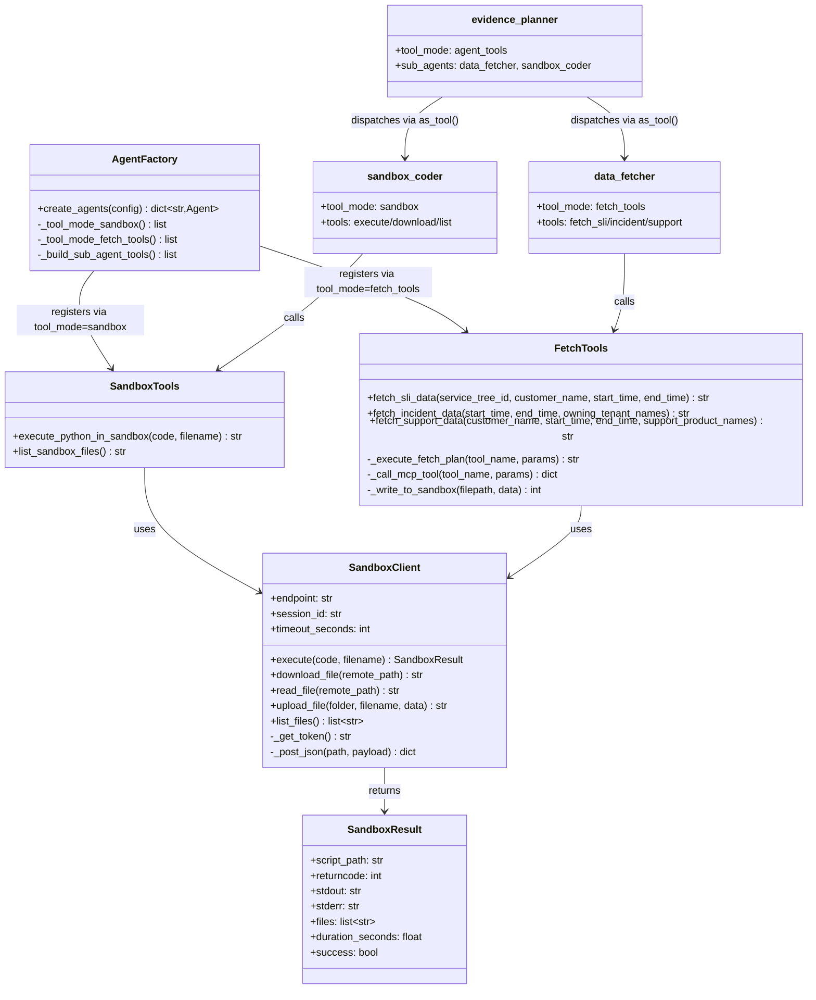

# Azure Dynamic Sessions Sandbox Integration

## Overview

The CustomerAgent project uses **Azure Container Apps Dynamic Sessions** (PythonLTS session pools) to execute Python analysis code in a secure, isolated sandbox environment. This sandbox is the computation engine for the investigation workflow — it allows the `sandbox_coder` agent to author and run statistical analysis scripts against collected evidence data without access to the host filesystem or network.

The sandbox serves two roles in the investigation pipeline:

1. **Data staging** — The `data_fetcher` agent writes raw evidence datasets (JSON) into the sandbox filesystem at `/mnt/data/{xcv}/evidence/`
2. **Code execution** — The `sandbox_coder` agent authors Python scripts that read the staged evidence, perform statistical analysis, and write results to `/mnt/data/{xcv}/analysis/`

The sandbox session is persistent within an investigation — files written by `data_fetcher` remain available for `sandbox_coder` to read, and analysis outputs persist across hypothesis cycles.

---

## Architecture

### Sandbox Client

The `SandboxClient` class in [`src/core/sandbox/client.py`](../src/core/sandbox/client.py) is an HTTP wrapper around the Azure Dynamic Sessions `/execute` API endpoint. It manages authentication, code submission, file transfer, and result parsing.



### Connection Flow

1. **Authentication**: The client uses `AzureCliCredential` locally (for development) with a fallback to `DefaultAzureCredential` (for production/managed identity). The token scope is `https://dynamicsessions.io/.default`.

2. **Session binding**: Each investigation shares a single session ID (default: `customeragent-default`), so files persist across tool calls within the same session. The session ID is configurable via `PYTHON_CUSTOM_POOL_SESSION_ID`.

3. **Code execution**: Python code is submitted as a POST request to `/execute?identifier={session_id}` with the code, filename, and timeout in the JSON body. The response includes `returncode`, `stdout`, `stderr`, and a list of files written.

4. **Async wrapping**: The HTTP call uses `urllib.request` (synchronous) wrapped in `asyncio.run_in_executor()` to avoid blocking the FastAPI event loop.

### Key Classes

```python
@dataclass
class SandboxResult:
    script_path: str       # Path where the script was written in the sandbox
    returncode: int        # 0 = success, non-zero = failure
    stdout: str            # Script's standard output
    stderr: str            # Script's standard error
    files: list[str]       # Files created during execution
    duration_seconds: float
    raw: dict[str, Any]    # Full API response

    @property
    def success(self) -> bool:
        return self.returncode == 0
```

```python
class SandboxClient:
    def __init__(self, endpoint, session_id, timeout_seconds): ...
    async def execute(self, code, filename, session_id, timeout_seconds) -> SandboxResult: ...
    async def download_file(self, remote_path, local_path, session_id) -> str: ...
    async def read_file(self, remote_path, session_id) -> str: ...
    async def upload_file(self, folder, filename, data, session_id) -> str: ...
    async def list_files(self, session_id) -> list[str]: ...
```

---

## Sandbox Tools

The sandbox module exposes two MAF `@tool` functions in [`src/core/sandbox/tools.py`](../src/core/sandbox/tools.py). These are the interface between agents and the sandbox runtime.

### `execute_python_in_sandbox`

The primary tool. Executes Python code in the sandbox container and returns structured JSON with the result.

```python
@tool(name="execute_python_in_sandbox")
async def execute_python_in_sandbox(code: str, filename: str = "agent_script.py") -> str:
```

**Behavior:**
- Prepends a **safety preamble** to every script that monkey-patches `json.dumps()` with handlers for numpy/pandas types and circular references
- Injects the `XCV` correlation variable so scripts can use `f"/mnt/data/{XCV}/..."` for consistent pathing
- Emits SSE events (`sandbox_code_generated`, `sandbox_execution_started`, `sandbox_execution_complete`) via `AgentLogger` for UI visualization
- Returns JSON with `success`, `returncode`, `stdout`, `stderr`, `files`, and `duration_seconds`

### `list_sandbox_files`

Lists files in the sandbox `/mnt/data/` directory.

```python
@tool(name="list_sandbox_files")
async def list_sandbox_files() -> str:
```

### Fetch Tools (Data Staging)

In addition to the core sandbox tools, [`src/core/sandbox/fetch_tools.py`](../src/core/sandbox/fetch_tools.py) defines config-driven **data fetch tools** that bridge MCP collection endpoints with the sandbox filesystem:

| Tool | Purpose |
|------|---------|
| `fetch_sli_data` | Fetches SLI breach data via MCP and writes to sandbox |
| `fetch_incident_data` | Fetches IcM incident data via MCP and writes to sandbox |
| `fetch_support_data` | Fetches support ticket data via MCP and writes to sandbox |

These tools:
1. Read their MCP tool names, parameter mappings, and output filenames from `config/fetch_tools_config.json`
2. Call MCP endpoints programmatically (bypassing LLM context)
3. Write the full raw JSON result to `/mnt/data/{xcv}/evidence/`
4. Return a lightweight manifest (file paths, row counts, schemas) to the LLM
5. Include call deduplication — identical calls within the same investigation are cached

---

## Agent Wiring

### Tool Mode Registry

The [`agent_factory.py`](../src/core/agent_factory.py) uses a **tool mode plugin registry** pattern to attach the right tools to each agent. Each agent's `tool_mode` in `agents_config.json` maps to a handler function:

```python
TOOL_MODE_HANDLERS = {
    "none":        _tool_mode_none,        # No tools
    "filtered":    _tool_mode_filtered,    # Specific MCP tools by name
    "all":         _tool_mode_all,         # All MCP tools (shared instance)
    "sandbox":     _tool_mode_sandbox,     # Sandbox execution tools
    "fetch_tools": _tool_mode_fetch_tools, # Data fetch tools
    "agent_tools": ...,                    # Sub-agents wired as tools (post-wiring)
}
```

### Sandbox Mode (`"sandbox"`)

The `_tool_mode_sandbox` handler imports and returns the two core sandbox tools:

```python
def _tool_mode_sandbox(agent_cfg, ctx):
    from core.sandbox.tools import (
        execute_python_in_sandbox,
        list_sandbox_files,
    )
    return [execute_python_in_sandbox, list_sandbox_files]
```

### Agent Configuration

The `sandbox_coder` agent in [`config/agents/agents_config.json`](../src/config/agents/agents_config.json) uses `tool_mode: "sandbox"`:

```json
{
  "name": "sandbox_coder",
  "description": "Authors and executes Python analysis code in a secure sandbox...",
  "prompt_file": "investigation_sandbox_coder_prompt.txt",
  "model": "gpt-4o",
  "temperature": 0.3,
  "tool_mode": "sandbox",
  "mcp_tools": []
}
```

The `evidence_planner` uses `tool_mode: "agent_tools"` with `data_fetcher` and `sandbox_coder` as sub-agents:

```json
{
  "name": "evidence_planner",
  "description": "Plans and executes evidence collection...",
  "prompt_file": "investigation_evidence_planner_prompt.txt",
  "model": "gpt-4o",
  "temperature": 0.5,
  "tool_mode": "agent_tools",
  "sub_agents": ["data_fetcher", "sandbox_coder"]
}
```

The `data_fetcher` uses `tool_mode: "fetch_tools"`:

```json
{
  "name": "data_fetcher",
  "description": "Fetches raw data from MCP collection tools and deposits datasets into sandbox...",
  "prompt_file": "investigation_data_fetcher_prompt.txt",
  "model": "gpt-4o",
  "temperature": 0.3,
  "tool_mode": "fetch_tools"
}
```

### Wiring Sequence



The factory uses **topological sorting** to ensure sub-agents are created before their coordinators. When the `evidence_planner` is created, `sandbox_coder` and `data_fetcher` already exist and are converted to callable tools via MAF's `Agent.as_tool()`:

```python
def _build_sub_agent_tools(agent_cfg, agents):
    for sub_name in agent_cfg.get("sub_agents", []):
        sub_agent = agents[sub_name]
        tool = sub_agent.as_tool(
            name=sub_name,
            description=sub_agent.description,
            arg_name="task",
            arg_description="A plain natural-language string describing what to do...",
            propagate_session=False,
        )
        tools.append(tool)
    return tools
```

Each sub-agent tool accepts a single `task` string argument — the evidence planner passes natural-language instructions, not structured JSON.

---

## Evidence Planner → Sandbox Coder Flow

The `evidence_planner` agent executes a **two-phase** evidence collection workflow. It is a coordinator that dispatches `data_fetcher` and `sandbox_coder` as sub-agent tools.

### Phase 1: Data Fetch

The evidence planner calls `data_fetcher(task=...)` with all required evidence requirement IDs (ER-IDs) in a single call. The data_fetcher:

1. Routes each ER-ID to the correct MCP collection tool (SLI, incident, support)
2. Calls the MCP endpoint programmatically
3. Writes raw JSON results to `/mnt/data/{xcv}/evidence/*.json`
4. Returns a manifest with file paths, row counts, and column schemas

### Phase 2: Analysis

After data_fetcher returns, the evidence planner calls `sandbox_coder(task=...)` with:

- The **hypothesis question** from the reasoner
- The **data manifest** from Phase 1 (file paths + schemas + row counts)
- Any **prior context** from earlier analysis passes

The sandbox_coder then:

1. Reads the task string and extracts the question, manifest, and context
2. Designs a statistical analysis plan
3. Authors a complete, self-contained Python script
4. Calls `execute_python_in_sandbox` with the script
5. If execution fails, reads stderr, fixes the code, and retries (max 3 attempts)
6. Returns the execution result (stdout answer + analysis JSON files)



### Evidence Reuse Across Hypotheses

When the investigation cycles to a new hypothesis, evidence already collected persists in the sandbox filesystem. The evidence planner computes an `evidence_delta`:

```
evidence_delta = evidence_needed − already_collected_ER_IDs
```

- **Full delta** (all ERs are new): Call data_fetcher then sandbox_coder
- **Partial delta** (some ERs already collected): Call data_fetcher for new ERs only, then sandbox_coder with all evidence paths
- **Empty delta** (all ERs reused): Skip data_fetcher, call sandbox_coder with the new hypothesis question against existing data files

This is critical — even when all evidence is reused, sandbox_coder must **re-analyze** the data because the prior analysis answered a different hypothesis question.

---

## Full Investigation Flow

The investigation workflow is a **GroupChat** orchestrated by the `investigation_orchestrator`. It follows a medical-analogy hybrid pipeline with pre-computed triage and hypothesis scoring (Stages 1-2) followed by sequential hypothesis evaluation (Stage 3).



### Phase Pipeline

The investigation config defines the phase pipeline:

| Phase | Agent | Mode | Description |
|-------|-------|------|-------------|
| `triage` | `triage_agent` | standalone | Classify signals, extract symptoms |
| `hypothesizing` | — | programmatic | Score and rank hypotheses |
| `evidence_loop` | `evidence_planner`, `reasoner` | groupchat | Collect evidence + evaluate (max 2 cycles per hypothesis) |
| `acting` | `action_planner` | standalone | Select remediation actions |
| `notifying` | — | auto_complete | Complete investigation |

### GroupChat Participants

The investigation GroupChat has only two participants:

```json
{
  "orchestrator_agent": "investigation_orchestrator",
  "participants": ["evidence_planner", "reasoner"]
}
```

The orchestrator decides who speaks next. The evidence_planner and reasoner alternate: evidence_planner collects, reasoner evaluates, orchestrator routes to the next hypothesis or resolves.

---

## Component Relationships



---

## Configuration

### Environment Variables

| Variable | Default | Description |
|----------|---------|-------------|
| `PYTHON_CUSTOM_POOL_ENDPOINT` | *(required)* | Azure Dynamic Sessions pool endpoint URL |
| `PYTHON_CUSTOM_POOL_SESSION_ID` | `customeragent-default` | Session identifier for sandbox isolation |
| `PYTHON_CUSTOM_POOL_TIMEOUT_SECONDS` | `180` | Max execution time per script (seconds) |
| `PYTHON_CUSTOM_POOL_DOWNLOAD_DIR` | `downloads` | Local directory for downloaded sandbox files |

Example `.env` configuration:

```env
PYTHON_CUSTOM_POOL_ENDPOINT=https://pythoncustompool.redwave-7f0e0561.westus3.azurecontainerapps.io
PYTHON_CUSTOM_POOL_SESSION_ID=customeragent-default
PYTHON_CUSTOM_POOL_TIMEOUT_SECONDS=180
```

### Authentication

The sandbox uses its own credential chain, separate from the middleware auth:

```python
def _get_sandbox_credential():
    try:
        cred = AzureCliCredential()
        cred.get_token("https://dynamicsessions.io/.default")  # Verify it works
        return cred  # Local development
    except Exception:
        return DefaultAzureCredential()  # Production (managed identity)
```

- **Local development**: Uses `AzureCliCredential` (requires `az login` with the `https://dynamicsessions.io/.default` scope)
- **Production**: Falls back to `DefaultAzureCredential` (managed identity on Container Apps)
- **Token scope**: `https://dynamicsessions.io/.default`

### Session Pool

The pool endpoint points to an Azure Container Apps session pool resource (`Microsoft.App/sessionPools`) of type `PythonLTS`. Key characteristics:

- Sessions are isolated containers with their own filesystem (`/mnt/data/`)
- The session persists across multiple `/execute` calls with the same `identifier`
- Pre-installed packages include `pandas`, `numpy`, `scikit-learn`, `scipy`, `requests`
- The `json.dumps` function is monkey-patched in every execution via the safety preamble

> **Important**: `Microsoft.App/sessionPools` are NOT regular Container Apps Environments. Use `az containerapp sessionpool` commands for management, not `az containerapp env`.

---

## Sandbox Filesystem Layout

During an investigation, the sandbox filesystem is organized by correlation ID (`XCV`):

```
/mnt/data/
└── {xcv}/
    ├── evidence/                    ← Written by data_fetcher
    │   ├── sli_customer.json        ← Customer-specific SLI breach data
    │   ├── sli_multicustomer.json   ← Cross-customer SLI data
    │   ├── incidents.json           ← IcM incident data
    │   ├── support_cases.json       ← Support ticket data
    │   └── support_multicustomer.json
    ├── analysis/                    ← Written by sandbox_coder
    │   ├── analysis_result.json     ← Statistical analysis output
    │   └── sli_analysis.json
    └── _manifest.json              ← File registry with metadata
```

Each evidence file follows the structure:

```json
{
  "rows": [
    {"IncidentId": 123, "Severity": 1, "IsOutage": true, ...},
    ...
  ],
  "count": 12
}
```

The manifest file tracks all files written during the investigation:

```json
{
  "files": [
    {
      "path": "/mnt/data/{xcv}/evidence/sli_customer.json",
      "description": "Customer SLI breach data",
      "rows": 145,
      "columns": ["resource_id", "availability", "region", "timestamp"]
    }
  ]
}
```

---

## Safety Preamble

Every script executed via `execute_python_in_sandbox` is automatically prepended with a safety preamble (defined in `tools.py`). This preamble:

1. **Imports** `json`, `numpy`, `pandas` so scripts don't need to
2. **Defines `_safe()`** — converts numpy/pandas types (integers, floats, booleans, timestamps, arrays) to native Python types for JSON serialization
3. **Defines `_json_dumps()`** — safe `json.dumps` wrapper that handles circular references via cycle-breaking traversal
4. **Monkey-patches `json.dumps`** globally — any library or script code using `json.dumps()` automatically gets numpy/pandas safety for free
5. **Injects `XCV`** — the correlation ID is available as a global variable so scripts use `f"/mnt/data/{XCV}/..."` for all file paths

This eliminates a common failure mode where pandas DataFrames or numpy arrays cause `TypeError: Object of type int64 is not JSON serializable` during serialization.
