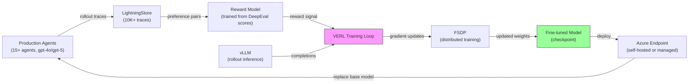

# VERL Feasibility Study

> **Status:** DEFERRED | **Author:** RATIO Team | **Last Updated:** 2026-04-27

## 1. Executive Summary

VERL (vLLM + FSDP Reinforcement Learning) is AGL's integration for weight-level fine-tuning of language models using reinforcement learning, going beyond textual prompt optimization. It combines vLLM for fast rollout inference with PyTorch FSDP for distributed gradient updates, guided by a reward model trained on evaluation scores. For the CustomerAgent system, VERL would allow fine-tuning the underlying model weights when prompt-level optimization (APO) reaches diminishing returns. This document assesses feasibility and recommends deferring until clear APO plateau evidence is established.

## 2. What is VERL?

VERL is a reinforcement learning framework that fine-tunes model weights (not just prompts) using three components:

- **vLLM Inference** — High-throughput serving engine that generates rollout completions from the current policy model during training. Handles batched inference efficiently on GPU.
- **FSDP Distributed Training** — Fully Sharded Data Parallel training across multiple GPUs. Shards model parameters, gradients, and optimizer states to fit large models in GPU memory.
- **Reward Model** — A learned scoring function (trained from human preferences or automated eval scores like DeepEval) that provides the reward signal for policy gradient updates.

The training loop: generate rollouts with vLLM → score with reward model → compute policy gradient → update weights with FSDP → repeat.

## 3. Prerequisites Checklist

| # | Requirement | Status | Detail |
|---|-------------|--------|--------|
| 1 | GPU infrastructure | Not Started | Azure NC-series VMs with A100 or H100 GPUs. Minimum 1× A100 80GB for 7B models, 4× A100 for 70B+ models. |
| 2 | vLLM deployment | Not Started | Self-hosted vLLM inference endpoint on GPU VM. Cannot use Azure OpenAI managed endpoints for VERL rollouts. |
| 3 | FSDP configuration | Not Started | PyTorch FSDP config for sharding strategy, mixed precision, activation checkpointing. Requires NCCL backend. |
| 4 | Custom reward model | Not Started | Train a reward model from DeepEval evaluation scores (correctness, faithfulness, relevance). Needs labeled preference pairs. |
| 5 | 10K+ rollout traces | Not Started | Accumulate rollout traces with reward signals in LightningStore from production APO runs. Current trace count: TBD. |
| 6 | Open-weight base model | Not Started | VERL requires access to model weights. Azure OpenAI models (gpt-4o/gpt-5) are closed-weight. Would need to switch to an open model (e.g., Llama, Mistral) or wait for Azure-hosted fine-tuning support. |
| 7 | AGL VERL SDK integration | Not Started | Import and configure `agentlightning.verl` module. Verify compatibility with current AGL version (latest). |

## 4. When to Consider VERL

VERL should be evaluated when **all** of the following criteria are met:

| # | Criterion | Measurement | Current State |
|---|-----------|-------------|---------------|
| 1 | APO has plateaued | < 1% improvement per run over last 5 consecutive runs | APO recently integrated (F01-F14), early optimization phase |
| 2 | Sufficient rollout data | 10K+ rollout traces with reward scores in LightningStore | Accumulating — not yet at threshold |
| 3 | GPU budget approved | NC-series VM allocation approved by team lead | Not requested |
| 4 | Prompt-unreachable behaviors | Identified agent behaviors that cannot be achieved through prompt engineering alone | None identified yet |
| 5 | Open-weight model viable | Performance parity demonstrated between open-weight model and current gpt-4o/gpt-5 | Not evaluated |

**Key insight:** VERL only makes sense when prompt optimization is exhausted. APO operates at ~$15/run with no GPU infrastructure. VERL requires significant infrastructure investment — only justified when the marginal value of weight-level changes exceeds the cost.

## 5. Cost Estimate

### GPU VM Costs (Azure NC-series, Pay-as-you-go, US West)

| VM Size | GPU | VRAM | vCPUs | Cost/hr | Est. Training Run (4-8 hrs) |
|---------|-----|------|-------|---------|-----------------------------|
| NC24ads A100 v4 | 1× A100 80GB | 80 GB | 24 | ~$3.67 | $14.68 – $29.36 |
| NC48ads A100 v4 | 2× A100 80GB | 160 GB | 48 | ~$7.34 | $29.36 – $58.72 |
| NC96ads A100 v4 | 4× A100 80GB | 320 GB | 96 | ~$14.68 | $58.72 – $117.44 |
| ND96isr H100 v5 | 8× H100 80GB | 640 GB | 96 | ~$32.77 | $131.08 – $262.16 |

### Total Estimated Costs per Training Cycle

| Component | One-time | Per Run |
|-----------|----------|---------|
| Reward model training | $50 – $150 | — |
| VERL training run (4× A100, 6 hrs avg) | — | ~$88 |
| vLLM inference during rollouts | — | Included in VM cost |
| Storage (LightningStore, checkpoints) | $10/month | — |
| **Total per training cycle** | — | **~$88 – $120** |

**Comparison:** APO prompt optimization costs ~$15/run (Azure OpenAI API only, no GPU). VERL is 6-8× more expensive per run.

## 6. Architecture

### Data Flow

1. **Collect** — Production agents generate rollout traces stored in LightningStore
2. **Label** — DeepEval scores (correctness, faithfulness, relevance) become reward signals
3. **Train Reward Model** — Supervised model maps (prompt, completion) → reward score
4. **VERL Loop** — vLLM generates completions → reward model scores them → FSDP updates weights
5. **Deploy** — Fine-tuned checkpoint deployed as self-hosted endpoint or via Azure managed fine-tuning
6. **Evaluate** — A/B test fine-tuned model against base model on held-out test set

## 7. Risks

| # | Risk | Severity | Mitigation |
|---|------|----------|------------|
| 1 | **Model drift** — Fine-tuned model degrades on out-of-distribution inputs | High | A/B test on held-out eval set before deployment. Maintain rollback to base model. Monitor eval scores post-deploy. |
| 2 | **GPU cost overrun** — Training takes longer than estimated or requires more iterations | Medium | Set hard budget caps. Use spot VMs where possible. Start with smallest viable GPU config (1× A100). |
| 3 | **vLLM compatibility** — Azure OpenAI models (gpt-4o/gpt-5) are closed-weight, incompatible with vLLM | High | Requires switching to open-weight model (Llama, Mistral) or waiting for Azure-supported VERL integration. This is the primary blocker. |
| 4 | **Reward signal quality** — DeepEval scores may not capture the nuances that matter for agent quality | Medium | Validate reward model correlation with human judgments on a sample. Iterate on eval criteria before training. |
| 5 | **Catastrophic forgetting** — Fine-tuning on agent-specific data degrades general capabilities | Medium | Use KL-divergence penalty in VERL config. Keep fine-tuning learning rate low. Test on general benchmarks. |
| 6 | **Infrastructure complexity** — vLLM + FSDP + reward model is significant operational overhead | Medium | Start with single-node setup. Document runbooks. Consider Azure ML managed training if available. |
| 7 | **AGL SDK stability** — VERL integration may be experimental/unstable in current AGL version | Low | Pin AGL version. Test in isolated environment before production integration. |

## 8. Recommendation

**DEFER until APO plateau is measured.**

Current recommendation: continue with APO prompt optimization (F01-F14) which delivers significant improvement at ~$15/run with zero GPU infrastructure requirements.

### Revisit VERL when ALL conditions are met:

1. **APO plateau confirmed** — < 1% improvement per run for 5 consecutive runs across target agents
2. **10K+ rollouts accumulated** — Sufficient training data in LightningStore with reward scores
3. **GPU budget approved** — Team lead approves NC-series VM allocation (~$100/training run)
4. **Open-weight model evaluated** — Performance parity demonstrated between an open-weight model and current gpt-4o/gpt-5 for CustomerAgent tasks
5. **Prompt-unreachable behavior identified** — Specific agent behaviors documented that cannot be achieved through prompt engineering

### Next Steps (when revisiting)

1. Benchmark open-weight models (Llama 3, Mistral) against gpt-4o on CustomerAgent eval set
2. Train reward model prototype from existing DeepEval scores
3. Run single-node VERL proof-of-concept on NC24ads A100 v4
4. Compare fine-tuned model vs APO-optimized prompts on held-out test set
5. If positive, propose full VERL pipeline to team
