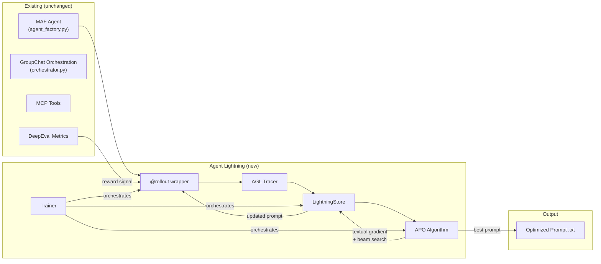
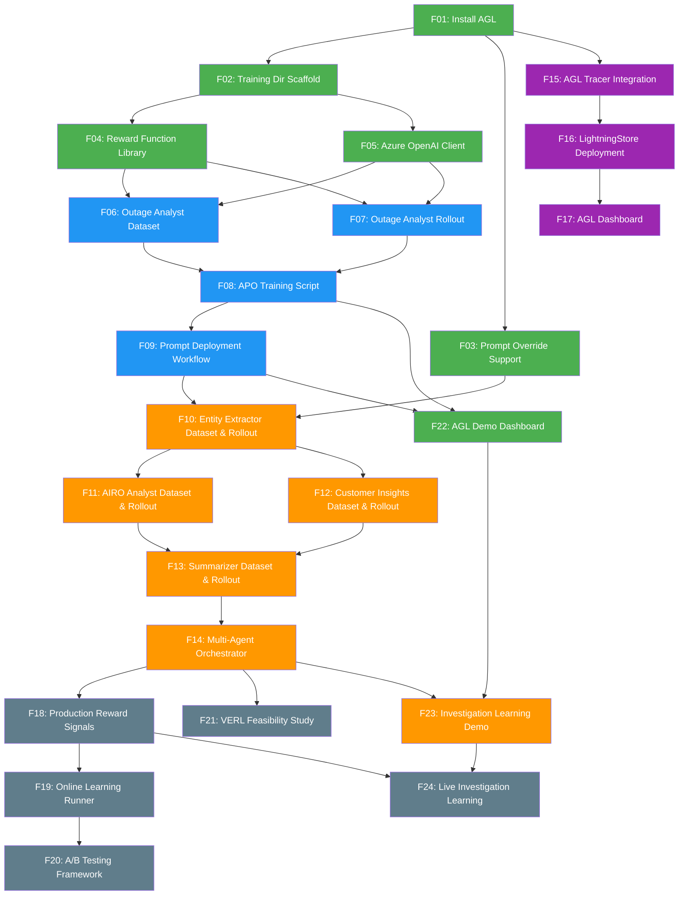
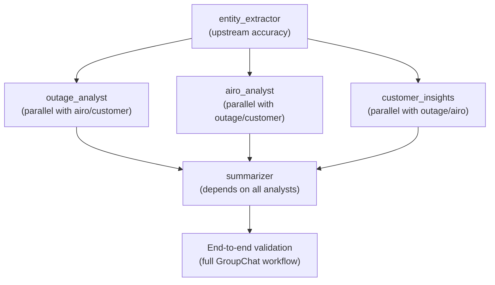
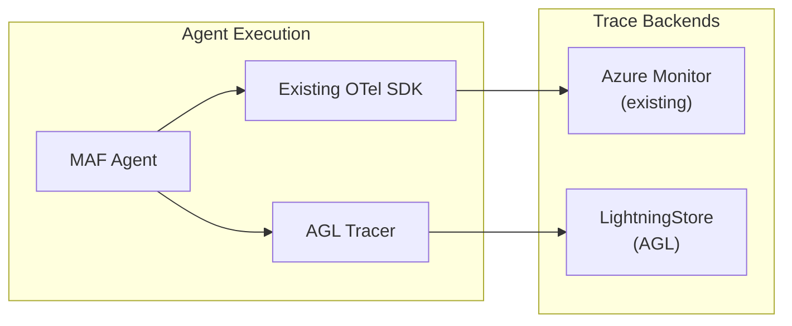
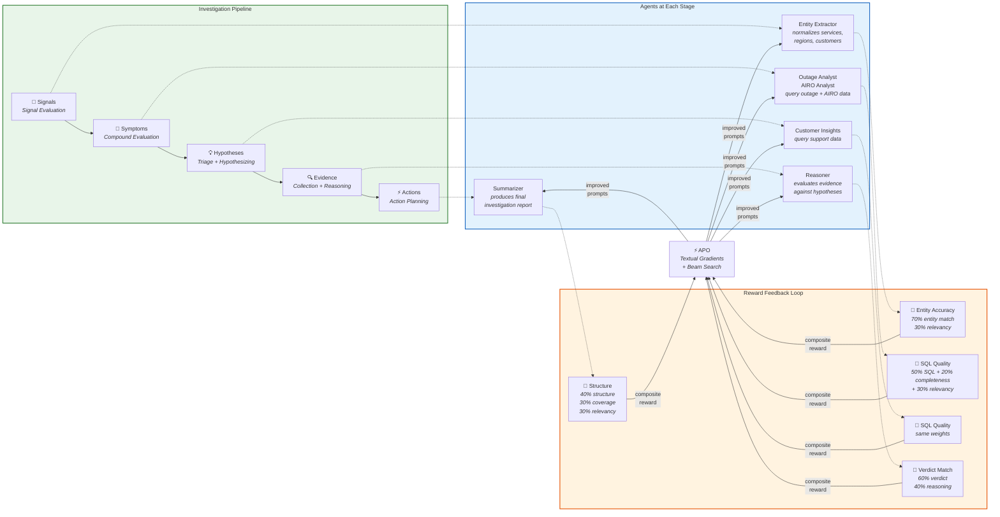
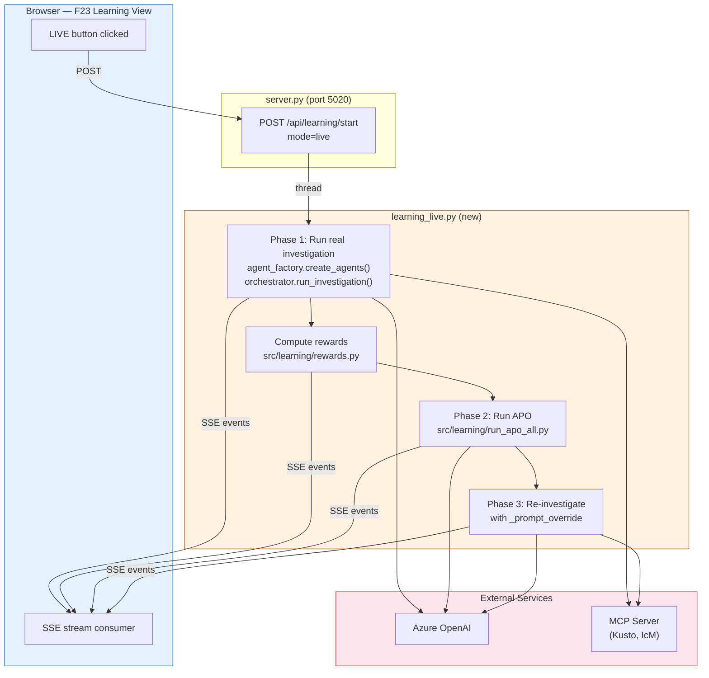

# Agent Lightning Integration Plan — RATIO-AI CustomerAgent

## Overview

**Agent Lightning** (AGL) is a Microsoft open-source framework for automatic prompt optimization (APO), reinforcement learning, and supervised fine-tuning of AI agents. This plan integrates AGL into the **CustomerAgent** multi-agent investigation system to replace manual prompt tuning with data-driven optimization. AGL layers on top of the existing Microsoft Agent Framework (MAF) — the 15-agent GroupChat system continues to run unchanged while AGL wraps each agent in a `@rollout` decorator, computes rewards via DeepEval metrics, and uses textual gradients + beam search to iteratively improve prompts. The integration spans 21 discrete features from foundation setup (F01–F05) through single-agent optimization (F06–F09), multi-agent expansion (F10–F14), observability (F15–F17), and continuous learning (F18–F21).



| CustomerAgent Concept | Agent Lightning Concept | Mapping |
|----------------------|------------------------|---------|
| MAF `Agent` instance | AGL `@rollout` function | Wrap a single agent's execution in a rollout function |
| Agent prompt `.txt` file | AGL `PromptTemplate` resource | Load current prompt as the seed `PromptTemplate` |
| GroupChat workflow run | AGL Rollout | One complete workflow execution = one rollout |
| DeepEval score (0.0–1.0) | AGL Reward (float) | Return DeepEval metric score as the rollout reward |
| Eval test cases | AGL Dataset (train + val) | Existing test cases become the training/validation dataset |
| OpenTelemetry spans | AGL Spans | AGL's OTel-based tracer aligns with existing spans |

---

## Feature Dependency Graph



**Legend**: Green = P0 Foundation & Demo · Blue = P0 Single-Agent · Orange = P1 Multi-Agent · Purple = P2 Observability · Gray = P3 Future

---

## Feature Catalog

| ID | Title | Priority | Dependencies | Files Changed/Created | Description |
|----|-------|----------|--------------|----------------------|-------------|
| F01 | Install Agent Lightning | P0 | None | `requirements.txt` | Add `agentlightning[apo]` dependency and verify compatibility |
| F02 | Training Directory Scaffold | P0 | F01 | `src/learning/**` (6 dirs, 4 files) | Create the `src/learning/` directory structure with subdirectories |
| F03 | Prompt Override Support | P0 | F01 | `src/core/agent_factory.py` | Add `_prompt_override` check — the only production code change |
| F04 | Reward Function Library | P0 | F02 | `src/learning/rewards.py` | DeepEval-based reward function returning composite float |
| F05 | Azure OpenAI Client for APO | P0 | F02 | `src/learning/apo_client.py` | `AsyncAzureOpenAI` helper with `DefaultAzureCredential` |
| F06 | Reasoner Training Dataset | P0 | F04, F05 | `src/learning/datasets/reasoner_tasks.py` | 20+ train tasks and 10+ val tasks for reasoner |
| F07 | Reasoner Rollout Wrapper | P0 | F04, F05 | `src/learning/rollouts/reasoner_rollout.py` | `@agl.rollout` decorator wrapping the MAF agent |
| F08 | APO Training Script | P0 | F06, F07 | `src/learning/run_apo.py` | Seed prompt → APO config → Trainer → fit → save best prompt |
| F09 | Prompt Deployment Workflow | P0 | F08 | (workflow, no new code) | Backup → validate → deploy → commit workflow |
| F10 | Entity Extractor Dataset & Rollout | P1 | F03, F09 | `src/learning/datasets/entity_extractor_tasks.py`, `src/learning/rollouts/entity_extractor_rollout.py` | Upstream agent — optimize first in multi-agent pass |
| F11 | AIRO & Outage Analyst Datasets & Rollouts | P1 | F10 | `src/learning/datasets/airo_analyst_tasks.py`, `src/learning/rollouts/airo_analyst_rollout.py`, `src/learning/datasets/outage_analyst_tasks.py`, `src/learning/rollouts/outage_analyst_rollout.py` | Parallel with F12 |
| F12 | Customer Insights Dataset & Rollout | P1 | F10 | `src/learning/datasets/customer_insights_tasks.py`, `src/learning/rollouts/customer_insights_rollout.py` | Parallel with F11 |
| F13 | Summarizer Dataset & Rollout | P1 | F11, F12 | `src/learning/datasets/summarizer_tasks.py`, `src/learning/rollouts/summarizer_rollout.py` | Depends on analyst prompts being stable |
| F14 | Multi-Agent Training Orchestrator | P1 | F13 | `src/learning/run_apo_all.py` | Sequential APO in dependency order with end-to-end validation |
| F15 | AGL Tracer Integration | P2 | F01 | `src/core/tracing/agl_tracer.py` | Wire AGL Tracer alongside existing OTel SDK |
| F16 | LightningStore Deployment | P2 | F15 | `docker-compose.yml` | Deploy persistent LightningStore (SQLite or client-server) |
| F17 | AGL Dashboard | P2 | F16 | `docker-compose.yml` | Deploy AGL training visualization dashboard on port 8095 |
| F18 | Production Reward Signals | P3 | F14 | `src/learning/rewards_production.py` | Collect rewards from live traffic (thumbs-up, T-SQL success, latency) |
| F19 | Online Learning Runner | P3 | F18 | `src/learning/run_online.py` | Continuous `step(task)` mode with safety guardrails |
| F20 | A/B Testing Framework | P3 | F19 | `src/core/prompt_router.py` | Route traffic between prompt variants, compare metrics |
| F21 | VERL Feasibility Study | P3 | F14 | (document, no code) | Assess GPU infrastructure for RL fine-tuning |
| F22 | AGL Demo Dashboard | P0 | F08, F09 | `CustomerAgentUI/views/training.js`, `CustomerAgentUI/lib/training-sse.js`, `CustomerAgentUI/training_api.py`, `CustomerAgentUI/server.py`, `CustomerAgentUI/app.js`, `CustomerAgentUI/index.html`, `CustomerAgentUI/styles.css` | Training dashboard in CustomerAgentUI showing live APO training progression, reward convergence chart, prompt before/after comparison, and deployment workflow |
| F23 | Investigation Learning Demo | P1 | F14, F22 | `CustomerAgentUI/views/learning.js`, `CustomerAgentUI/lib/learning-sse.js`, `CustomerAgentUI/learning_api.py`, `CustomerAgentUI/server.py`, `CustomerAgentUI/app.js`, `CustomerAgentUI/index.html`, `CustomerAgentUI/styles.css` | Multi-agent learning demo integrated into the investigation flow — shows how each pipeline stage (Signal→Symptom→Hypothesis→Evidence→Action) produces reward signals that feed back into APO to improve all 5 agents simultaneously |
| F24 | Live Investigation Learning | P3 | F23, F18 | `CustomerAgentUI/learning_api.py`, `CustomerAgentUI/learning_live.py` | Wire the LIVE button in F23's learning view to run the actual investigation pipeline — real agents, real MCP tools, real reward computation, real APO optimization — instead of simulated demo data |

---

## Features

---

### F01: Install Agent Lightning

**Priority**: P0
**Dependencies**: None
**Blocked by**: Nothing — this is the entry point
**Blocks**: F02, F03, F15

#### Description

Add the `agentlightning[apo]` package to the project dependencies and verify it is compatible with the existing Python 3.11+ environment, `openai`, `pydantic`, and `agent-framework` packages. This establishes the AGL SDK as available for all downstream features.

#### Acceptance Criteria

- [ ] `agentlightning[apo]>=0.3.0,<1.0.0` is in `requirements.txt`
- [ ] `pip install -r requirements.txt` completes without dependency conflicts
- [ ] `import agentlightning as agl` succeeds in a Python shell
- [ ] Existing tests (`pytest -v`) still pass after installation

#### Files Changed

| Action | Path | Detail |
|--------|------|--------|
| MODIFY | `requirements.txt` | Add `agentlightning[apo]>=0.3.0,<1.0.0`; tighten `openai` lower bound to `>=1.100.0` |

#### Compatibility Matrix

| Existing Dependency | Current Pin | AGL Requirement | Conflict? |
|---------------------|-------------|-----------------|-----------|
| Python | 3.11+ | 3.10+ | No |
| `openai` | `>=1.12.0,<2.0.0` | `>=1.100.0` | **Tighten lower bound** to `>=1.100.0` |
| `agent-framework` | `>=1.0.1,<2.0.0` | No requirement | No |
| `pydantic` | `>=2.5.0,<3.0.0` | Compatible | No |

#### Step-by-Step Instructions

**Step 1: Add AGL to requirements.txt**

Open `requirements.txt` and append:

```
# ── Agent optimization ───────────────────────────────────────
agentlightning[apo]>=0.3.0,<1.0.0
```

Also update the `openai` pin from `>=1.12.0,<2.0.0` to `>=1.100.0,<2.0.0` (required by AGL's `TraceToMessages` adapter).

**Step 2: Install in your virtual environment**

```bash
cd Code/CustomerAgent
pip install -r requirements.txt
```

**Step 3: Verify installation**

```bash
python -c "import agentlightning as agl; print(f'AGL version: {agl.__version__}')"
```

**Step 4: Run existing tests to confirm no regressions**

```bash
pytest -v
```

#### Verification

```bash
python -c "from agentlightning import APO, Trainer, PromptTemplate; print('All AGL imports OK')"
pytest -v --tb=short  # All existing tests pass
```

---

### F02: Training Directory Scaffold

**Priority**: P0
**Dependencies**: F01
**Blocked by**: F01 (AGL must be installed before creating training infrastructure)
**Blocks**: F04, F05

#### Description

Create the `src/learning/` directory structure under `Code/CustomerAgent/` with `__init__.py` files, `datasets/`, `rollouts/`, and `outputs/` subdirectories. This provides the organized file structure for all subsequent training features.

#### Acceptance Criteria

- [ ] `Code/CustomerAgent/src/learning/` directory exists with proper `__init__.py` files
- [ ] `datasets/`, `rollouts/`, `outputs/` subdirectories exist
- [ ] `outputs/` has a `.gitkeep` and is gitignored (training artifacts should not be committed)
- [ ] `python -c "import learning"` works from the `Code/CustomerAgent/` directory

#### Files Changed

| Action | Path | Detail |
|--------|------|--------|
| CREATE | `src/learning/__init__.py` | Package init |
| CREATE | `src/learning/datasets/__init__.py` | Datasets sub-package |
| CREATE | `src/learning/rollouts/__init__.py` | Rollouts sub-package |
| CREATE | `src/learning/outputs/.gitkeep` | Placeholder for APO output directory |
| MODIFY | `.gitignore` | Add `src/learning/outputs/*.txt` and `src/learning/outputs/*.json` |

#### Step-by-Step Instructions

**Step 1: Create the directory tree**

```bash
cd Code/CustomerAgent
mkdir -p src/learning/datasets src/learning/rollouts src/learning/outputs
```

**Step 2: Create `__init__.py` files**

```bash
touch src/learning/__init__.py
touch src/learning/datasets/__init__.py
touch src/learning/rollouts/__init__.py
touch src/learning/outputs/.gitkeep
```

**Step 3: Add gitignore entries**

Append to `.gitignore`:

```
# AGL training outputs (generated by APO)
src/learning/outputs/*.txt
src/learning/outputs/*.json
!src/learning/outputs/.gitkeep
```

#### File Structure After Completion

```
Code/CustomerAgent/
├── src/                                # Contains learning/ and other source
│   ├── learning/                       # AGL learning infrastructure
│   │   ├── __init__.py
│   │   ├── datasets/
│   │   │   └── __init__.py
│   │   ├── rollouts/
│   │   │   └── __init__.py
│   │   └── outputs/                    # APO output directory (gitignored)
│   │       └── .gitkeep
│   └── ...
├── eval/                               # UNCHANGED
└── requirements.txt                    # MODIFIED in F01
```

#### Verification

```bash
cd Code/CustomerAgent
python -c "import learning; import learning.datasets; import learning.rollouts; print('Scaffold OK')"
```

---

### F03: Prompt Override Support

**Priority**: P0
**Dependencies**: F01
**Blocked by**: F01 (AGL SDK must be available for type awareness)
**Blocks**: F10 (multi-agent optimization requires override injection)

#### Description

Add a `_prompt_override` check to `agent_factory.py` so AGL can inject optimized prompts during training without modifying the agent's persistent prompt file. This is the **only change to existing production code** in the entire integration.

#### Acceptance Criteria

- [ ] `agent_factory.py` checks for `_prompt_override` in agent config after loading the prompt from file
- [ ] When `_prompt_override` is present, its value is used instead of the file-loaded prompt
- [ ] When `_prompt_override` is absent, behavior is unchanged (file-loaded prompt used)
- [ ] Existing tests still pass — no behavioral change in normal operation

#### Files Changed

| Action | Path | Detail |
|--------|------|--------|
| MODIFY | `src/core/agent_factory.py` | Add 2-line `_prompt_override` check in the agent creation loop |

#### Step-by-Step Instructions

**Step 1: Locate the prompt loading code in `agent_factory.py`**

Find the line in the agent creation loop where the prompt is loaded from file, typically:

```python
prompt = prompts[agent_cfg["name"]]
```

**Step 2: Add the override check immediately after**

```python
# In agent_factory.py, within the agent creation loop:
# After loading the prompt from file, check for override
prompt = prompts[agent_cfg["name"]]
if "_prompt_override" in agent_cfg:
    prompt = agent_cfg["_prompt_override"]
```

This allows AGL's rollout wrapper (see [F07](#f07-outage-analyst-rollout-wrapper)) to inject optimized prompts by setting `agent_cfg["_prompt_override"]` before calling `create_agents()`.

**Step 3: Verify no existing tests break**

```bash
pytest -v tests/
```

#### Verification

Temporarily add `_prompt_override` to one agent config in a test and verify the override is used:

```python
# In a test:
config["agents"][0]["_prompt_override"] = "TEST OVERRIDE PROMPT"
agents = await create_agents(config)
# Verify the agent's prompt is "TEST OVERRIDE PROMPT"
```

---

### F04: Reward Function Library

**Priority**: P0
**Dependencies**: F02
**Blocked by**: F02 (training directory must exist)
**Blocks**: F06, F07

#### Description

Create `src/learning/rewards.py` with a `compute_reasoner_reward()` function that evaluates the reasoner's output quality: verdict accuracy (does the verdict match the expected verdict?) weighted with reasoning quality via DeepEval's Answer Relevancy metric. Returns a composite float (0.0–1.0) compatible with AGL's rollout return type.

#### Acceptance Criteria

- [ ] `src/learning/rewards.py` exists with `compute_reasoner_reward()`
- [ ] Function accepts `hypothesis`, `evidence`, `agent_output`, `expected_verdict`, `expected_reasoning` parameters
- [ ] Verdict accuracy contributes 60% of the score, reasoning quality 40%
- [ ] Returns a float in [0.0, 1.0]
- [ ] Gracefully returns 0.0 on evaluation failure (never raises)

#### Files Changed

| Action | Path | Detail |
|--------|------|--------|
| CREATE | `src/learning/rewards.py` | DeepEval reward function library |

#### Step-by-Step Instructions

**Step 1: Create `src/learning/rewards.py`**

```python
"""
Reward functions for Agent Lightning training.

Provides reward functions for each agent being optimized.
Each function returns a single float reward (0.0–1.0)
compatible with AGL's rollout return type.
"""
from __future__ import annotations

import logging
from typing import Any

from deepeval.test_case import LLMTestCase
from deepeval.metrics import AnswerRelevancyMetric

logger = logging.getLogger(__name__)

# Valid verdicts the reasoner can return
VALID_VERDICTS = {"CONFIRMED", "CONTRIBUTING", "REFUTED", "needs_more_evidence"}


def compute_reasoner_reward(
    hypothesis: str,
    evidence: str,
    agent_output: str,
    expected_verdict: str,
    expected_reasoning: str | None = None,
) -> float:
    """Compute a composite reward for the reasoner agent.

    Scoring:
      - 60% weight: Verdict accuracy (1.0 if correct, 0.0 if wrong)
      - 40% weight: Reasoning quality via DeepEval Answer Relevancy

    Returns a float in [0.0, 1.0].
    """
    try:
        # ── Verdict accuracy (60%) ───────────────────────
        # Check if the expected verdict appears in the agent output
        verdict_score = 0.0
        output_upper = agent_output.upper()
        if expected_verdict.upper() in output_upper:
            verdict_score = 1.0
        elif expected_verdict == "needs_more_evidence" and "NEEDS_MORE_EVIDENCE" in output_upper.replace(" ", "_"):
            verdict_score = 1.0

        # ── Reasoning quality (40%) ──────────────────────
        reasoning_score = 0.0
        try:
            test_case = LLMTestCase(
                input=f"Hypothesis: {hypothesis}\nEvidence: {evidence}",
                actual_output=agent_output,
                expected_output=expected_reasoning or expected_verdict,
            )
            relevancy = AnswerRelevancyMetric(threshold=0.5)
            relevancy.measure(test_case)
            reasoning_score = relevancy.score or 0.0
        except Exception as e:
            logger.warning("Reasoning quality eval failed: %s", e)
            reasoning_score = 0.0

        composite = (verdict_score * 0.6) + (reasoning_score * 0.4)

        logger.info(
            "Reward: verdict=%.1f, reasoning=%.3f, composite=%.3f",
            verdict_score, reasoning_score, composite,
        )
        return composite

    except Exception as e:
        logger.error("Reward computation failed: %s", e)
        return 0.0
```

#### Verification

```python
# Smoke test (requires Azure OpenAI env vars):
from learning.rewards import compute_reasoner_reward
score = compute_reasoner_reward(
    hypothesis="Storage outage caused customer impact",
    evidence="SLI breach detected. Incident confirmed.",
    agent_output="Based on the evidence, the verdict is CONFIRMED. "
                 "All three sources converge on the same service and time window.",
    expected_verdict="CONFIRMED",
    expected_reasoning="Evidence convergence confirms the hypothesis.",
)
assert 0.0 <= score <= 1.0
print(f"Reward score: {score}")
```

---

### F05: Azure OpenAI Client for APO

**Priority**: P0
**Dependencies**: F02
**Blocked by**: F02 (training directory must exist)
**Blocks**: F06, F07

#### Description

Create a helper module that builds an `AsyncAzureOpenAI` client authenticated via `DefaultAzureCredential` for APO's gradient and edit model calls. APO's `__init__` expects an `AsyncOpenAI` client — `AsyncAzureOpenAI` is a compatible subclass.

#### Acceptance Criteria

- [ ] `src/learning/apo_client.py` exists with `create_azure_openai_client()` function
- [ ] Uses `DefaultAzureCredential` + `get_bearer_token_provider` (not API keys)
- [ ] Reads endpoint and API version from environment variables
- [ ] Returns an `AsyncAzureOpenAI` instance ready for APO

#### Files Changed

| Action | Path | Detail |
|--------|------|--------|
| CREATE | `src/learning/apo_client.py` | Azure OpenAI client factory for APO |

#### Step-by-Step Instructions

**Step 1: Create `src/learning/apo_client.py`**

```python
"""
Azure OpenAI client factory for Agent Lightning APO.

APO's __init__ expects an AsyncOpenAI client. AsyncAzureOpenAI is a
compatible subclass that authenticates via DefaultAzureCredential.
"""
from __future__ import annotations

import os

from openai import AsyncAzureOpenAI
from azure.identity import DefaultAzureCredential, get_bearer_token_provider


def create_azure_openai_client() -> AsyncAzureOpenAI:
    """Create an AsyncAzureOpenAI client for APO's gradient/edit models.

    Reads configuration from environment variables:
      - AZURE_OPENAI_ENDPOINT: The Azure OpenAI resource endpoint
      - AZURE_OPENAI_API_VERSION: API version (default: 2024-12-01-preview)
    """
    credential = DefaultAzureCredential()
    token_provider = get_bearer_token_provider(
        credential,
        "https://cognitiveservices.azure.com/.default",
    )
    return AsyncAzureOpenAI(
        azure_endpoint=os.getenv("AZURE_OPENAI_ENDPOINT", ""),
        api_version=os.getenv("AZURE_OPENAI_API_VERSION", "2024-12-01-preview"),
        azure_ad_token_provider=token_provider,
    )
```

**Note**: APO uses model deployment names for `gradient_model` and `apply_edit_model` — these must match your Azure OpenAI deployment names (e.g., `"gpt-4o"`).

#### Verification

```python
from learning.apo_client import create_azure_openai_client
client = create_azure_openai_client()
print(f"Client type: {type(client).__name__}")  # AsyncAzureOpenAI
print(f"Endpoint: {client._base_url}")
```

---

### F06: Reasoner Training Dataset

**Priority**: P0
**Dependencies**: F04, F05
**Blocked by**: F04 and F05 (reward function and client must exist so datasets can be tested end-to-end)
**Blocks**: F08

#### Description

Create `src/learning/datasets/reasoner_tasks.py` with 20+ training tasks and 10+ validation tasks for the `reasoner` agent. Each task provides a `hypothesis`, `evidence`, `expected_verdict` (CONFIRMED / CONTRIBUTING / REFUTED / needs_more_evidence), and `expected_reasoning`. The validation set must be disjoint from the training set.

**Why `reasoner`?** It is a pure reasoning agent (no tools, `tool_mode: "none"`), which makes rollouts fast and deterministic — no MCP server or T-SQL execution required. Its output quality directly determines investigation accuracy (hypothesis verdicts feed into the action planner). Optimizing its reasoning prompt delivers high impact with low infrastructure overhead.

#### Acceptance Criteria

- [ ] `src/learning/datasets/reasoner_tasks.py` exists
- [ ] `TRAIN_TASKS` contains 20+ dicts with `hypothesis`, `evidence`, `expected_verdict`, `expected_reasoning` keys
- [ ] `VAL_TASKS` contains 10+ dicts, disjoint from training
- [ ] Tasks cover: confirmed hypotheses, refuted hypotheses, contributing factors, insufficient evidence, edge cases with conflicting evidence

#### Files Changed

| Action | Path | Detail |
|--------|------|--------|
| CREATE | `src/learning/datasets/reasoner_tasks.py` | Train/val task definitions for hypothesis evaluation |

#### Step-by-Step Instructions

**Step 1: Create the dataset file**

```python
"""
Training and validation datasets for reasoner prompt optimization.

The reasoner agent evaluates collected evidence against a hypothesis and
returns a verdict: CONFIRMED, CONTRIBUTING, REFUTED, or needs_more_evidence.

Each task is a dict with:
  - hypothesis: The hypothesis being evaluated
  - evidence: Collected evidence from SLI, incident, and support collectors
  - expected_verdict: The correct verdict (CONFIRMED | CONTRIBUTING | REFUTED | needs_more_evidence)
  - expected_reasoning: Description of what good reasoning looks like
"""
from __future__ import annotations

TRAIN_TASKS: list[dict] = [
    {
        "hypothesis": "Azure Storage outage in East US caused customer AIRO impact",
        "evidence": "SLI breach detected for 3 storage accounts in East US region. "
                    "Incident INC-2026-04001 confirms storage control plane outage "
                    "from 2026-04-10T14:00Z to 2026-04-10T16:30Z. "
                    "12 support requests filed during the window referencing storage failures.",
        "expected_verdict": "CONFIRMED",
        "expected_reasoning": "All three evidence sources (SLI, incident, support) converge on "
                              "the same service, region, and time window. The hypothesis is confirmed "
                              "with high confidence.",
    },
    {
        "hypothesis": "Network latency spike in West Europe degraded Cosmos DB throughput",
        "evidence": "SLI data shows no breaches for Cosmos DB in West Europe. "
                    "No active incidents match the region and service. "
                    "2 support requests mention slow queries but are attributed to customer-side index issues.",
        "expected_verdict": "REFUTED",
        "expected_reasoning": "No SLI breaches or active incidents corroborate the hypothesis. "
                              "Support requests point to customer-side root cause. "
                              "The hypothesis is refuted.",
    },
    {
        "hypothesis": "VM scale-set failures in South Central US are linked to a platform update",
        "evidence": "SLI breach detected for 5 VM scale sets. "
                    "Incident INC-2026-04015 references a platform update rollout. "
                    "No support requests mention the issue.",
        "expected_verdict": "CONTRIBUTING",
        "expected_reasoning": "SLI and incident evidence partially support the hypothesis, but the "
                              "lack of customer-reported support requests suggests limited external impact. "
                              "The platform update is a contributing factor, not the sole cause.",
    },
    # Add 15-25 more tasks covering:
    # - needs_more_evidence scenarios (partial SLI data, no incident yet)
    # - Conflicting evidence (SLI says yes, incidents say no)
    # - Multi-service cascading failures
    # - Time window mismatches (evidence outside hypothesis window)
    # - Edge cases: empty evidence, single weak signal, ambiguous severity
]

VAL_TASKS: list[dict] = [
    {
        "hypothesis": "DNS resolution failures caused cascading outage across multiple Azure services",
        "evidence": "SLI breaches detected across 4 services in East US 2. "
                    "Incident INC-2026-04022 confirms DNS infrastructure issue "
                    "with 45-minute resolution. 8 CritSit cases filed.",
        "expected_verdict": "CONFIRMED",
        "expected_reasoning": "Validation task — multi-service cascading failure with strong evidence convergence.",
    },
    # Add 10-15 validation tasks (disjoint from training)
]
```

**Step 2: Populate with at least 20 training tasks**

Cover these categories (3-5 tasks each):
- **CONFIRMED**: Strong evidence convergence across SLI, incidents, and support
- **REFUTED**: Evidence contradicts the hypothesis or points elsewhere
- **CONTRIBUTING**: Partial support — hypothesis is one factor among several
- **needs_more_evidence**: Insufficient data to render a verdict
- **Edge cases**: Conflicting signals, time window mismatches, empty evidence sets

#### Verification

```python
from learning.datasets.reasoner_tasks import TRAIN_TASKS, VAL_TASKS
assert len(TRAIN_TASKS) >= 20, f"Need 20+ train tasks, got {len(TRAIN_TASKS)}"
assert len(VAL_TASKS) >= 10, f"Need 10+ val tasks, got {len(VAL_TASKS)}"
# Verify no overlap
train_hyps = {t["hypothesis"] for t in TRAIN_TASKS}
val_hyps = {t["hypothesis"] for t in VAL_TASKS}
assert train_hyps.isdisjoint(val_hyps), "Train/val sets must be disjoint"
# Verify all expected verdicts are valid
valid_verdicts = {"CONFIRMED", "CONTRIBUTING", "REFUTED", "needs_more_evidence"}
for t in TRAIN_TASKS + VAL_TASKS:
    assert t["expected_verdict"] in valid_verdicts, f"Invalid verdict: {t['expected_verdict']}"
print(f"Dataset OK: {len(TRAIN_TASKS)} train, {len(VAL_TASKS)} val")
```

---

### F07: Reasoner Rollout Wrapper

**Priority**: P0
**Dependencies**: F04, F05
**Blocked by**: F04 (reward function) and F05 (Azure OpenAI client)
**Blocks**: F08

#### Description

Create `src/learning/rollouts/reasoner_rollout.py` with an `@agl.rollout`-decorated function that wraps the MAF `reasoner` agent. The function executes the agent on a hypothesis-evaluation task, computes a reward using the reward function from [F04](#f04-reward-function-library), and returns the score to AGL for optimization. Since the reasoner has no tools (`tool_mode: "none"`), rollouts are fast and require no MCP server.

#### Acceptance Criteria

- [ ] `src/learning/rollouts/reasoner_rollout.py` exists with `reasoner_rollout()` function
- [ ] Function is decorated with `@agl.rollout`
- [ ] Accepts `task: dict` and `prompt_template: agl.PromptTemplate` parameters
- [ ] Overrides the reasoner prompt via `_prompt_override` (see [F03](#f03-prompt-override-support))
- [ ] Passes hypothesis + evidence as the user message to the agent
- [ ] Returns a float reward in [0.0, 1.0] from the reward function
- [ ] Handles agent execution failures gracefully (returns 0.0)

#### Files Changed

| Action | Path | Detail |
|--------|------|--------|
| CREATE | `src/learning/rollouts/reasoner_rollout.py` | `@agl.rollout` wrapper for reasoner |

#### Step-by-Step Instructions

**Step 1: Create the rollout wrapper**

```python
"""
AGL rollout wrapper for the reasoner agent.

Wraps the MAF reasoner agent execution in an AGL-compatible @rollout function.
The reasoner is a pure reasoning agent (no tools) that evaluates evidence
against a hypothesis and returns a verdict. This makes rollouts fast
and deterministic — no MCP server required.
"""
from __future__ import annotations

import asyncio
import logging
import os

import agentlightning as agl

# Ensure project root is on path for service-local imports
import sys
sys.path.insert(0, os.path.join(os.path.dirname(__file__), "..", "..", "src"))

from core.agent_factory import create_agents, load_config
from learning.rewards import compute_reasoner_reward

logger = logging.getLogger(__name__)


@agl.rollout
def reasoner_rollout(
    task: dict,
    prompt_template: agl.PromptTemplate,
) -> float:
    """Execute the reasoner agent on a hypothesis-evaluation task and return a reward.

    This function:
    1. Loads the agent config and overrides the reasoner prompt
       with the AGL-provided prompt_template
    2. Constructs a user message with hypothesis + evidence
    3. Runs the agent and captures its verdict
    4. Computes a reward by comparing the verdict to the expected outcome (F04)

    Args:
        task: Dict with 'hypothesis', 'evidence', 'expected_verdict',
              'expected_reasoning' keys.
        prompt_template: The prompt being optimized by APO.

    Returns:
        Reward float in [0.0, 1.0].
    """
    return asyncio.run(_run_agent_and_score(task, prompt_template))


async def _run_agent_and_score(
    task: dict,
    prompt_template: agl.PromptTemplate,
) -> float:
    """Async inner function that runs the MAF reasoner and computes reward."""

    # Load config and override the reasoner prompt
    config = load_config()
    for agent_cfg in config["agents"]:
        if agent_cfg["name"] == "reasoner":
            # AGL passes the optimized prompt — inject it
            agent_cfg["_prompt_override"] = prompt_template.template
            break

    # Create agents (the factory will use the override if present)
    agents, capture_mw, eval_mw = await create_agents(config)

    # Get the reasoner agent
    agent = agents.get("reasoner")
    if not agent:
        logger.error("reasoner not found in agent registry")
        return 0.0

    # Construct the user message with hypothesis and evidence
    from agent_framework import Message
    user_message = (
        f"## Hypothesis\n{task['hypothesis']}\n\n"
        f"## Collected Evidence\n{task['evidence']}\n\n"
        "Evaluate the evidence against the hypothesis. "
        "Return your verdict: CONFIRMED, CONTRIBUTING, REFUTED, or needs_more_evidence. "
        "Provide your reasoning."
    )
    messages = [Message(role="user", content=user_message)]

    try:
        response = await agent.get_response(messages=messages)
        agent_output = response.content if response else ""
    except Exception as e:
        logger.error("Agent execution failed: %s", e)
        return 0.0

    # Compute reward using the reasoner-specific reward function (F04)
    reward = compute_reasoner_reward(
        hypothesis=task["hypothesis"],
        evidence=task["evidence"],
        agent_output=agent_output,
        expected_verdict=task["expected_verdict"],
        expected_reasoning=task.get("expected_reasoning"),
    )

    return reward
```

#### Verification

```python
# Dry-run test (requires live Azure OpenAI — no MCP tools needed):
from learning.rollouts.reasoner_rollout import reasoner_rollout
import agentlightning as agl

task = {
    "hypothesis": "Storage outage caused customer impact",
    "evidence": "SLI breach detected. Incident confirmed. 5 support requests filed.",
    "expected_verdict": "CONFIRMED",
    "expected_reasoning": "All evidence converges.",
}
pt = agl.PromptTemplate(template="You are a reasoner that evaluates evidence...", engine="f-string")

# This will execute the agent + reward pipeline (no MCP required)
reward = reasoner_rollout(task=task, prompt_template=pt)
assert 0.0 <= reward <= 1.0
print(f"Rollout reward: {reward}")
```

---

### F08: APO Training Script

**Priority**: P0
**Dependencies**: F06, F07
**Blocked by**: F06 (dataset) and F07 (rollout wrapper) — both must exist to run training
**Blocks**: F09

#### Description

Create `src/learning/run_apo.py` — the main training script that wires together the seed prompt, APO algorithm configuration, Trainer, and dataset to produce an optimized prompt. This is the core of the single-agent optimization pipeline.

#### Acceptance Criteria

- [ ] `src/learning/run_apo.py` exists and is runnable via `python -m src.learning.run_apo`
- [ ] Loads the current `investigation_reasoner_prompt.txt` as the seed prompt
- [ ] Creates Azure OpenAI client from [F05](#f05-azure-openai-client-for-apo)
- [ ] Configures APO with beam search parameters (width=3, rounds=3)
- [ ] Runs `trainer.fit()` with train/val datasets from [F06](#f06-reasoner-training-dataset)
- [ ] Saves the best prompt to `src/learning/outputs/investigation_reasoner_prompt_optimized.txt`

#### Files Changed

| Action | Path | Detail |
|--------|------|--------|
| CREATE | `src/learning/run_apo.py` | Main APO training script |

#### APO Configuration Reference

| Parameter | Value | Purpose |
|-----------|-------|---------|
| `gradient_model` | `"gpt-4o"` | Model for computing textual gradients |
| `apply_edit_model` | `"gpt-4o"` | Model for applying edits to prompts |
| `beam_width` | 3 | Top-k prompts to keep per round |
| `branch_factor` | 3 | Candidates generated per parent prompt |
| `beam_rounds` | 3 | Number of optimization rounds |
| `gradient_batch_size` | 4 | Rollouts sampled for gradient computation |
| `val_batch_size` | 8 | Validation examples per evaluation |
| `rollout_batch_timeout` | 600.0 | 10 min timeout per batch |

#### PromptTemplate Engine

AGL's `PromptTemplate` supports `"f-string"` and `"jinja2"` engines. Since the CustomerAgent prompts are plain text (no template variables), use `"f-string"` with no placeholders:

```python
agl.PromptTemplate(
    template=seed_prompt,  # Full prompt text
    engine="f-string",
)
```

If prompts contain `{variable}` placeholders (e.g., from `prompt_loader._resolve_template_vars`), those will be preserved and correctly handled by the `f-string` engine.

#### Execution Strategy

For initial development, use `SharedMemoryExecutionStrategy` (single-process, easier to debug):

```python
trainer = agl.Trainer(
    algorithm=apo,
    n_runners=4,  # 4 parallel runners in-process
    initial_resources={...},
    adapter=agl.TraceToMessages(),
    # SharedMemory is the default — no explicit config needed
)
```

For production/larger runs, switch to `ClientServerExecutionStrategy` with a dedicated LightningStore server (see [F16](#f16-lightningstore-deployment)).

#### Azure OpenAI Quota

APO makes additional LLM calls for gradient computation and edit application. Budget per training run:

| Call Type | Count | Model | TPM Impact |
|-----------|-------|-------|------------|
| Gradient computation | ~12 (4 per round × 3 rounds) | gpt-4o | ~30K tokens each |
| Edit application | ~27 (3×3×3) | gpt-4o | ~10K tokens each |
| Rollout execution | ~60–100 (dataset × beam candidates) | gpt-4o | ~5K tokens each |
| DeepEval judging | ~60–100 | gpt-4o | ~3K tokens each |

**Total**: ~1.5–3M tokens per training run. Ensure gpt-4o deployment has sufficient TPM quota.

#### Step-by-Step Instructions

**Step 1: Create `src/learning/run_apo.py`**

```python
"""
APO training script for reasoner prompt optimization.

Usage:
    cd Code/CustomerAgent
    python -m src.learning.run_apo

Requires:
    - AZURE_OPENAI_ENDPOINT, AZURE_OPENAI_API_VERSION env vars
    - agentlightning[apo] installed
"""
from __future__ import annotations

import asyncio
import logging
import os
import sys

from dotenv import load_dotenv
from openai import AsyncAzureOpenAI
from azure.identity import DefaultAzureCredential, get_bearer_token_provider

import agentlightning as agl

# Add project paths
sys.path.insert(0, os.path.join(os.path.dirname(__file__), "..", "src"))
sys.path.insert(0, os.path.join(os.path.dirname(__file__), ".."))

from learning.rollouts.reasoner_rollout import reasoner_rollout
from learning.datasets.reasoner_tasks import TRAIN_TASKS, VAL_TASKS

load_dotenv(os.path.join(os.path.dirname(__file__), "..", "src", ".env"))

logging.basicConfig(level=logging.INFO, format="%(asctime)s %(name)s %(levelname)s %(message)s")
logger = logging.getLogger(__name__)


def load_seed_prompt() -> str:
    """Load the current reasoner prompt as the seed for APO."""
    prompt_path = os.path.join(
        os.path.dirname(__file__), "..", "src", "prompts",
        "investigation_reasoner_prompt.txt",
    )
    with open(prompt_path, "r", encoding="utf-8") as f:
        return f.read().strip()


def create_azure_openai_client() -> AsyncAzureOpenAI:
    """Create an AsyncAzureOpenAI client for APO's gradient/edit models."""
    credential = DefaultAzureCredential()
    token_provider = get_bearer_token_provider(
        credential,
        "https://cognitiveservices.azure.com/.default",
    )
    return AsyncAzureOpenAI(
        azure_endpoint=os.getenv("AZURE_OPENAI_ENDPOINT", ""),
        api_version=os.getenv("AZURE_OPENAI_API_VERSION", "2024-12-01-preview"),
        azure_ad_token_provider=token_provider,
    )


def main():
    """Run APO to optimize the reasoner prompt."""
    logger.info("=== APO Training: reasoner ===")

    # ── 1. Load seed prompt ──────────────────────────────
    seed_prompt = load_seed_prompt()
    logger.info("Seed prompt loaded (%d chars)", len(seed_prompt))

    # ── 2. Create Azure OpenAI client for APO ────────────
    aoai_client = create_azure_openai_client()

    # ── 3. Configure APO algorithm ───────────────────────
    apo = agl.APO(
        async_openai_client=aoai_client,
        gradient_model="gpt-4o",          # Model for computing textual gradients
        apply_edit_model="gpt-4o",        # Model for applying edits to prompts
        beam_width=3,                     # Top-k prompts to keep per round
        branch_factor=3,                  # Candidates generated per parent prompt
        beam_rounds=3,                    # Number of optimization rounds
        gradient_batch_size=4,            # Rollouts sampled for gradient computation
        val_batch_size=8,                 # Validation examples per evaluation
        rollout_batch_timeout=600.0,      # 10 min timeout per batch
    )

    # ── 4. Configure Trainer ─────────────────────────────
    trainer = agl.Trainer(
        algorithm=apo,
        n_runners=4,                      # Parallel rollout runners
        initial_resources={
            "reasoner_prompt": agl.PromptTemplate(
                template=seed_prompt,
                engine="f-string",
            ),
        },
        adapter=agl.TraceToMessages(),
    )

    # ── 5. Run training ──────────────────────────────────
    logger.info(
        "Starting APO: %d train tasks, %d val tasks",
        len(TRAIN_TASKS), len(VAL_TASKS),
    )

    trainer.fit(
        agent=reasoner_rollout,
        train_dataset=TRAIN_TASKS,
        val_dataset=VAL_TASKS,
    )

    # ── 6. Extract best prompt ───────────────────────────
    best_prompt = apo.get_best_prompt()
    logger.info("Best prompt found (%.0f chars)", len(best_prompt.template))

    # ── 7. Save optimized prompt ─────────────────────────
    output_dir = os.path.join(os.path.dirname(__file__), "outputs")
    os.makedirs(output_dir, exist_ok=True)

    output_path = os.path.join(output_dir, "investigation_reasoner_prompt_optimized.txt")
    with open(output_path, "w", encoding="utf-8") as f:
        f.write(best_prompt.template)

    logger.info("Optimized prompt saved to: %s", output_path)
    logger.info("=== APO Training Complete ===")


if __name__ == "__main__":
    main()
```

#### Verification

```bash
cd Code/CustomerAgent
python -m src.learning.run_apo
# Expected output:
#   APO Training: reasoner
#   Seed prompt loaded (N chars)
#   Starting APO: 20 train tasks, 10 val tasks
#   ... (APO optimization rounds) ...
#   Best prompt found (N chars)
#   Optimized prompt saved to: src/learning/outputs/investigation_reasoner_prompt_optimized.txt
#   APO Training Complete

# Verify the output file exists:
cat src/learning/outputs/investigation_reasoner_prompt_optimized.txt | head -5
```

---

### F09: Prompt Deployment Workflow

**Priority**: P0
**Dependencies**: F08
**Blocked by**: F08 (training must produce an optimized prompt)
**Blocks**: F10 (multi-agent optimization needs a proven deployment workflow)

#### Description

Define the backup → validate → deploy → commit workflow for moving an APO-optimized prompt into production. This is a procedural workflow, not a new code file — it establishes the team's standard operating procedure for prompt deployment.

#### Acceptance Criteria

- [ ] Original prompt is backed up before replacement
- [ ] Optimized prompt is validated against the held-out test set before deployment
- [ ] Score comparison (old vs. new) is documented in the commit message
- [ ] Rollback is possible by restoring the `.bak` file

#### Files Changed

| Action | Path | Detail |
|--------|------|--------|
| (none) | — | This is a workflow definition, not a code change |

#### Step-by-Step Instructions

**Step 1: Review the optimized prompt**

```bash
# Compare the original and optimized prompts
diff src/prompts/investigation_reasoner_prompt.txt src/learning/outputs/investigation_reasoner_prompt_optimized.txt
```

Review the diff manually. Look for:
- Removed `{variable}` placeholders (see Risk #5)
- Hallucinated instructions that don't match the agent's tools
- Excessive length increases (> 2x original)

**Step 2: Validate on the held-out test set**

Run the agent on validation tasks with both the old and new prompt. Compare composite reward scores.

**Step 3: Backup the original prompt**

```bash
cp src/prompts/investigation_reasoner_prompt.txt src/prompts/investigation_reasoner_prompt.txt.bak
```

**Step 4: Deploy the optimized prompt**

```bash
cp src/learning/outputs/investigation_reasoner_prompt_optimized.txt src/prompts/investigation_reasoner_prompt.txt
```

**Step 5: Commit with score reference**

```bash
git add src/prompts/investigation_reasoner_prompt.txt
git commit -m "Deploy APO-optimized reasoner prompt (verdict +15%, reasoning +10%)"
```

**Step 6: Rollback if needed**

```bash
cp src/prompts/investigation_reasoner_prompt.txt.bak src/prompts/investigation_reasoner_prompt.txt
git add src/prompts/investigation_reasoner_prompt.txt
git commit -m "Rollback reasoner prompt to pre-APO version"
```

#### Verification

After deployment, run the agent against 5 validation queries and confirm reward scores are at or above the APO training report's validation score.

---

### F10: Entity Extractor Dataset & Rollout

**Priority**: P1
**Dependencies**: F03, F09
**Blocked by**: F03 (prompt override must work for multi-agent injection) and F09 (single-agent deployment workflow must be proven)
**Blocks**: F11, F12

#### Description

Create the training dataset and `@agl.rollout` wrapper for the `entity_extractor` agent. This is the first agent in the multi-agent optimization pass because it is upstream — entity normalization accuracy affects all downstream analyst agents. Optimize it first so analysts receive correct entity inputs.

#### Acceptance Criteria

- [ ] `src/learning/datasets/entity_extractor_tasks.py` with 20+ train / 10+ val tasks
- [ ] `src/learning/rollouts/entity_extractor_rollout.py` with `@agl.rollout` wrapper
- [ ] Tasks cover: entity normalization, ambiguous service names, region mapping, multi-entity extraction
- [ ] Reward function extended in `src/learning/rewards.py` with entity-specific metrics if needed

#### Files Changed

| Action | Path | Detail |
|--------|------|--------|
| CREATE | `src/learning/datasets/entity_extractor_tasks.py` | Entity extraction train/val tasks |
| CREATE | `src/learning/rollouts/entity_extractor_rollout.py` | `@agl.rollout` wrapper for entity_extractor |
| MODIFY | `src/learning/rewards.py` | Add `compute_entity_extractor_reward()` (optional — may reuse base reward) |

#### Step-by-Step Instructions

**Step 1: Create the dataset**

Follow the same pattern as [F06](#f06-reasoner-training-dataset) but with entity extraction tasks. Focus on:
- Service name normalization (e.g., "Azure SQL" → canonical form)
- Region mapping (e.g., "East US" vs "eastus")
- Multi-entity queries (multiple services in one question)
- Ambiguous inputs (abbreviations, typos)

**Step 2: Create the rollout wrapper**

Follow the same pattern as [F07](#f07-reasoner-rollout-wrapper), targeting `entity_extractor` instead of `reasoner`.

**Step 3: Run APO**

```bash
# Modify run_apo.py to accept an agent name argument, or create a dedicated script
python -m src.learning.run_apo --agent entity_extractor
```

#### Verification

Run the entity_extractor rollout on 5 sample tasks and verify reward scores are in [0.0, 1.0].

---

### F11: AIRO & Outage Analyst Datasets & Rollouts

**Priority**: P1
**Dependencies**: F10
**Blocked by**: F10 (entity_extractor prompt must be stable — it feeds entity data into analyst queries)
**Blocks**: F13

#### Description

Create the training datasets and rollout wrappers for the `airo_analyst` and `outage_analyst` agents. Both are T-SQL-generating analyst agents at the same dependency level. This feature can run in **parallel** with [F12](#f12-customer-insights-dataset--rollout). The `outage_analyst` was moved from P0 to P1 because the `reasoner` (a tool-free pure reasoning agent) was chosen as the P0 target for simpler initial validation.

#### Acceptance Criteria

- [ ] `src/learning/datasets/airo_analyst_tasks.py` with 20+ train / 10+ val tasks
- [ ] `src/learning/rollouts/airo_analyst_rollout.py` with `@agl.rollout` wrapper
- [ ] `src/learning/datasets/outage_analyst_tasks.py` with 20+ train / 10+ val tasks
- [ ] `src/learning/rollouts/outage_analyst_rollout.py` with `@agl.rollout` wrapper
- [ ] Tasks cover AIRO metric queries, outage/incident analysis, T-SQL generation, RCA

#### Files Changed

| Action | Path | Detail |
|--------|------|--------|
| CREATE | `src/learning/datasets/airo_analyst_tasks.py` | AIRO analyst train/val tasks |
| CREATE | `src/learning/rollouts/airo_analyst_rollout.py` | `@agl.rollout` wrapper for airo_analyst |
| CREATE | `src/learning/datasets/outage_analyst_tasks.py` | Outage analyst train/val tasks (T-SQL, RCA, severity) |
| CREATE | `src/learning/rollouts/outage_analyst_rollout.py` | `@agl.rollout` wrapper for outage_analyst |

#### Step-by-Step Instructions

Follow the same pattern as [F06](#f06-reasoner-training-dataset) and [F07](#f07-reasoner-rollout-wrapper), targeting `airo_analyst`. Focus tasks on:
- AIRO metric queries (SR-to-outage correlation)
- T-SQL generation for AIRO-specific tables
- Time-series analysis and trend detection

Then repeat for `outage_analyst`. Focus tasks on:
- Outage/incident T-SQL queries with severity, TTM, QCO, CritSit filters
- RCA analysis using `collect_root_cause_tool`
- Regional breakdowns, date range handling
- Edge cases: empty results, ambiguous service names

**Note**: The `outage_analyst` requires MCP tools (`run_tsql_query_tool`, `collect_root_cause_tool`) — ensure the MCP server is running or mocked during rollouts.

#### Verification

Same as [F10](#f10-entity-extractor-dataset--rollout) — run rollout on sample tasks, verify reward scores.

---

### F12: Customer Insights Dataset & Rollout

**Priority**: P1
**Dependencies**: F10
**Blocked by**: F10 (entity_extractor prompt must be stable)
**Blocks**: F13

#### Description

Create the training dataset and rollout wrapper for the `customer_insights` agent. Runs in **parallel** with [F11](#f11-airo-analyst-dataset--rollout).

#### Acceptance Criteria

- [ ] `src/learning/datasets/customer_insights_tasks.py` with 20+ train / 10+ val tasks
- [ ] `src/learning/rollouts/customer_insights_rollout.py` with `@agl.rollout` wrapper
- [ ] Tasks cover customer impact analysis, T-SQL generation, support case correlation

#### Files Changed

| Action | Path | Detail |
|--------|------|--------|
| CREATE | `src/learning/datasets/customer_insights_tasks.py` | Customer insights train/val tasks |
| CREATE | `src/learning/rollouts/customer_insights_rollout.py` | `@agl.rollout` wrapper for customer_insights |

#### Step-by-Step Instructions

Follow the same pattern as [F06](#f06-reasoner-training-dataset) and [F07](#f07-reasoner-rollout-wrapper), targeting `customer_insights`. Focus tasks on:
- Customer impact severity analysis
- Support request correlation with outages
- Multi-tenant impact queries

#### Verification

Same as [F10](#f10-entity-extractor-dataset--rollout) — run rollout on sample tasks, verify reward scores.

---

### F13: Summarizer Dataset & Rollout

**Priority**: P1
**Dependencies**: F11, F12
**Blocked by**: F11 and F12 (analyst prompts must be stable — the summarizer consumes their output)
**Blocks**: F14

#### Description

Create the training dataset and rollout wrapper for the `summarizer` agent. The summarizer depends on stable analyst outputs, so it is optimized last in the analyst chain. The reward function should weight `SummarizationMetric` higher than generic relevancy.

#### Acceptance Criteria

- [ ] `src/learning/datasets/summarizer_tasks.py` with 20+ train / 10+ val tasks
- [ ] `src/learning/rollouts/summarizer_rollout.py` with `@agl.rollout` wrapper
- [ ] Reward function uses `SummarizationMetric` (extend `src/learning/rewards.py`)
- [ ] Tasks include multi-analyst consolidation scenarios

#### Files Changed

| Action | Path | Detail |
|--------|------|--------|
| CREATE | `src/learning/datasets/summarizer_tasks.py` | Summarizer train/val tasks |
| CREATE | `src/learning/rollouts/summarizer_rollout.py` | `@agl.rollout` wrapper for summarizer |
| MODIFY | `src/learning/rewards.py` | Add `compute_summarizer_reward()` with `SummarizationMetric` |

#### Step-by-Step Instructions

Follow the same pattern as [F06](#f06-reasoner-training-dataset) and [F07](#f07-reasoner-rollout-wrapper), targeting `summarizer`. Additionally:

1. Extend `src/learning/rewards.py` with a summarizer-specific reward function that weights `SummarizationMetric` higher
2. Include tasks with multi-analyst output consolidation (simulating the full GroupChat workflow)

#### Verification

Same verification pattern. Additionally, run the full GroupChat workflow end-to-end with all optimized prompts and verify the summarizer output quality.

---

### F14: Multi-Agent Training Orchestrator

**Priority**: P1
**Dependencies**: F13
**Blocked by**: F13 (all per-agent rollouts must exist)
**Blocks**: F18, F21

#### Description

Create `src/learning/run_apo_all.py` — a script that runs APO sequentially for all target agents in dependency order, using previously optimized prompts for upstream agents, with end-to-end validation between each agent.

#### Acceptance Criteria

- [ ] `src/learning/run_apo_all.py` exists and runs all agents in correct dependency order
- [ ] After each agent's optimization, an end-to-end GroupChat validation is run
- [ ] If composite score drops after optimizing an agent, the script halts and reports
- [ ] All optimized prompts are saved to `src/learning/outputs/`

#### Selective Optimization Strategy

APO currently supports **single prompt template** optimization per run. For multi-agent optimization:

1. **Optimize one agent at a time** — Hold all other agents' prompts constant
2. **Order by dependency** — Optimize upstream agents first
3. **Evaluate holistically** — After each agent's prompt is optimized, run end-to-end validation on the full GroupChat workflow
4. **Iterate** — Re-optimize earlier agents if downstream changes affect them



#### Files Changed

| Action | Path | Detail |
|--------|------|--------|
| CREATE | `src/learning/run_apo_all.py` | Multi-agent sequential APO orchestrator |

#### Step-by-Step Instructions

**Step 1: Create `src/learning/run_apo_all.py`**

```python
"""
Sequential APO optimization for all target agents.

Runs APO on each agent in dependency order, using the previously
optimized prompts for upstream agents.
"""
OPTIMIZATION_ORDER = [
    "entity_extractor",
    "outage_analyst",
    "airo_analyst",
    "customer_insights",
    "summarizer",
]

# For each agent in order:
# 1. Load current best prompts for all other agents
# 2. Run APO for this agent
# 3. Save optimized prompt
# 4. Run end-to-end validation
```

**Step 2: Implement the orchestration loop**

For each agent in `OPTIMIZATION_ORDER`:
1. Load all currently-best prompts (original or previously optimized)
2. Run the agent-specific APO training (reusing the per-agent rollout from F07/F10–F13)
3. Save the optimized prompt to `src/learning/outputs/`
4. Run end-to-end GroupChat validation with all current-best prompts
5. If composite score drops below threshold, halt and report

#### Verification

```bash
python -m src.learning.run_apo_all
# Expected: Sequential optimization of all 5 agents with validation between each
```

---

### F15: AGL Tracer Integration

**Priority**: P2
**Dependencies**: F01
**Blocked by**: F01 (AGL must be installed)
**Blocks**: F16

#### Description

Wire AGL's OpenTelemetry-based Tracer alongside the existing OTel SDK in the CustomerAgent. Map XCV correlation IDs to AGL rollout IDs so traces from both systems can be correlated. AGL auto-instruments `openai` library calls.

#### Acceptance Criteria

- [ ] AGL Tracer is initialized alongside existing OTel instrumentation
- [ ] AGL spans appear in LightningStore (once deployed in [F16](#f16-lightningstore-deployment))
- [ ] Existing Azure Monitor traces are unaffected
- [ ] XCV correlation IDs are propagated to AGL rollout IDs

#### Files Changed

| Action | Path | Detail |
|--------|------|--------|
| CREATE | `src/core/tracing/agl_tracer.py` | AGL Tracer initialization and XCV mapping |

#### Architecture



#### Step-by-Step Instructions

**Step 1: Enable AGL Tracer**

Initialize the AGL Tracer alongside existing OTel instrumentation. AGL auto-instruments `openai` library calls.

**Step 2: Map AGL spans to Azure Monitor**

Configure OTel exporters to send to both Azure Monitor and LightningStore.

**Step 3: Correlate traces**

Use the existing XCV correlation ID as the AGL rollout ID for cross-system tracing.

**Step 4: LightningStore as offline repository**

Use the store for batch analysis of historical agent performance.

#### Verification

Run an agent query and verify spans appear in both Azure Monitor and LightningStore.

---

### F16: LightningStore Deployment

**Priority**: P2
**Dependencies**: F15
**Blocked by**: F15 (tracer must be wired before the store can receive spans)
**Blocks**: F17

#### Description

Deploy a persistent LightningStore instance (SQLite for dev, client-server for production) and add it to `docker-compose.yml`. LightningStore is AGL's trace and rollout data repository.

#### Acceptance Criteria

- [ ] LightningStore is running and accessible
- [ ] AGL Tracer writes spans to LightningStore
- [ ] Historical rollout data is queryable for batch analysis
- [ ] `docker-compose.yml` includes the LightningStore service

#### Files Changed

| Action | Path | Detail |
|--------|------|--------|
| MODIFY | `docker-compose.yml` | Add LightningStore service |

#### Step-by-Step Instructions

**Step 1: Add LightningStore to docker-compose.yml**

Add a new service definition for LightningStore. For development, SQLite mode is sufficient. For production, use the client-server mode.

**Step 2: Configure the AGL Tracer to use the deployed store**

Update the tracer initialization from [F15](#f15-agl-tracer-integration) to point to the LightningStore endpoint.

#### Verification

```bash
docker-compose up -d lightningstore
# Verify the store is running and accepting connections
```

---

### F17: AGL Dashboard

**Priority**: P2
**Dependencies**: F16
**Blocked by**: F16 (LightningStore must be deployed — dashboard reads from it)
**Blocks**: None

#### Description

Deploy the AGL built-in training visualization dashboard on port 8095, alongside the existing DevUI services.

#### Acceptance Criteria

- [ ] AGL Dashboard is accessible at `http://localhost:8095`
- [ ] Dashboard shows training runs, reward curves, prompt versions
- [ ] No port conflicts with existing services

#### Service Port Table

| Service | Port | Purpose |
|---------|------|---------|
| agents | 8000 | Agent orchestration API |
| agents-devui | 8090 | MAF workflow debugging |
| **agl-dashboard** | **8095** | AGL training visualization (new) |

#### Files Changed

| Action | Path | Detail |
|--------|------|--------|
| MODIFY | `docker-compose.yml` | Add AGL dashboard service on port 8095 |

#### Step-by-Step Instructions

**Step 1: Add the dashboard service to `docker-compose.yml`**

Configure the AGL dashboard container to bind to port 8095 and connect to LightningStore from [F16](#f16-lightningstore-deployment).

#### Verification

```bash
docker-compose up -d agl-dashboard
curl http://localhost:8095  # Should return the dashboard HTML
```

---

### F18: Production Reward Signals

**Priority**: P3
**Dependencies**: F14
**Blocked by**: F14 (multi-agent optimization must be stable before collecting production signals)
**Blocks**: F19

#### Description

Collect reward signals from live production traffic to drive continuous prompt improvement. Reward sources include user feedback (thumbs-up/down), T-SQL query success, response latency from OTel spans, and DeepEval scores from the eval middleware.

#### Acceptance Criteria

- [ ] Reward signals are collected from 4 sources (table below)
- [ ] Signals are stored in a format consumable by AGL's online learning mode
- [ ] No impact to production latency (async collection)

#### Reward Signal Table

| Signal | Source | Reward Mapping |
|--------|--------|----------------|
| User thumbs-up/down | Frontend UI | 1.0 / 0.0 |
| T-SQL query success | MCP tool result (no error) | 0.8 (success) / 0.0 (error) |
| Response latency | OTel spans | 1.0 (< 5s) → 0.0 (> 30s) linear decay |
| DeepEval scores | Eval middleware | Direct metric score (0.0–1.0) |

#### Files Changed

| Action | Path | Detail |
|--------|------|--------|
| CREATE | `src/learning/rewards_production.py` | Production reward signal collector |

#### Step-by-Step Instructions

**Step 1: Implement reward signal collectors** for each source in the table above.

**Step 2: Create an aggregation function** that produces a composite reward from all available signals for a given request.

**Step 3: Wire the collector** into the existing middleware pipeline (async, non-blocking).

#### Verification

Process 10 live queries and verify reward signals are collected for each.

---

### F19: Online Learning Runner

**Priority**: P3
**Dependencies**: F18
**Blocked by**: F18 (production reward signals must be flowing)
**Blocks**: F20

#### Description

Implement `step(task)` mode for continuous prompt improvement based on production traffic. Include safety guardrails to prevent prompt degradation.

#### Acceptance Criteria

- [ ] Online learning runner processes one query at a time from live traffic
- [ ] APO runs in the background, producing prompt update candidates
- [ ] All safety guardrails are implemented (see below)
- [ ] Prompt rollback works automatically on metric degradation

#### Safety Guardrails

- **Validation gate**: No prompt goes live without passing a minimum val score threshold
- **Rollback mechanism**: If production metrics degrade, auto-revert to the previous prompt version
- **Rate limiting**: Maximum one prompt update per 24 hours
- **Human review**: Flag prompts that differ > 40% from the baseline for manual review

#### Files Changed

| Action | Path | Detail |
|--------|------|--------|
| CREATE | `src/learning/run_online.py` | Online learning runner with safety guardrails |

#### Step-by-Step Instructions

**Step 1: Implement the `step(task)` loop**

Process one query at a time from live traffic using `Runner.step(task)`.

**Step 2: Implement the validation gate**

After each prompt candidate is produced, run it against the held-out validation set. Only deploy if score ≥ threshold.

**Step 3: Implement rate limiting**

Track the last prompt deployment timestamp. Reject updates that arrive within 24 hours of the last deployment.

**Step 4: Implement rollback**

Monitor production metrics. If composite reward drops > 10% from baseline over a sliding window, auto-revert.

**Step 5: Implement human review flagging**

Compute the edit distance between the candidate and baseline prompts. If > 40% different, flag for manual review instead of auto-deploying.

#### Verification

Run the online learning runner for 24 hours in a staging environment. Verify:
- At most 1 prompt update is produced
- Validation gate blocks low-quality candidates
- Rollback triggers if test metrics are artificially degraded

---

### F20: A/B Testing Framework

**Priority**: P3
**Dependencies**: F19
**Blocked by**: F19 (online learning must be producing prompt candidates)
**Blocks**: None

#### Description

Route a configurable percentage of traffic between prompt variants (current production vs. APO candidate) and compare metrics over time.

#### Acceptance Criteria

- [ ] Traffic routing splits requests between prompt A (production) and prompt B (candidate)
- [ ] Split percentage is configurable (e.g., 90/10, 80/20)
- [ ] Metrics are tracked per-variant for comparison
- [ ] Statistical significance test determines when to promote a candidate

#### Files Changed

| Action | Path | Detail |
|--------|------|--------|
| CREATE | `src/core/prompt_router.py` | A/B traffic routing for prompt variants |

#### Step-by-Step Instructions

**Step 1: Implement a prompt router** that reads the split configuration and selects a prompt variant per request.

**Step 2: Log the variant used** in each request's trace (for metric attribution).

**Step 3: Implement a comparison dashboard** (or extend [F17](#f17-agl-dashboard)) to show per-variant metrics.

#### Verification

Configure a 50/50 split and send 100 requests. Verify ~50 use each variant and metrics are tracked separately.

---

### F21: VERL Feasibility Study

**Priority**: P3
**Dependencies**: F14
**Blocked by**: F14 (multi-agent optimization must be running to assess plateau)
**Blocks**: None

#### Description

Assess GPU infrastructure requirements for RL fine-tuning via AGL's VERL integration (RL with vLLM + FSDP). This is a document/assessment deliverable, not a code feature.

#### Acceptance Criteria

- [ ] Prerequisites checklist is completed (see table below)
- [ ] Cost estimate for GPU infrastructure is documented
- [ ] Decision criteria for "when to consider VERL" are defined
- [ ] Recommendation (proceed / defer) with justification

#### VERL Prerequisites

| Requirement | Detail |
|-------------|--------|
| GPU infrastructure | NVIDIA A100/H100 cluster (Azure NC-series VMs) |
| vLLM deployment | Self-hosted inference endpoint |
| FSDP | Fully Sharded Data Parallel for distributed training |
| Custom reward model | Trained from accumulated DeepEval scores |

#### Prerequisite Steps

1. Deploy a vLLM inference server with the target model
2. Accumulate 10K+ rollout traces with reward scores from F01–F14
3. Train a reward model from DeepEval score distributions
4. Configure VERL with FSDP on GPU cluster

#### When to Consider VERL

VERL makes sense when:
- APO prompt optimization has plateaued (diminishing returns)
- There's enough training data (10K+ rollouts with rewards)
- GPU budget is approved
- The team needs agent behaviors that can't be achieved through prompt changes alone

#### Files Changed

| Action | Path | Detail |
|--------|------|--------|
| CREATE | `docs/verl-feasibility-study.md` | VERL assessment document |

#### Step-by-Step Instructions

**Step 1: Measure APO plateau**

Track APO reward improvement across the last 5 training runs. If improvement < 1% per run, APO is plateauing.

**Step 2: Audit rollout data volume**

Query LightningStore for total rollout count. Need 10K+ for VERL to be viable.

**Step 3: Estimate GPU cost**

Use the Azure pricing calculator to estimate NC-series VM costs for a VERL training run.

**Step 4: Write the recommendation**

Document findings in `docs/verl-feasibility-study.md` with a clear proceed/defer recommendation.

#### Verification

The feasibility study document is reviewed by the team and a decision is recorded.

---

### F22: AGL Demo Dashboard

**Priority**: P0
**Dependencies**: F08, F09
**Blocked by**: F08 (APO training script must exist to provide training events) and F09 (deployment workflow defines the deploy button behavior)
**Blocks**: None

#### Description

Add an AGL Training Dashboard view to the CustomerAgentUI that visualizes APO training progress in real time. The dashboard showcases Agent Lightning's prompt optimization capability through a live, step-by-step training progression — designed to demonstrate the system to stakeholders. Includes demo mode (simulated training for credential-free demos) and live mode (real APO execution).

Key design principles (tailored for stakeholder demos):
- **Live progression**: Step-by-step APO round visibility with domain-meaningful labels ("Computing textual gradients...", "Scoring candidates on validation set...")
- **Before/after comparison**: Side-by-side prompt diff panel showing original vs. optimized prompt with highlighted changes
- **Reward convergence**: Real-time canvas chart showing composite reward score improving across beam search rounds
- **Precise framing**: Clear labels distinguishing demo/simulated mode from live training

#### Acceptance Criteria

- [ ] Training view accessible via "⚡ Training" tab in the sidebar
- [ ] Training controls: Start/Stop buttons, status badge (Idle → Training → Complete), elapsed timer
- [ ] Round stepper shows 5 APO sub-steps per round with pulsing active indicator and checkmarks for completed steps
- [ ] Reward convergence chart renders a canvas-based line chart with seed score baseline and per-round data points
- [ ] Prompt comparison panel shows original and optimized prompts side-by-side with line-diff highlighting
- [ ] Training summary shows rounds, rollouts, elapsed time, scores, improvement delta, and a "Deploy Prompt" button
- [ ] Demo mode (`APO_DEMO_MODE=true`, default) simulates 3 rounds with realistic timing (~3-5s per round) and scores
- [ ] Live mode (`APO_DEMO_MODE=false`) integrates with `src/learning/run_apo.py` for real APO execution
- [ ] SSE streaming works end-to-end: training_api.py → server.py → training-sse.js → training.js view
- [ ] No external JavaScript libraries — all rendering uses vanilla JS, CSS, and Canvas API

#### Files Changed

| Action | Path | Detail |
|--------|------|--------|
| CREATE | `CustomerAgentUI/views/training.js` | Training dashboard view with stepper, chart, prompt comparison, and summary |
| CREATE | `CustomerAgentUI/lib/training-sse.js` | SSE client for training endpoint (mirrors `sse.js` pattern) |
| CREATE | `CustomerAgentUI/training_api.py` | Backend training API with demo mode and SSE streaming |
| MODIFY | `CustomerAgentUI/index.html` | Add `⚡ Training` tab button and `#view-training` container div |
| MODIFY | `CustomerAgentUI/app.js` | Import training view, wire init and event dispatch |
| MODIFY | `CustomerAgentUI/styles.css` | Training view CSS (~300 lines) with purple accent, stepper animations, chart, prompt panels |
| MODIFY | `CustomerAgentUI/server.py` | Route `/api/training/start` to `training_api.handle_training_request()` |

#### SSE Event Protocol

| Event Type | Payload | When |
|------------|---------|------|
| `training_started` | `{ agent, seed_prompt_length, train_count, val_count }` | Training begins |
| `training_round_started` | `{ round, total_rounds }` | Each APO round starts |
| `training_step` | `{ round, step, label, progress }` | Each sub-step within a round |
| `training_round_complete` | `{ round, best_score, scores: [...] }` | Round finishes with candidate scores |
| `training_complete` | `{ best_score, seed_score, improvement, optimized_prompt, original_prompt, total_rollouts, elapsed_seconds }` | All rounds complete |
| `training_error` | `{ error }` | Training failure |

Steps within each round:
1. `gradient_batch` — "Sampling gradient batch..."
2. `computing_gradients` — "Computing textual gradients..."
3. `generating_candidates` — "Generating beam candidates..."
4. `scoring_validation` — "Scoring candidates on validation set..."
5. `selecting_topk` — "Selecting top-k prompts..."

#### Architecture

```
┌─────────────────────────────────────────────────────────────┐
│ Browser                                                      │
│  ┌──────────────┐     ┌───────────────┐     ┌────────────┐  │
│  │ training.js  │ ◄── │ training-sse  │ ◄── │ SSE stream │  │
│  │ (view)       │     │ (client)      │     │ (fetch)    │  │
│  └──────────────┘     └───────────────┘     └────────────┘  │
└────────────────────────────────────────┬────────────────────┘
                                         │ POST /api/training/start
                                         ▼
┌─────────────────────────────────────────────────────────────┐
│ server.py (port 5020)                                        │
│  ┌───────────────────┐                                       │
│  │ training_api.py   │ ── thread ──► Demo training loop     │
│  │ handle_training() │       or     ► Live APO (run_apo.py) │
│  └───────────────────┘                                       │
└─────────────────────────────────────────────────────────────┘
```

#### Demo Mode Details

Demo mode (`APO_DEMO_MODE=true`, the default) simulates a complete APO training run:
- 3 rounds of beam search optimization
- ~3-5 seconds per round (realistic pacing)
- Seed score starts at ~0.42-0.54 (randomized for variety)
- Each round shows monotonically improving scores with diminishing returns
- Original and optimized prompts are hardcoded but representative of real reasoner prompt evolution
- Total demo runtime: ~15-20 seconds

This mode requires no Azure OpenAI credentials, no AGL installation, and no backend services — perfect for stakeholder demos.

#### Verification

```bash
# Start the UI server:
cd Code/CustomerAgent/CustomerAgentUI
python server.py

# Open http://localhost:5020
# Click the "⚡ Training" tab
# Click "⚡ Start Training"
# Observe: round stepper progresses, chart plots scores, prompts appear on completion
```

---

### F23: Investigation Learning Demo

**Priority**: P1
**Dependencies**: F14, F22
**Blocked by**: F14 (multi-agent orchestrator must exist) and F22 (base training dashboard provides the UI foundation)
**Blocks**: None

#### Description

Add an **Investigation Learning** view to the CustomerAgentUI that demonstrates how the full multi-agent investigation pipeline — Signal → Symptom → Hypothesis → Evidence → Action — produces reward feedback that AGL uses to improve each agent's prompt. Unlike F22 (which shows a single-agent APO training run), this demo walks through a complete investigation scenario end-to-end, highlights each agent's contribution at each pipeline stage, shows the quality scores each agent receives, and then demonstrates how those scores drive prompt improvement across the entire agent team.

This is the **stakeholder-facing demo** for the multi-agent optimization story. It answers the question: *"How does the system learn from its own investigations?"*

#### Key Design Principles

- **Investigation-first framing**: The demo starts with a real investigation scenario (e.g., "Storage outage in East US"), not with training knobs. Stakeholders see the pipeline they already understand, then see the learning layer on top.
- **Stage-by-stage reward visibility**: Each pipeline stage shows which agent acted, what it produced, and what reward score it received — making the feedback loop tangible.
- **Before/after comparison**: Run the same investigation scenario with the original prompts vs. optimized prompts, showing measurable improvement at each stage.
- **Closed-loop narrative**: The demo completes the loop — investigation produces rewards → rewards improve prompts → improved prompts produce better investigations.

#### Investigation Pipeline Stages (mapped to agents)



#### Acceptance Criteria

- [ ] Learning view accessible via "🧠 Learning" tab in the sidebar
- [ ] Demo runs a simulated investigation with 5 pipeline stages (Signal → Symptom → Hypothesis → Evidence → Action)
- [ ] Each stage shows: which agent acted, its output summary, and its reward score (animated gauge or bar)
- [ ] After the investigation completes, a "learning phase" animates showing rewards flowing into APO
- [ ] APO optimization round runs (reusing F22 stepper/chart components) producing improved prompts for all 5 agents
- [ ] Before/After panel shows a second pass of the same investigation with optimized prompts, with side-by-side score comparison
- [ ] Composite improvement summary (e.g., "+18% verdict accuracy, +12% SQL quality, +9% summary coverage")
- [ ] Demo mode simulates the full flow in ~30-45 seconds with no credentials required
- [ ] The 12-stage phase bar at the top lights up in sync with the investigation stages (reuses existing phase bar component)

#### SSE Event Protocol

| Event Type | Payload | When |
|------------|---------|------|
| `learning_started` | `{ scenario, description }` | Demo begins |
| `investigation_stage` | `{ stage, agent, label, output_summary, duration_ms }` | Each pipeline stage completes |
| `agent_reward` | `{ stage, agent, reward, breakdown: { metric: score, ... } }` | Reward computed for an agent's output |
| `investigation_complete` | `{ total_reward, per_agent_rewards: {...} }` | First investigation pass done |
| `learning_phase_started` | `{ agents: [...], total_rounds }` | APO optimization begins (multi-agent) |
| `learning_round_complete` | `{ round, agent_scores: { agent: score, ... } }` | One APO round done across all agents |
| `learning_complete` | `{ improved_prompts: {...}, score_deltas: {...} }` | Optimization done |
| `reinvestigation_stage` | `{ stage, agent, label, output_summary, old_score, new_score }` | Same investigation with improved prompts |
| `reinvestigation_complete` | `{ improvements: { agent: { before, after, delta }, ... } }` | Final comparison |
| `learning_error` | `{ error }` | Failure |

#### Demo Scenario

The default demo scenario simulates an Azure Storage outage investigation:

1. **Signals** → Entity Extractor normalizes "Azure Storage", "East US", customer "Contoso"
2. **Symptoms** → Outage Analyst queries IcM incidents, AIRO Analyst queries SLI data
3. **Hypotheses** → Customer Insights correlates support cases to the outage window
4. **Evidence** → Reasoner evaluates evidence: SLI breach + incident + 12 support requests → CONFIRMED
5. **Actions** → Summarizer produces the investigation report with severity, TTM, impacted services

Each step shows the agent's output snippet, reward score with a breakdown, and a visual quality indicator (red/yellow/green).

After the investigation, the demo shows:
- All 5 reward scores flowing into APO
- 2 rounds of multi-agent optimization (entity_extractor → analysts → summarizer)
- A re-run of the same scenario with improved prompts
- Side-by-side comparison: original vs. improved at each stage

#### UI Layout

Matches the Investigation Reasoning Flow UI pattern — horizontal pipeline bar with connected nodes, two-column main content (agent log + reward verdicts), and a confidence result banner at the bottom.

```
┌─────────────────────────────────────────────────────────────────────────────────┐
│ Investigation Learning Flow                          ● Connected   🧠 Learning │
├─────────────────────────────────────────────────────────────────────────────────┤
│                                                                                 │
│  ┌─────────┐    ┌─────────┐    ┌─────────┐    ┌─────────┐    ┌─────────┐      │
│  │ ✓       │    │ ✓       │    │ ✓       │    │ ✓       │    │ ✓       │      │
│  │ Signal  │───→│ Symptom │───→│ Hypothe │───→│Evidence │───→│ Learn   │      │
│  │   22    │    │    7    │    │    4    │    │    7    │    │   89%   │      │
│  └─────────┘    └─────────┘    └─────────┘    └─────────┘    └─────────┘      │
│                                                                                 │
│  ✅ Summarizer  Investigation complete              ◉ COMPLETE    ● 35.2s      │
│                                                                                 │
│  ┌────────┬────────┐  ┌────────────────────────────────┐  ┌─────────┬──────┐   │
│  │  DEMO  │  LIVE  │  │  xcv-a1b2c3d4-e5f6-...        │  │Deep Dive│Re-run│   │
│  └────────┴────────┘  └────────────────────────────────┘  └─────────┴──────┘   │
│                                                                                 │
│  ⚡ Contoso Ltd — Azure Storage, East US                          Resolved      │
│                                                                                 │
│  ┌────────────────────────────────────┬─────────────────────────────────────┐   │
│  │                                    │                                     │   │
│  │  ℹ Agent Reasoning      Complete  │  🎯 Agent Rewards     5 scored      │   │
│  │                                    │                                     │   │
│  │  ✓ Agent invoked: entity_extr     │  #1 Entity Extractor                │   │
│  │  ✓ Output parsed                  │     services=[Azure Storage],       │   │
│  │  ✓ Reward scored: 0.82            │     regions=[East US] ─── 82% 🟢   │   │
│  │  ✓ Agent invoked: outage_anal     │                                     │   │
│  │  ✓ Output parsed                  │  #2 Outage Analyst                  │   │
│  │  ✓ Reward scored: 0.74            │     INC-2026-04001, storage         │   │
│  │  ✓ Agent invoked: airo_analyst    │     control plane ──────── 74% 🟡   │   │
│  │  ✓ Output parsed                  │                                     │   │
│  │  ✓ Reward scored: 0.68            │  #3 AIRO Analyst                    │   │
│  │  ✓ Agent invoked: customer_ins    │     SLI breach: 3 storage           │   │
│  │  ✓ Output parsed                  │     accounts ──────────── 68% 🟡   │   │
│  │  ✓ Reward scored: 0.71            │                                     │   │
│  │  ✓ Agent invoked: reasoner        │  #4 Reasoner                        │   │
│  │  ✓ Output parsed                  │     Verdict: CONFIRMED              │   │
│  │  ✓ Reward scored: 0.78            │     3 sources converge ─── 78% 🟢  │   │
│  │  ✓ Agent invoked: summarizer      │                                     │   │
│  │  ✓ Output parsed                  │  #5 Summarizer                      │   │
│  │  ✓ Reward scored: 0.70            │     Sev-1, TTM: 2h30m,             │   │
│  │  ░ Learning: 5 rewards → APO      │     12 SRs correlated ──── 70% 🟡  │   │
│  │  ✓ APO Round 1 complete           │                                     │   │
│  │  ✓ APO Round 2 complete           │  ● Best agent: Entity Extractor     │   │
│  │  ✓ Re-investigation started       │    at 82% — 4 need improvement      │   │
│  │  ✅ Learning complete: 5 rewards  │                                     │   │
│  │     → 4 hypotheses → 7 evidence   │                                     │   │
│  │     → improved prompts (35s)      │                                     │   │
│  │                                    │                                     │   │
│  └────────────────────────────────────┴─────────────────────────────────────┘   │
│                                                                                 │
│  ┌─ ✅ Prompts Improved ───────────────────────────────────────────────────┐   │
│  │                                                                         │   │
│  │  Agent Lightning optimized 5 agent prompts using investigation rewards. │   │
│  │  APO applied textual gradients + beam search across 2 rounds.           │   │
│  │                                                                         │   │
│  │  COMPOSITE IMPROVEMENT                                                  │   │
│  │  +17%  ████████████████████████████████████████████████████████████░░░   │   │
│  │                                                                         │   │
│  │  PER AGENT                                                              │   │
│  │  Entity Extractor    0.82 → 0.91  (+11%)  ███████████░                  │   │
│  │  Outage Analyst      0.74 → 0.85  (+15%)  ███████████████░              │   │
│  │  AIRO Analyst        0.68 → 0.80  (+18%)  ██████████████████░           │   │
│  │  Reasoner            0.78 → 0.93  (+19%)  ███████████████████░          │   │
│  │  Summarizer          0.70 → 0.81  (+16%)  ████████████████░             │   │
│  │                                                                         │   │
│  │  SUMMARY                                                                │   │
│  │  ┌─────────────────────────────────────────────────────────────────┐    │   │
│  │  │ Investigated 22 signals → 7 symptoms → 4 hypotheses →          │    │   │
│  │  │ 7 evidence items → 5 agent rewards → 2 APO rounds (35s)       │    │   │
│  │  └─────────────────────────────────────────────────────────────────┘    │   │
│  │                                                                         │   │
│  └─────────────────────────────────────────────────────────────────────────┘   │
│                                                                                 │
└─────────────────────────────────────────────────────────────────────────────────┘
```

**Key layout elements (matching Investigation Reasoning Flow):**

| Element | Pattern | Learning Demo Mapping |
|---------|---------|----------------------|
| **Pipeline bar** | Horizontal connected nodes with ✓ checkmarks and counts | 5 stages: Signal → Symptom → Hypothesis → Evidence → Learn |
| **Status bar** | Agent name + status + COMPLETE badge + elapsed time | "Summarizer: Investigation complete ◉ COMPLETE ● 35.2s" |
| **DEMO/LIVE toggle** | Left-aligned toggle buttons | Demo mode (simulated) vs Live mode (real APO) |
| **Scenario card** | Customer name + service + resolution badge | "Contoso Ltd — Azure Storage, East US" with Resolved badge |
| **Two-column layout** | Left: scrollable agent log · Right: scored items with % bars | Left: Agent Reasoning log · Right: Agent Rewards with score bars |
| **Result banner** | Green banner with confidence bar + summary | "Prompts Improved" with +17% composite bar + per-agent deltas |
| **Score indicators** | Percentage + colored badge (SUPPORTED/REFUTED) | Percentage + colored dot (🟢 >0.80, 🟡 0.60–0.80, 🔴 <0.60) |

#### Files Changed

| Action | Path | Detail |
|--------|------|--------|
| CREATE | `CustomerAgentUI/views/learning.js` | Investigation learning view with stage cards, reward gauges, learning phase, and before/after comparison |
| CREATE | `CustomerAgentUI/lib/learning-sse.js` | SSE client for learning endpoint (mirrors `training-sse.js` pattern) |
| CREATE | `CustomerAgentUI/learning_api.py` | Backend learning demo API with full investigation + learning simulation |
| MODIFY | `CustomerAgentUI/index.html` | Add `🧠 Learning` tab button and `#view-learning` container div |
| MODIFY | `CustomerAgentUI/app.js` | Import learning view, wire init and event dispatch |
| MODIFY | `CustomerAgentUI/styles.css` | Learning view CSS: stage cards, reward bars, comparison panels |
| MODIFY | `CustomerAgentUI/server.py` | Route `/api/learning/start` to `learning_api.handle_learning_request()` |

#### Architecture

```
┌──────────────────────────────────────────────────────────────────┐
│ Browser                                                          │
│  ┌──────────────┐     ┌───────────────┐     ┌────────────────┐  │
│  │ learning.js  │ ◄── │ learning-sse  │ ◄── │ SSE stream     │  │
│  │ (view)       │     │ (client)      │     │ (fetch)        │  │
│  │              │     │               │     │                │  │
│  │ Stage cards  │     │               │     │ 3 phases:      │  │
│  │ Reward bars  │     │               │     │ 1. Investigate │  │
│  │ Learning viz │     │               │     │ 2. Learn       │  │
│  │ Before/After │     │               │     │ 3. Re-invest.  │  │
│  └──────────────┘     └───────────────┘     └────────────────┘  │
└──────────────────────────────────────┬───────────────────────────┘
                                       │ POST /api/learning/start
                                       ▼
┌──────────────────────────────────────────────────────────────────┐
│ server.py (port 5020)                                            │
│  ┌─────────────────────┐                                         │
│  │ learning_api.py     │ ── thread ──► Demo simulation           │
│  │ handle_learning()   │              (30-45s full scenario)     │
│  └─────────────────────┘                                         │
└──────────────────────────────────────────────────────────────────┘
```

#### Demo Mode Details

Demo mode simulates the complete investigate → learn → re-investigate cycle:

**Phase 1 — Investigation (~15s):**
- 5 stages, ~2-3s each
- Each stage shows agent name, output snippet, and reward score
- Reward scores are realistic but intentionally sub-optimal (0.65–0.82 range) to show room for improvement
- Phase bar lights up in sync with each stage

**Phase 2 — Learning (~10s):**
- All 5 agent rewards animate flowing into a central APO node
- 2 optimization rounds run (reusing F22's stepper visuals)
- Per-agent score improvement deltas appear as they complete

**Phase 3 — Re-Investigation (~10s):**
- Same scenario replays with optimized prompts
- Each stage shows old score → new score with green improvement indicators
- Final composite comparison: original avg vs. improved avg

Total demo: ~35 seconds, no credentials required.

#### Verification

```bash
# Start the UI server:
cd Code/CustomerAgent/CustomerAgentUI
python server.py

# Open http://localhost:5020
# Click the "🧠 Learning" tab
# Click "🧠 Start Learning Demo"
# Observe:
#   1. Investigation stages appear one by one with reward scores
#   2. Learning phase shows rewards flowing into APO
#   3. Re-investigation shows improved scores at each stage
#   4. Final summary shows per-agent improvement deltas
```

---

### F24: Live Investigation Learning

**Priority**: P3
**Dependencies**: F23, F18
**Blocked by**: F23 (demo UI must exist as the shell) and F18 (production reward signals must be wired so rewards are computed from real agent output, not hardcoded)
**Blocks**: None

#### Description

Wire the **LIVE** button (`lrn-src-btn_live`) in the F23 Investigation Learning view to run the actual CustomerAgent investigation pipeline instead of simulated demo data. When LIVE is selected:

1. **Phase 1 — Investigation**: Run the real investigation orchestrator (`orchestrator.py`) with the user's input scenario. Each agent (entity_extractor, outage_analyst, airo_analyst, customer_insights, reasoner, summarizer) executes against live Azure OpenAI + MCP tools. Real agent outputs stream to the Agent Reasoning log; real reward scores (from `src/learning/rewards.py`) populate the Agent Rewards panel.
2. **Phase 2 — Learning**: Run the real `run_apo_all.py` multi-agent optimizer using the investigation's reward signals as training data. APO executes beam search with textual gradients against Azure OpenAI.
3. **Phase 3 — Re-Investigation**: Re-run the same investigation scenario with the newly optimized prompts (injected via `_prompt_override`) and compute new reward scores for comparison.

This is the production-grade version of F23. It requires Azure OpenAI credentials, MCP server running, and sufficient Azure OpenAI TPM quota.

#### Prerequisites

| Requirement | Detail |
|-------------|--------|
| Azure OpenAI | `AZURE_OPENAI_ENDPOINT` + `DefaultAzureCredential` configured in `.env` |
| APO endpoint | `APO_AZURE_OPENAI_ENDPOINT` + `APO_MODEL` configured in `.env` |
| MCP Server | Running at `MCP_SERVER_URL` (default `http://localhost:8000/mcp`) |
| Agent config | `src/config/agents.yaml` with all 15+ agents configured |
| Reward functions | `src/learning/rewards.py` with all agent-specific reward functions (F04, F10-F13) |
| Production rewards | `src/learning/rewards_production.py` (F18) for real-time signal collection |
| APO_DEMO_MODE | Set to `false` in `.env` |

#### How LIVE Mode Differs from DEMO Mode

| Aspect | DEMO (F23) | LIVE (F24) |
|--------|-----------|------------|
| **Agent execution** | Hardcoded output strings | Real LLM calls via MAF agent factory |
| **MCP tools** | Not invoked | Real T-SQL queries, IcM lookups |
| **Reward scores** | Fixed floats (0.68–0.82) | Computed by `src/learning/rewards.py` |
| **APO optimization** | Simulated with `time.sleep()` | Real `run_apo_all.py` execution |
| **Re-investigation** | Same hardcoded outputs with higher scores | Real agent re-execution with optimized prompts |
| **Credentials needed** | None | Azure OpenAI + MCP + Key Vault |
| **Duration** | ~35 seconds | ~5-15 minutes (real LLM + APO) |
| **Cost** | $0 | ~$5-15 per run (LLM tokens) |

#### Acceptance Criteria

- [ ] Clicking `LIVE` button in F23 view switches the source mode indicator to "LIVE" (green badge)
- [ ] `POST /api/learning/start` with `{ "mode": "live", "customer_name": "...", "service_tree_id": "..." }` runs the real pipeline
- [ ] Phase 1 streams real agent outputs via `investigation_stage` + `agent_reward` events with live-computed scores
- [ ] Phase 2 runs `run_apo_all.py` and streams `learning_round_complete` events with real APO scores
- [ ] Phase 3 re-runs the investigation with `_prompt_override` injected optimized prompts
- [ ] Error handling: if MCP server is unreachable or Azure OpenAI fails, emit `learning_error` and gracefully fall back
- [ ] The Agent Reasoning log (left column) shows real agent narration text, not hardcoded strings
- [ ] The Agent Rewards panel (right column) shows real reward breakdowns from `src/learning/rewards.py`
- [ ] `APO_DEMO_MODE=false` in `.env` enables LIVE mode; `APO_DEMO_MODE=true` (default) restricts to DEMO only

#### Files Changed

| Action | Path | Detail |
|--------|------|--------|
| CREATE | `CustomerAgentUI/learning_live.py` | Live learning orchestrator — imports `agent_factory`, `orchestrator`, `src/learning/rewards.py`, `src/learning/run_apo_all.py` |
| MODIFY | `CustomerAgentUI/learning_api.py` | Route to `_run_live_learning()` when `mode=live`; pass customer/service params |

#### Architecture



#### Step-by-Step Instructions

**Step 1: Create `learning_live.py`**

This module contains `run_live_learning(emit_fn, params)` which:

```python
import sys, os
sys.path.insert(0, os.path.join(os.path.dirname(__file__), '..', 'src'))
sys.path.insert(0, os.path.join(os.path.dirname(__file__), '..'))

from core.agent_factory import create_agents, load_config
from core.orchestrator import run_investigation
from learning.rewards import (
    compute_entity_extractor_reward,
    compute_analyst_reward,
    compute_reasoner_reward,
    compute_summarizer_reward,
)
from learning.run_apo_all import _optimize_agent, AGENT_CONFIG, OPTIMIZATION_ORDER
```

**Phase 1 — Live Investigation:**
1. Load agent config via `load_config()`
2. Create all agents via `create_agents(config)`
3. Run the investigation orchestrator with the user's scenario params
4. For each agent that executes, capture its output and emit `investigation_stage` events
5. After each agent output, compute the real reward using the agent-specific reward function and emit `agent_reward` events
6. Emit `investigation_complete` with the real composite reward

**Phase 2 — Live APO:**
1. Call `_optimize_agent()` for each agent in `OPTIMIZATION_ORDER` (from `run_apo_all.py`)
2. Emit `learning_round_complete` events with real APO scores
3. Emit `learning_complete` with real score deltas

**Phase 3 — Live Re-Investigation:**
1. Reload agent config
2. For each optimized agent, inject `_prompt_override` with the optimized prompt from `src/learning/outputs/`
3. Re-run the investigation
4. Compute new rewards and emit `reinvestigation_stage` events with old_score vs. new_score
5. Emit `reinvestigation_complete`

**Step 2: Modify `learning_api.py`**

Update `handle_learning_request` to check the `mode` parameter:

```python
def handle_learning_request(handler, body: bytes):
    params = json.loads(body) if body else {}
    mode = params.get("mode", "demo")
    
    if mode == "live":
        demo_mode_env = os.environ.get("APO_DEMO_MODE", "true").lower()
        if demo_mode_env == "true":
            _emit("learning_error", {"error": "Live mode disabled. Set APO_DEMO_MODE=false in .env."})
            return
        from learning_live import run_live_learning
        target = lambda: run_live_learning(_emit, params)
    else:
        pace = params.get("pace", "normal")
        target = lambda: _run_demo_learning(pace)
    
    # ... rest of SSE streaming setup
```

**Step 3: Update `learning.js` LIVE button handler**

The LIVE button should pass `{ mode: "live", customer_name: "...", service_tree_id: "..." }` in the POST body to `/api/learning/start`. The UI already has input fields from the main pipeline view — reuse those values or add a scenario input field.

#### Error Handling

| Error | Response |
|-------|----------|
| MCP server unreachable | `learning_error` with "MCP server not available at {MCP_SERVER_URL}" |
| Azure OpenAI auth failure | `learning_error` with "Azure OpenAI authentication failed" |
| APO_DEMO_MODE=true | `learning_error` with "Live mode disabled. Set APO_DEMO_MODE=false" |
| Agent execution timeout | `learning_narration` (orange) warning + continue with 0.0 reward |
| APO training failure | `learning_narration` (red) error + skip to Phase 3 with original prompts |

#### Verification

```bash
# Prerequisites:
# 1. Set APO_DEMO_MODE=false in Code/CustomerAgent/.env
# 2. Ensure MCP server is running: cd Code/CustomerAgent/src && python -m server.app
# 3. Ensure Azure CLI login: az login

cd Code/CustomerAgent/CustomerAgentUI
python server.py

# Open http://localhost:5020
# Click the "🧠 Learning" tab
# Click the "LIVE" source button (should turn green)
# Click "🧠 Start Learning"
# Observe:
#   1. Real agent outputs appear in Agent Reasoning log (not hardcoded text)
#   2. Real reward scores appear in Agent Rewards panel
#   3. Real APO optimization runs (~5-10 min for Phase 2)
#   4. Re-investigation shows actual improvement from optimized prompts
```

---

## Resource Requirements

| Feature Tier | Compute | LLM Calls Per Run | Est. Cost |
|--------------|---------|-------------------|-----------|
| P0 Foundation + Single-Agent (F01–F09) | CPU only (local dev machine) | ~200–400 (APO gradient + eval + rollouts) | ~$5–15 per training run |
| P1 Multi-Agent (F10–F14) | CPU only | ~1,000–2,000 (5 agents × single-agent) | ~$25–75 per full sweep |
| P2 Observability (F15–F17) | CPU + LightningStore server | Minimal (tracing, not training) | Infrastructure cost only |
| P3 Continuous Learning (F18–F20) | CPU + LightningStore | Continuous, budget-capped | $50–200/month |
| P3 VERL (F21) | GPU cluster (A100/H100) | N/A (model weights) | $1,000+ per training run |

---

## Risks & Mitigations

| # | Risk | Severity | Likelihood | Mitigation |
|---|------|----------|-----------|------------|
| 1 | **APO prompt degradation** — Optimized prompt performs worse than original on unseen queries | High | Medium | Maintain a held-out test set (disjoint from train/val). Compare scores before deploying. Always keep `.bak` of original prompt. |
| 2 | **LLM cost increase** — APO training runs consume significant Azure OpenAI tokens | Medium | High | Set `rollout_batch_timeout`, limit `beam_rounds` and `beam_width`. Budget cap per training run. |
| 3 | **Framework version conflicts** — AGL's `openai>=1.100.0` requirement may conflict with other dependencies | Medium | Low | Pin versions explicitly in `requirements.txt`. Test in isolated venv before merging. |
| 4 | **Multi-agent optimization instability** — Optimizing one agent's prompt degrades another agent's performance | High | Medium | Optimize one at a time (Phase 2). Run end-to-end validation after each agent. Rollback if composite score drops. |
| 5 | **Prompt template variables** — APO may corrupt or remove `{variable}` placeholders in prompts | Medium | Medium | Validate optimized prompts still contain required placeholders before saving. Add post-processing step. |
| 6 | **MCP tool dependency** — P1 rollouts (outage/airo/customer analysts) require live MCP servers during training; P0 reasoner has no tools | Medium | Medium | P0 (reasoner) has no MCP dependency. For P1 agents, mock MCP tools during training with representative responses, or run against a dev/test database. |
| 7 | **AsyncOpenAI vs Azure auth** — AGL's APO expects `AsyncOpenAI`; we use `DefaultAzureCredential` | Low | Low | `AsyncAzureOpenAI` is a subclass of `AsyncOpenAI` — confirmed compatible. |
| 8 | **Reward function quality** — Poor reward signal leads APO in the wrong direction | High | Medium | Start with well-validated DeepEval metrics. Manually review a sample of high/low reward rollouts before trusting the signal. |

---

## Success Metrics

### Quality Metrics

| Metric | Baseline (Before) | Target (After P0) | Measurement |
|--------|-------------------|----------------------|-------------|
| Verdict accuracy | Measure on val set | +15–20% improvement | % of correct CONFIRMED/REFUTED/CONTRIBUTING/needs_more_evidence verdicts |
| DeepEval Answer Relevancy | Measure on val set | +10–15% improvement | `AnswerRelevancyMetric` score avg on reasoning quality |
| Composite reward (avg) | APO seed round score | Higher than seed by round 3 | APO training logs |

### Efficiency Metrics

| Metric | Current | Target | Measurement |
|--------|---------|--------|-------------|
| Prompt tuning time | Hours (manual iteration) | Minutes (APO run) | Wall-clock time per optimization cycle |
| Prompt iterations per improvement | 5–10 (manual) | 1 (automated) | APO produces best prompt in one run |
| New agent prompt onboarding | Days | Hours | Time from first prompt draft to optimized version |

### Operational Metrics

| Metric | Target | Measurement |
|--------|--------|-------------|
| Training run reproducibility | Same inputs → similar output quality | Run APO 3x, compare best prompt scores (±5%) |
| Optimized prompt stability | No regression on held-out test set | Automated validation pipeline |
| Zero production incidents from prompt changes | 0 incidents | Incident tracking |

---

## Appendix A: Agent Lightning Key References

| Resource | URL |
|----------|-----|
| GitHub repo | https://github.com/microsoft/agent-lightning |
| Documentation | https://microsoft.github.io/agent-lightning/stable/ |
| APO algorithm reference | https://microsoft.github.io/agent-lightning/stable/algorithm-zoo/apo/ |
| Train First Agent tutorial | https://microsoft.github.io/agent-lightning/stable/how-to/train-first-agent/ |
| Train SQL Agent with RL | https://microsoft.github.io/agent-lightning/stable/how-to/train-sql-agent/ |
| Write Agents guide | https://microsoft.github.io/agent-lightning/stable/tutorials/write-agents/ |
| arXiv paper | https://arxiv.org/abs/2508.03680 |
| PyPI | https://pypi.org/project/agentlightning/ |

## Appendix B: CustomerAgent Agents Reference

| Agent | Config `evaluate` | Prompt File | Tools | Feature |
|-------|-------------------|-------------|-------|---------|
| `orchestrator` | false | `maf_orchestrator_prompt.txt` | none | Future |
| `entity_extractor` | false | `maf_entity_extractor_prompt.txt` | `normalize_entity_mapping_tool` | F10 (P1) |
| `outage_analyst` | true | `maf_outage_analyst_prompt.txt` | `run_tsql_query_tool`, `collect_root_cause_tool` | F11 (P1) |
| `airo_analyst` | true | `maf_airo_analyst_prompt.txt` | `run_tsql_query_tool` | F11 (P1) |
| `customer_insights` | true | `maf_customer_insights_prompt.txt` | `run_tsql_query_tool` | F12 (P1) |
| `visualizer` | false | `maf_visualizer_prompt.txt` | none | Not planned |
| `summarizer` | true | `maf_summarizer_prompt.txt` | none | F13 (P1) |
| `analyst_coordinator` | false | `maf_analyst_coordinator_prompt.txt` | sub-agents | Not planned |
| `investigation_orchestrator` | false | `investigation_orchestrator_prompt.txt` | none | Future |
| `triage_agent` | false | `investigation_triage_prompt.txt` | filtered | Future |
| `sli_collector` | false | `investigation_sli_collector_prompt.txt` | MCP tools | Future |
| `incident_collector` | false | `investigation_incident_collector_prompt.txt` | MCP tools | Future |
| `support_collector` | false | `investigation_support_collector_prompt.txt` | MCP tools | Future |
| `evidence_planner` | false | `investigation_evidence_planner_prompt.txt` | sub-agents | Future |
| `reasoner` | false | `investigation_reasoner_prompt.txt` | none | **F06–F09 (P0)** |
| `narrator` | false | `investigation_narrator_prompt.txt` | none | Not planned |
| `action_planner` | false | `investigation_action_planner_prompt.txt` | none | Future |
