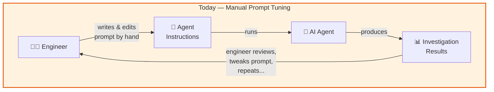
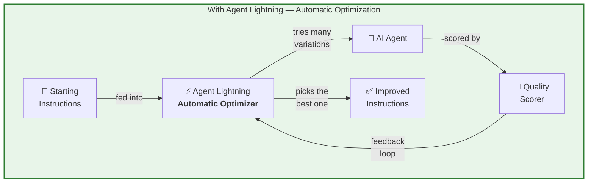
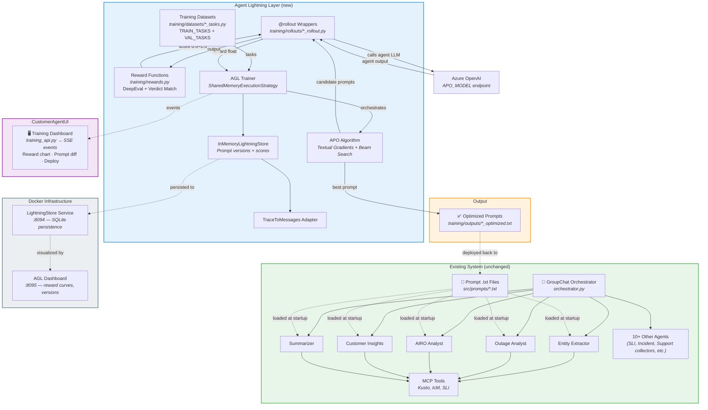
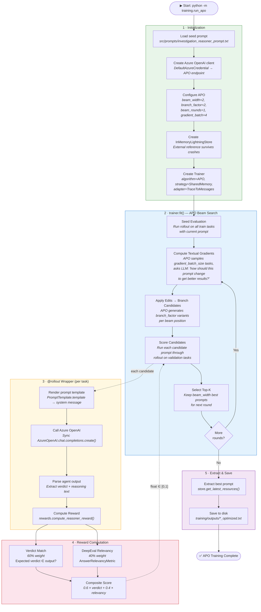
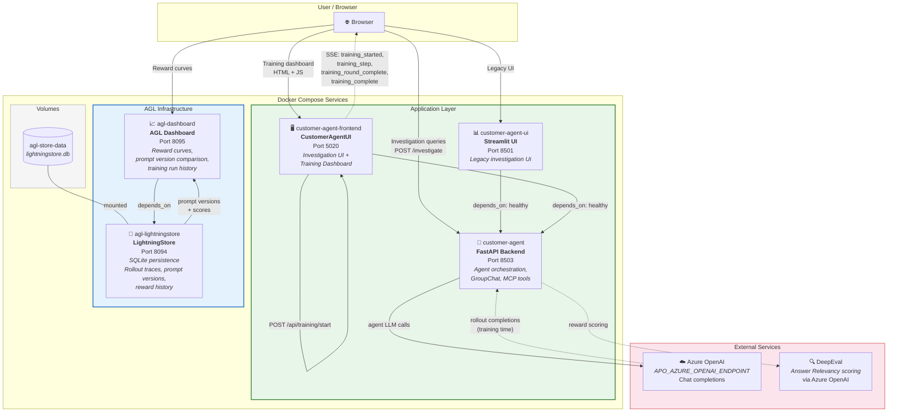

# Agent Lightning Integration — Architecture Diagrams

## Overview

These diagrams illustrate how **Agent Lightning (AGL)** integrates into the RATIO-AI **CustomerAgent** multi-agent investigation system. AGL adds automatic prompt optimization (APO) on top of the existing Microsoft Agent Framework (MAF) — the 15+ agent GroupChat system continues to run unchanged while AGL wraps each agent in a `@rollout` decorator, scores outputs via DeepEval, and uses textual gradients + beam search to iteratively improve prompts.

---

## Simplified Overview

How Agent Lightning improves our AI agents — no code knowledge required.

### What changes?

| | Before | After |
|---|---|---|
| **Who tunes prompts?** | Engineer, manually | Agent Lightning, automatically |
| **How long?** | Hours of trial & error | Minutes of automated optimization |
| **How do we know it's better?** | Gut feel + spot checks | Measured score improvement on test cases |
| **Risk of breaking things?** | High — no safety net | Low — old prompt backed up, score compared before deploying |

### The core idea in one sentence

> **Agent Lightning automatically rewrites AI agent instructions to make them better at their job, using the same "try → score → improve" loop that humans do — just faster and more systematic.**

---

## Diagram 1: High-Level Architecture

The left side is the existing MAF agent system (unchanged). The right side is the AGL training layer that wraps agents, computes rewards, and produces optimized prompts.

**Key insight:** AGL is a pure training-time addition. The MAF agents, GroupChat orchestration, and MCP tools are completely unchanged. AGL wraps each target agent in a `@rollout` function that calls the LLM directly (bypassing the full MAF factory for speed), scores the output, and feeds the reward back to APO for gradient-based prompt improvement.

---

## Diagram 2: APO Training Loop (Single Agent)

Traces one complete APO optimization cycle for a single agent. Shows how the seed prompt is iteratively improved through beam search with textual gradients.

**Key details:**
- The rollout wrapper uses a **sync `AzureOpenAI` client** (not the full MAF agent factory) for ~10x faster iteration — no need to spin up all 17 agents and MCP connections
- The Windows asyncio deque crash is mitigated by a monkey-patch on `SharedMemoryExecutionStrategy._run_runner` that retries on `IndexError`
- The `InMemoryLightningStore` is held as an external reference so prompt data survives runner thread crashes

---

## Diagram 3: Multi-Agent Optimization Pipeline

Sequential optimization order from `run_apo_all.py`. Entity extraction is the most upstream task; summarizer runs last because it synthesizes outputs from all analysts.

```mermaid
flowchart LR
    START(["▶ run_apo_all.py"])

    subgraph pipeline["Sequential Optimization Order"]
        direction LR
        EE["1️⃣ Entity Extractor<br/><i>maf_entity_extractor_prompt.txt</i><br/>Extracts services, regions, customers"]
        OA["2️⃣ Outage Analyst<br/><i>maf_outage_analyst_prompt.txt</i><br/>Analyzes outage signals"]
        AA["3️⃣ AIRO Analyst<br/><i>maf_airo_analyst_prompt.txt</i><br/>Analyzes AIRO data"]
        CI["4️⃣ Customer Insights<br/><i>maf_customer_insights_prompt.txt</i><br/>Analyzes customer impact"]
        SU["5️⃣ Summarizer<br/><i>maf_summarizer_prompt.txt</i><br/>Produces final summary"]
    end

    START --> EE
    EE -->|"✅ optimized prompt<br/>feeds downstream"| OA
    OA -->|"✅ optimized prompt"| AA
    AA -->|"✅ optimized prompt"| CI
    CI -->|"✅ optimized prompt"| SU

    subgraph per_agent["Per Agent: _optimize_agent()"]
        direction TB
        LOAD2["Load seed from src/prompts/"]
        IMPORT["Dynamic import:<br/>rollout module + dataset module"]
        APO2["Configure APO + Trainer"]
        FIT2["trainer.fit(rollout, train, val)"]
        EXTRACT2["Extract best prompt"]
        SAVE2["Save to training/outputs/"]
    end

    EE -.-> per_agent

    subgraph outputs["Optimized Outputs"]
        O1["entity_extractor_prompt_optimized.txt"]
        O2["outage_analyst_prompt_optimized.txt"]
        O3["airo_analyst_prompt_optimized.txt"]
        O4["customer_insights_prompt_optimized.txt"]
        O5["summarizer_prompt_optimized.txt"]
    end

    SU --> SUMMARY(["📊 Summary Table<br/><i>Agent | Seed | Optimized | Changed | Time</i>"])

    EE -.-> O1
    OA -.-> O2
    AA -.-> O3
    CI -.-> O4
    SU -.-> O5

    subgraph cli["CLI Options"]
        direction TB
        ALL["--agents entity_extractor,summarizer<br/><i>Run subset in order</i>"]
        SKIP["--skip-to customer_insights<br/><i>Resume from a specific agent</i>"]
    end

    style pipeline fill:#e3f2fd,stroke:#1565C0,stroke-width:2px
    style per_agent fill:#f1f8e9,stroke:#558B2F
    style outputs fill:#fff3e0,stroke:#E65100
    style cli fill:#eceff1,stroke:#455A64
```

**Why this order?** Entity extraction is the most upstream task — its output (identified services, regions, customers) feeds into all analyst agents. The summarizer runs last because it synthesizes outputs from all analysts. Optimizing upstream prompts first ensures downstream agents train against the best available upstream quality.

---

## Diagram 4: Service Topology

Docker Compose service topology showing ports, data flows, and dependencies.

### Port Summary

| Port | Service | Purpose |
|------|---------|---------|
| **5020** | CustomerAgentUI | Training dashboard + investigation UI |
| **8094** | LightningStore | Persistent prompt/trace storage (SQLite) |
| **8095** | AGL Dashboard | Training visualization (reward curves, prompt diffs) |
| **8501** | Streamlit UI | Legacy investigation interface |
| **8503** | CustomerAgent | FastAPI backend (GroupChat orchestration, agents, MCP) |

### Data Flow Summary

| Flow | Protocol | Description |
|------|----------|-------------|
| UI → Training API | `POST /api/training/start` | Kicks off APO training (demo or live mode) |
| Training API → Browser | **SSE** (`text/event-stream`) | Real-time progress: round starts, gradient steps, scores, completion |
| Trainer → LightningStore | Internal SDK | Writes prompt versions, rollout traces, reward history |
| LightningStore → Dashboard | HTTP read | Dashboard reads store for visualization |
| Rollout → Azure OpenAI | HTTPS | Chat completion calls during training (sync client) |
| Reward → DeepEval → Azure OpenAI | HTTPS | Answer Relevancy scoring via the APO model endpoint |
