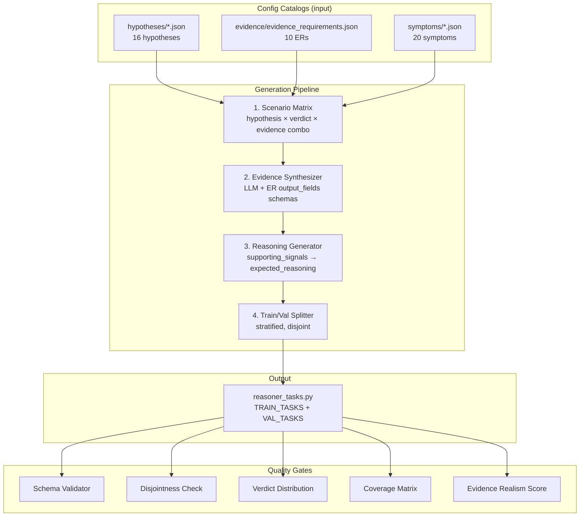
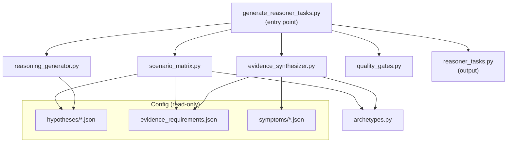
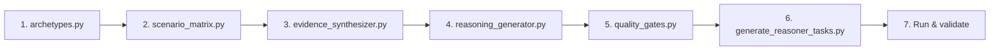

# F06: Automated Dataset Generation Plan for Reasoner APO Training

## Executive Summary

F06 requires 20+ training tasks and 10+ validation tasks for the `reasoner` agent's prompt optimization via Agent Lightning (AGL). The existing F06 spec in the [integration plan](agent-lightning-integration-plan.md) defines the task schema and provides 3 example tasks — but leaves the remaining 27+ tasks as a manual exercise. Manual data entry is slow, error-prone, and decouples the dataset from the config catalogs it should mirror.

This plan replaces manual authoring with a **fully automated generation pipeline** that:

1. Reads the hypothesis, evidence, and symptom catalogs (`src/config/hypotheses/`, `src/config/evidence/`, `src/config/symptoms/`) as structural input
2. Generates a **scenario matrix** of every (hypothesis × verdict × evidence combination) that the reasoner could encounter
3. Synthesizes realistic evidence text using LLM generation grounded in real Kusto data patterns and ER output field schemas
4. Produces expected reasoning aligned with each hypothesis's `supporting_signals` rubric
5. Stratifies the output into disjoint train/val sets with guaranteed coverage of every hypothesis ID, every verdict, and every ER-ID
6. Validates quality via automated gates (schema checks, distribution balance, disjointness, coverage matrix, LLM-judged evidence realism)

The pipeline runs as a single Python script (`training/datasets/generate_reasoner_tasks.py`) and outputs the canonical `TRAIN_TASKS` and `VAL_TASKS` lists to `training/datasets/reasoner_tasks.py`. It can be re-run whenever configs evolve.

---

## Architecture Overview



---

## Data Sources

### 1. Hypothesis Catalogs (structural backbone)

The generator reads all 4 hypothesis files to build the scenario matrix.

| File | Hypotheses | IDs |
|------|-----------|-----|
| `src/config/hypotheses/outage_hypotheses.json` | 5 | HYP-OUT-001 through HYP-OUT-005 |
| `src/config/hypotheses/sli_hypotheses.json` | 5 | HYP-SLI-001 through HYP-SLI-005 |
| `src/config/hypotheses/dependency_hypotheses.json` | 2 | HYP-DEP-001, HYP-DEP-002 |
| `src/config/hypotheses/risk_hypotheses.json` | 1 | HYP-RISK-003 |

**Total: 13 hypotheses** (some repos reference up to 16 with future additions).

Each hypothesis provides:
- `id`, `name`, `statement` (with template variables like `{incident_id}`, `{severity}`)
- `expected_symptoms[]` — the symptom IDs the reasoner checks
- `evidence_needed[]` — the ER-IDs that must be collected
- `supporting_signals` — the natural-language grading rubric the reasoner uses to weigh evidence
- `min_symptoms_for_match` — minimum symptom count for triage to surface this hypothesis

These fields directly determine what realistic evidence looks like for each verdict.

### 2. Evidence Requirements (`src/config/evidence/evidence_requirements.json`)

10 ER definitions, each with `output_fields` that define the schema of evidence summaries.

| ER-ID | Category | Key Output Fields |
|-------|----------|-------------------|
| ER-OUT-001 | IcM | IncidentId, Severity, IsOutage, Title, Status, ImpactStartDate, ChildCount, SupportTicketId |
| ER-OUT-002 | IcM | Root cause analysis text |
| ER-SLI-001 | SLI | CustomerName, SubscriptionId, Region, SLO_SliId, ImpactedResources, TotalImpactDurationMin, AvgValueAcrossWindows |
| ER-SLI-002 | SLI | Region, SLO_SliId, ImpactedSubscriptions (cross-customer) |
| ER-TKT-001 | Support | CaseNumber, Title, IsCritSit, SupportProductName, Severity |
| ER-TKT-002 | Support | Cross-customer support request aggregate |
| ER-LOAD-001 | SLI | Workload/throughput metrics (derived from SLI patterns) |
| ER-LOAD-002 | SLI | Cross-customer baseline comparison |
| ER-DEP-002 | Dependency | DependencyServiceName, Region, SLO_SliId, ImpactedSubscriptions |
| ER-REGION-001 | Dependency | CustomerName, Region |

The `output_fields` arrays are the **schema contract** for synthesized evidence — every generated evidence string must reference fields from these schemas to be realistic.

### 3. Symptom Templates (`src/config/symptoms/`)

20 symptom templates across 4 files. Each symptom has a `template` field with placeholders (e.g., `{incident_id}`, `{impacted_resources}`) and `filters` that define threshold conditions (e.g., `min_impacted_resources: 1`, `max_delta_minutes: 60`).

| File | Symptoms | IDs |
|------|---------|-----|
| `sli_breach.json` | 7 | SYM-SLI-001 through SYM-SLI-007 |
| `outage_exposure.json` | 4 | SYM-OUT-001 through SYM-OUT-004 |
| `support_tickets.json` | 5 | SYM-SUP-001 through SYM-SUP-005 |
| `dependency_degradation.json` | 3 | SYM-DEP-001 through SYM-DEP-003 |

Symptom templates ground the evidence text — for a CONFIRMED scenario, the evidence must contain data that satisfies the symptom filters; for REFUTED, it must violate them.

### 4. Kusto Data Patterns (realism grounding)

The generator does NOT query Kusto live. Instead, it uses **curated data archetypes** — realistic value ranges derived from real IcM/SLI/SR data patterns:

| Data Domain | Archetype Values |
|-------------|-----------------|
| Incident IDs | `INC-YYYY-NNNNN` format, Severity 1–3, Status Active/Mitigated/Resolved |
| Regions | eastus, westus2, westeurope, southcentralus, southeastasia, etc. |
| SLI values | AvgValue: 0.0 (total failure) – 99.9 (healthy), MinValue: 0 (critical) – 95 (degraded) |
| Impact duration | 5 min (transient) – 480 min (prolonged) |
| ImpactedResources | 1 (isolated) – 500+ (widespread) |
| Support case IDs | `SRnnnnnnnnnn` format, Severity A/B/C |
| Customer names | Fictional but realistic: "Contoso Corp", "Fabrikam Inc", "Woodgrove Bank" |
| SubscriptionIds | UUIDs: `aaaaaaaa-bbbb-cccc-dddd-eeeeeeeeeeee` pattern |
| SLO_SliId | Realistic SLI names: "Availability", "Latency_P99", "ErrorRate", "Throughput" |
| OwningTenantName | Real Azure team names: "Azure Storage", "Azure SQL", "Azure Networking" |

These archetypes are defined as constant dictionaries in the generator, keeping the pipeline offline and deterministic.

---

## Generation Pipeline

### Step 1: Build the Scenario Matrix

The generator loads all hypothesis configs and computes a **cross-product** of (hypothesis × verdict), then assigns evidence combinations to each scenario.

```python
# Pseudocode — scenario_matrix.py logic

from itertools import product

VERDICTS = ["CONFIRMED", "CONTRIBUTING", "REFUTED", "needs_more_evidence"]

def build_scenario_matrix(hypotheses: list[dict]) -> list[dict]:
    """Generate one scenario per (hypothesis, verdict) pair.

    For each pair, determine which ERs should be present/absent/conflicting
    based on the verdict:
      CONFIRMED       → All critical ERs present and supporting
      CONTRIBUTING    → Most ERs present, mixed signals
      REFUTED         → Critical ERs present but contradicting
      needs_more_evidence → Critical ERs missing/empty
    """
    scenarios = []
    for hyp in hypotheses:
        for verdict in VERDICTS:
            scenarios.append({
                "hypothesis_id": hyp["id"],
                "hypothesis_name": hyp["name"],
                "hypothesis_statement": hyp["statement"],
                "category": hyp["category"],
                "expected_symptoms": hyp["expected_symptoms"],
                "evidence_needed": hyp["evidence_needed"],
                "supporting_signals": hyp["supporting_signals"],
                "target_verdict": verdict,
                "er_plan": _plan_evidence(hyp, verdict),
            })
    return scenarios  # 13 hypotheses × 4 verdicts = 52 base scenarios
```

The `_plan_evidence()` function assigns an evidence posture to each ER-ID the hypothesis requires:

```python
def _plan_evidence(hyp: dict, verdict: str) -> list[dict]:
    """Decide the evidence posture for each ER the hypothesis needs."""
    plans = []
    critical_ers = _identify_critical_ers(hyp)  # e.g., ER-OUT-001 for outage hyps

    for er_id in hyp["evidence_needed"]:
        is_critical = er_id in critical_ers

        if verdict == "CONFIRMED":
            posture = "strongly_supports"
        elif verdict == "CONTRIBUTING":
            posture = "supports" if is_critical else "inconclusive"
        elif verdict == "REFUTED":
            posture = "refutes" if is_critical else "inconclusive"
        elif verdict == "needs_more_evidence":
            posture = "missing" if is_critical else "supports"

        plans.append({"er_id": er_id, "posture": posture, "is_critical": is_critical})
    return plans
```

**Critical ER identification** follows the rules from the reasoner prompt:
- Outage hypotheses → ER-OUT-001 is always critical
- SLI hypotheses → ER-SLI-001 is always critical
- Cross-customer determination → ER-SLI-002 or ER-TKT-002 is critical
- ER-OUT-002 is critical when incident exists but cause unknown

This produces 52 base scenarios. After deduplication and edge-case augmentation (Step 1b), the final matrix contains 35–45 scenarios.

#### Step 1b: Edge-Case Augmentation

Beyond the base matrix, inject specific edge cases that stress the reasoner:

| Edge Case | Description | Count |
|-----------|-------------|-------|
| **Conflicting evidence** | ER-SLI-001 strongly supports but ER-OUT-001 refutes (SLI breach exists but no matching incident) | 3 |
| **Time window mismatch** | Incident exists but `ImpactStartDate` is 6+ hours before SLI breach — outside the 60-min overlap threshold | 2 |
| **Empty evidence** | All ERs return empty/no-data — reasoner must handle gracefully | 2 |
| **Single weak signal** | Only one ER collected with `partially_supports` — not enough for any verdict | 2 |
| **Multi-service cascade** | 3+ incidents across different services with overlapping timelines — tests multi-hypothesis reasoning | 2 |
| **Near-threshold confidence** | Evidence crafted to produce confidence right at the 0.4 and 0.7 boundaries | 3 |

**Target total: 38–45 scenarios** (enough for 25 train + 13 val with margin).

### Step 2: Evidence Synthesis

For each scenario, the generator produces realistic evidence text. Two modes are available:

#### Mode A: Template-Based Synthesis (default, deterministic)

Each ER's `output_fields` define the data structure. The generator fills templates with archetype values matched to the scenario's `posture`:

```python
# Pseudocode — evidence_synthesizer.py logic

def synthesize_er_evidence(er_id: str, posture: str, hyp: dict, context: dict) -> str:
    """Generate realistic evidence text for a single ER.

    Args:
        er_id: The evidence requirement ID (e.g., "ER-OUT-001")
        posture: The evidence stance ("strongly_supports", "refutes", "missing", etc.)
        hyp: The hypothesis dict (for template variable resolution)
        context: Scenario context (region, customer_name, incident_id, etc.)
    """
    er_def = load_er_definition(er_id)

    if posture == "missing":
        return f"[{er_id}] No data available — collector returned empty results."

    # Select archetype values based on posture
    values = select_archetype_values(er_id, posture, context)

    # Build the evidence summary mimicking collector output format
    return format_er_summary(er_id, er_def, values, posture)
```

Example output for ER-OUT-001 with `posture="strongly_supports"`:

```text
[ER-OUT-001] Incident Details:
  IncidentId: INC-2026-04112
  Severity: 1
  IsOutage: true
  Title: "Azure SQL Database - Connectivity failures in East US"
  Status: Active
  CreateDate: 2026-04-15T08:12:00Z
  ImpactStartDate: 2026-04-15T07:45:00Z
  ChildCount: 8
  OwningTenantName: Azure SQL
  SupportTicketId: SR2180044521
```

Example output for ER-SLI-001 with `posture="refutes"`:

```text
[ER-SLI-001] Customer SLI Data:
  CustomerName: Contoso Corp
  SubscriptionId: a1b2c3d4-e5f6-7890-abcd-ef1234567890
  Region: eastus
  SLO_SliId: Availability
  ImpactedResources: 0
  TotalImpactDurationMin: 0
  EarliestImpactStart: null
  LatestImpactEnd: null
  AvgValueAcrossWindows: 99.95
  MinValueAcrossWindows: 99.80
  No SLI breaches detected for this customer in the specified time window.
```

The full evidence string for a task is the concatenation of all ER summaries:

```python
def build_full_evidence(scenario: dict) -> str:
    """Concatenate all ER evidence summaries into a single evidence string."""
    context = generate_scenario_context(scenario)
    parts = []
    for er_plan in scenario["er_plan"]:
        parts.append(synthesize_er_evidence(
            er_plan["er_id"], er_plan["posture"], scenario, context
        ))
    return "\n\n".join(parts)
```

#### Mode B: LLM-Augmented Synthesis (optional, for realism scoring)

For higher-fidelity evidence, the generator can call Azure OpenAI to produce natural-language evidence summaries. This is used selectively (e.g., for edge cases or when template output feels mechanical):

```python
async def llm_synthesize_evidence(scenario: dict, client: AsyncAzureOpenAI) -> str:
    """Use LLM to generate realistic evidence text for a scenario.

    The LLM receives:
    - The hypothesis statement and supporting_signals rubric
    - The ER output_fields schemas
    - The target posture for each ER
    - A few-shot example of what good evidence looks like

    The LLM produces a natural-language evidence summary that reads like
    real collector output.
    """
    system_prompt = (
        "You are an evidence data generator for an Azure incident investigation system. "
        "Generate realistic evidence summaries that match the specified output field schemas "
        "and evidence postures. Evidence should read like actual collector output — "
        "include specific IDs, timestamps, metrics, and service names."
    )
    user_prompt = _build_evidence_generation_prompt(scenario)

    response = await client.chat.completions.create(
        model="gpt-5",
        messages=[
            {"role": "system", "content": system_prompt},
            {"role": "user", "content": user_prompt},
        ],
        temperature=0.7,
    )
    return response.choices[0].message.content
```

**Default recommendation: Use Mode A for the initial 35+ scenarios, Mode B for 5–8 edge cases.** This keeps the pipeline deterministic and fast while adding realism where it matters most.

### Step 3: Expected Reasoning Generation

Each scenario needs an `expected_reasoning` string that describes what good reasoner output looks like. The generator derives this from the hypothesis's `supporting_signals` rubric:

```python
def generate_expected_reasoning(scenario: dict) -> str:
    """Generate expected_reasoning from the hypothesis rubric and evidence postures.

    The expected_reasoning should describe:
    1. Which ERs support/refute and why (referencing specific data points)
    2. Which symptoms are satisfied/not_satisfied
    3. Why the verdict is what it is (referencing the supporting_signals rubric)
    """
    verdict = scenario["target_verdict"]
    hyp = scenario
    er_plans = scenario["er_plan"]

    parts = []

    # Summarize evidence alignment
    supporting = [p for p in er_plans if p["posture"] in ("strongly_supports", "supports")]
    refuting = [p for p in er_plans if p["posture"] in ("refutes", "strongly_refutes")]
    missing = [p for p in er_plans if p["posture"] == "missing"]

    if verdict == "CONFIRMED":
        parts.append(
            f"Evidence from {len(supporting)} sources converges: "
            f"{', '.join(p['er_id'] for p in supporting)} all support the hypothesis."
        )
        parts.append(
            f"The supporting_signals rubric is satisfied: {_extract_key_rubric_conditions(hyp)}"
        )
        parts.append("Cross-domain correlation (SLI + incident + support) strengthens confidence above 0.7.")

    elif verdict == "REFUTED":
        parts.append(
            f"Critical evidence contradicts the hypothesis: "
            f"{', '.join(p['er_id'] for p in refuting)} refute the expected pattern."
        )
        parts.append(
            f"Key rubric conditions are NOT met: {_extract_missing_rubric_conditions(hyp, er_plans)}"
        )
        parts.append("Confidence falls below 0.4 — the hypothesis is refuted.")

    elif verdict == "CONTRIBUTING":
        parts.append(
            f"Partial support from {len(supporting)} sources, but "
            f"{len(refuting)} sources are inconclusive or weakly contradicting."
        )
        parts.append("The hypothesis is a contributing factor but not the sole root cause.")
        parts.append("Confidence is 0.4–0.69 with all critical ERs collected.")

    elif verdict == "needs_more_evidence":
        parts.append(
            f"Critical evidence is missing: {', '.join(p['er_id'] for p in missing)}."
        )
        parts.append(
            "Without these ERs, the verdict could flip between CONFIRMED and REFUTED."
        )
        parts.append("Confidence is 0.4–0.69 but critical ERs are not yet collected.")

    return " ".join(parts)
```

### Step 4: Hypothesis Statement Resolution

The hypothesis `statement` fields contain template variables like `{incident_id}`, `{severity}`, `{region}`. The generator resolves these using the scenario context:

```python
def resolve_hypothesis_statement(statement_template: str, context: dict) -> str:
    """Fill hypothesis template variables with scenario-specific values.

    Example:
      Input:  "Incident '{incident_id}' (Severity {severity}) by '{owning_tenant_name}'..."
      Output: "Incident 'INC-2026-04112' (Severity 1) by 'Azure SQL'..."
    """
    return statement_template.format_map(defaultdict(lambda: "<unknown>", context))
```

### Step 5: Train/Val Split with Stratification

The splitter ensures:
1. **Disjointness** — no scenario appears in both sets
2. **Verdict balance** — each set has at least 2 tasks per verdict category
3. **Hypothesis coverage** — every hypothesis ID appears at least once across both sets
4. **ER coverage** — every ER-ID referenced by any hypothesis appears in at least one task's evidence

```python
def split_train_val(
    scenarios: list[dict],
    train_ratio: float = 0.65,
    min_train: int = 20,
    min_val: int = 10,
) -> tuple[list[dict], list[dict]]:
    """Stratified split ensuring coverage guarantees.

    Strategy:
    1. Group scenarios by verdict
    2. Within each verdict group, sort by hypothesis_id for determinism
    3. Assign ~65% to train, ~35% to val from each group
    4. Verify coverage constraints; if violated, swap tasks between sets
    """
    from collections import defaultdict
    import random

    random.seed(42)  # Reproducible splits

    by_verdict = defaultdict(list)
    for s in scenarios:
        by_verdict[s["target_verdict"]].append(s)

    train, val = [], []
    for verdict, group in by_verdict.items():
        random.shuffle(group)
        split_idx = max(2, int(len(group) * train_ratio))  # At least 2 per verdict in train
        train.extend(group[:split_idx])
        val.extend(group[split_idx:])

    # Ensure minimums
    assert len(train) >= min_train, f"Train set too small: {len(train)} < {min_train}"
    assert len(val) >= min_val, f"Val set too small: {len(val)} < {min_val}"

    # Verify hypothesis coverage
    _verify_hypothesis_coverage(train, val, scenarios)

    return train, val
```

### Step 6: Output Formatting

The final step formats the scenarios into the exact task dict structure that `training/datasets/reasoner_tasks.py` exports:

```python
def format_task(scenario: dict, evidence_text: str, expected_reasoning: str) -> dict:
    """Format a scenario into the AGL task dict.

    Output matches the schema expected by the reasoner rollout wrapper (F07)
    and the reward function (F04).
    """
    return {
        "hypothesis": resolve_hypothesis_statement(
            scenario["hypothesis_statement"],
            scenario["_context"],
        ),
        "evidence": evidence_text,
        "expected_verdict": scenario["target_verdict"],
        "expected_reasoning": expected_reasoning,
    }
```

---

## Quality Gates

All quality gates run automatically after generation. Any failure blocks output.

### Gate 1: Schema Validation

```python
def validate_schema(tasks: list[dict]) -> None:
    """Ensure every task has exactly the required keys with correct types."""
    REQUIRED_KEYS = {"hypothesis", "evidence", "expected_verdict", "expected_reasoning"}
    VALID_VERDICTS = {"CONFIRMED", "CONTRIBUTING", "REFUTED", "needs_more_evidence"}

    for i, task in enumerate(tasks):
        assert set(task.keys()) == REQUIRED_KEYS, f"Task {i}: unexpected keys {set(task.keys())}"
        assert isinstance(task["hypothesis"], str) and len(task["hypothesis"]) > 20
        assert isinstance(task["evidence"], str) and len(task["evidence"]) > 50
        assert task["expected_verdict"] in VALID_VERDICTS, f"Task {i}: invalid verdict"
        assert isinstance(task["expected_reasoning"], str) and len(task["expected_reasoning"]) > 30
```

### Gate 2: Verdict Distribution Balance

```python
def validate_distribution(train: list[dict], val: list[dict]) -> None:
    """Ensure no verdict category is under-represented."""
    from collections import Counter

    for name, tasks in [("train", train), ("val", val)]:
        dist = Counter(t["expected_verdict"] for t in tasks)
        for verdict in ["CONFIRMED", "CONTRIBUTING", "REFUTED", "needs_more_evidence"]:
            assert dist[verdict] >= 2, f"{name}: verdict '{verdict}' has only {dist[verdict]} tasks (need ≥2)"
```

### Gate 3: Disjointness Check

```python
def validate_disjoint(train: list[dict], val: list[dict]) -> None:
    """Ensure no hypothesis text appears in both train and val sets."""
    train_hyps = {t["hypothesis"] for t in train}
    val_hyps = {t["hypothesis"] for t in val}
    overlap = train_hyps & val_hyps
    assert len(overlap) == 0, f"Train/val overlap: {overlap}"
```

### Gate 4: Coverage Matrix

```python
def validate_coverage(
    train: list[dict],
    val: list[dict],
    all_hypothesis_ids: set[str],
    all_er_ids: set[str],
) -> None:
    """Ensure every hypothesis ID and every ER-ID appears at least once."""
    all_tasks = train + val

    # Check hypothesis ID coverage (hypothesis text contains the ID)
    covered_hyps = set()
    for task in all_tasks:
        for hyp_id in all_hypothesis_ids:
            if hyp_id in task["hypothesis"] or hyp_id in task["evidence"]:
                covered_hyps.add(hyp_id)
    missing_hyps = all_hypothesis_ids - covered_hyps
    assert len(missing_hyps) == 0, f"Uncovered hypothesis IDs: {missing_hyps}"

    # Check ER-ID coverage (evidence text references the ER-ID)
    covered_ers = set()
    for task in all_tasks:
        for er_id in all_er_ids:
            if er_id in task["evidence"]:
                covered_ers.add(er_id)
    missing_ers = all_er_ids - covered_ers
    assert len(missing_ers) == 0, f"Uncovered ER-IDs: {missing_ers}"
```

### Gate 5: Evidence Realism Score (LLM Judge)

An optional gate that uses an LLM to score whether generated evidence reads like real collector output:

```python
async def score_evidence_realism(
    tasks: list[dict],
    client: AsyncAzureOpenAI,
    threshold: float = 0.7,
) -> float:
    """Score evidence realism using an LLM judge.

    Returns average realism score (0.0–1.0). Fails if below threshold.
    """
    scores = []
    for task in tasks[:10]:  # Sample 10 tasks to limit cost
        response = await client.chat.completions.create(
            model="gpt-5",
            messages=[
                {"role": "system", "content": (
                    "You are an evidence quality judge. Score the following evidence text "
                    "on a scale of 0.0 to 1.0 for realism — does it read like actual output "
                    "from an Azure monitoring collector? Consider: specific IDs, realistic "
                    "timestamps, plausible metric values, correct field names, and natural "
                    "language consistency. Return ONLY a float."
                )},
                {"role": "user", "content": task["evidence"]},
            ],
            temperature=0.0,
        )
        score = float(response.choices[0].message.content.strip())
        scores.append(score)

    avg_score = sum(scores) / len(scores)
    assert avg_score >= threshold, f"Evidence realism score {avg_score:.2f} < {threshold}"
    return avg_score
```

### Gate 6: Reward Function Smoke Test

Verify that generated tasks produce valid rewards when passed through the existing reward function:

```python
def smoke_test_rewards(tasks: list[dict]) -> None:
    """Run each task through compute_reasoner_reward with a mock agent output."""
    from learning.rewards import compute_reasoner_reward

    for task in tasks:
        # Simulate a correct agent output
        mock_output = f"Determination: {task['expected_verdict']}. {task['expected_reasoning']}"
        reward = compute_reasoner_reward(
            hypothesis=task["hypothesis"],
            evidence=task["evidence"],
            agent_output=mock_output,
            expected_verdict=task["expected_verdict"],
            expected_reasoning=task["expected_reasoning"],
        )
        assert 0.0 <= reward <= 1.0, f"Reward out of range: {reward}"
        # Correct verdict should produce reward >= 0.5 (0.6 * 1.0 + 0.4 * reasoning)
        assert reward >= 0.5, f"Correct-verdict reward too low: {reward}"
```

---

## Implementation Plan

### Files to Create

| File | Purpose | LOC (est.) |
|------|---------|-----------|
| `training/datasets/generate_reasoner_tasks.py` | Main generation script — orchestrates the full pipeline | 350–450 |
| `training/datasets/scenario_matrix.py` | Step 1: Build the scenario matrix from config catalogs | 120–160 |
| `training/datasets/evidence_synthesizer.py` | Step 2: Synthesize evidence text (template-based + optional LLM) | 200–280 |
| `training/datasets/reasoning_generator.py` | Step 3: Generate expected_reasoning from rubrics | 80–120 |
| `training/datasets/quality_gates.py` | Validation functions (Gates 1–6) | 100–140 |
| `training/datasets/archetypes.py` | Constant dictionaries of realistic archetype values | 60–80 |
| `training/datasets/reasoner_tasks.py` | Generated output (TRAIN_TASKS + VAL_TASKS) — written by the generator | Auto-generated |

### File Dependency Graph



### Module Specifications

#### `archetypes.py`

```python
"""Realistic data archetypes for evidence synthesis.

Constants only — no logic. Provides value pools that the evidence
synthesizer draws from when filling ER output field templates.
"""

REGIONS = [
    "eastus", "eastus2", "westus2", "westus3", "centralus",
    "westeurope", "northeurope", "southeastasia", "southcentralus",
    "australiaeast", "japaneast", "uksouth",
]

CUSTOMER_NAMES = [
    "Contoso Corp", "Fabrikam Inc", "Woodgrove Bank", "Adventure Works",
    "Northwind Traders", "Tailspin Toys", "Alpine Ski House", "Datum Corp",
]

OWNING_TENANTS = [
    "Azure SQL", "Azure Storage", "Azure Networking", "Azure Compute",
    "Azure Cosmos DB", "Azure App Service", "Azure Kubernetes Service",
    "Azure Virtual Machines", "Azure DNS", "Azure Load Balancer",
]

SLI_NAMES = [
    "Availability", "Latency_P99", "Latency_P50", "ErrorRate",
    "Throughput", "ConnectionSuccess", "QuerySuccess", "ReplicationLag",
]

SUPPORT_PRODUCTS = [
    "Azure SQL Database", "Azure Storage Accounts", "Azure Virtual Machines",
    "Azure Kubernetes Service", "Azure Cosmos DB", "Azure App Service",
]

SEVERITY_LEVELS = [1, 2, 3]
SUPPORT_SEVERITIES = ["A", "B", "C"]

# Value ranges keyed by posture
SLI_VALUES = {
    "strongly_supports": {"avg": (0.0, 5.0), "min": (0.0, 0.0), "resources": (10, 500), "duration_min": (30, 480)},
    "supports": {"avg": (5.0, 30.0), "min": (0.0, 5.0), "resources": (3, 50), "duration_min": (15, 120)},
    "partially_supports": {"avg": (30.0, 60.0), "min": (10.0, 30.0), "resources": (1, 10), "duration_min": (5, 30)},
    "inconclusive": {"avg": (50.0, 80.0), "min": (40.0, 60.0), "resources": (0, 3), "duration_min": (0, 10)},
    "refutes": {"avg": (90.0, 99.9), "min": (85.0, 99.0), "resources": (0, 0), "duration_min": (0, 0)},
    "strongly_refutes": {"avg": (99.0, 100.0), "min": (98.0, 100.0), "resources": (0, 0), "duration_min": (0, 0)},
}
```

#### `scenario_matrix.py`

```python
"""Build the scenario matrix from config catalogs.

Reads hypothesis, evidence, and symptom configs. Produces a list of
scenario dicts, each containing the hypothesis metadata, target verdict,
and an evidence plan (posture per ER-ID).
"""
from __future__ import annotations
import json
from pathlib import Path

_CONFIG_ROOT = Path(__file__).resolve().parents[2] / "src" / "config"

def load_all_hypotheses() -> list[dict]:
    """Load and merge all hypothesis files."""
    hyps = []
    for f in (_CONFIG_ROOT / "hypotheses").glob("*.json"):
        data = json.loads(f.read_text())
        hyps.extend(data.get("hypotheses", []))
    return hyps

def load_evidence_requirements() -> dict[str, dict]:
    """Load evidence requirements keyed by ER-ID."""
    data = json.loads((_CONFIG_ROOT / "evidence" / "evidence_requirements.json").read_text())
    return {er["id"]: er for er in data["evidence_requirements"]}

def build_scenario_matrix() -> list[dict]:
    """Main entry point — returns the full scenario list."""
    ...
```

#### `evidence_synthesizer.py`

```python
"""Synthesize realistic evidence text for each scenario.

Uses ER output_fields schemas and archetype values to produce evidence
strings that mimic real collector output. Supports template-based
(deterministic) and optional LLM-augmented modes.
"""
from __future__ import annotations
import random
from datetime import datetime, timedelta
from archetypes import *

def synthesize_evidence(scenario: dict, mode: str = "template") -> str:
    """Generate the full evidence string for a scenario."""
    ...

def _synthesize_er_out_001(posture: str, context: dict) -> str:
    """Generate ER-OUT-001 (Incident Details) evidence."""
    ...

def _synthesize_er_sli_001(posture: str, context: dict) -> str:
    """Generate ER-SLI-001 (Customer SLI Data) evidence."""
    ...

# ... one function per ER-ID
```

#### `generate_reasoner_tasks.py` (entry point)

```python
"""Automated generation of reasoner training/validation datasets.

Usage:
    cd Code/CustomerAgent
    python -m training.datasets.generate_reasoner_tasks

Reads hypothesis, evidence, and symptom catalogs from src/config/.
Writes TRAIN_TASKS and VAL_TASKS to training/datasets/reasoner_tasks.py.
Runs all quality gates before writing output.
"""
from __future__ import annotations
import sys
from pathlib import Path

from learning.datasets.scenario_matrix import build_scenario_matrix, load_all_hypotheses, load_evidence_requirements
from learning.datasets.evidence_synthesizer import synthesize_evidence
from learning.datasets.reasoning_generator import generate_expected_reasoning
from learning.datasets.quality_gates import (
    validate_schema,
    validate_distribution,
    validate_disjoint,
    validate_coverage,
    smoke_test_rewards,
)


def main() -> None:
    # Step 1: Build scenario matrix
    scenarios = build_scenario_matrix()
    print(f"Generated {len(scenarios)} scenarios")

    # Step 2-3: Synthesize evidence + reasoning for each scenario
    tasks = []
    for scenario in scenarios:
        evidence = synthesize_evidence(scenario)
        reasoning = generate_expected_reasoning(scenario)
        tasks.append({
            "hypothesis": scenario["resolved_statement"],
            "evidence": evidence,
            "expected_verdict": scenario["target_verdict"],
            "expected_reasoning": reasoning,
        })

    # Step 4: Split into train/val
    train, val = split_train_val(tasks)
    print(f"Split: {len(train)} train, {len(val)} val")

    # Step 5: Run quality gates
    print("Running quality gates...")
    validate_schema(train + val)
    validate_distribution(train, val)
    validate_disjoint(train, val)

    all_hyp_ids = {h["id"] for h in load_all_hypotheses()}
    all_er_ids = set(load_evidence_requirements().keys())
    validate_coverage(train, val, all_hyp_ids, all_er_ids)

    smoke_test_rewards(train + val)
    print("All quality gates passed ✓")

    # Step 6: Write output
    output_path = Path(__file__).parent / "reasoner_tasks.py"
    _write_tasks_file(output_path, train, val)
    print(f"Wrote {output_path}")


def _write_tasks_file(path: Path, train: list[dict], val: list[dict]) -> None:
    """Write the reasoner_tasks.py file with TRAIN_TASKS and VAL_TASKS."""
    lines = [
        '"""Auto-generated reasoner training/validation datasets.',
        "",
        "Generated by: training/datasets/generate_reasoner_tasks.py",
        "Do not edit manually — re-run the generator to update.",
        '"""',
        "from __future__ import annotations",
        "",
        "",
        f"TRAIN_TASKS: list[dict] = {_pformat(train)}",
        "",
        "",
        f"VAL_TASKS: list[dict] = {_pformat(val)}",
        "",
    ]
    path.write_text("\n".join(lines))


if __name__ == "__main__":
    main()
```

### Dependencies

| Package | Required By | Already Installed? |
|---------|------------|-------------------|
| `deepeval` | `quality_gates.py` (smoke_test_rewards → rewards.py) | Yes |
| `openai` | `evidence_synthesizer.py` (Mode B, optional) | Yes |
| `azure-identity` | `evidence_synthesizer.py` (Mode B, optional) | Yes |

No new dependencies required.

### Implementation Order



Each module can be implemented and unit-tested independently. The entry point (`generate_reasoner_tasks.py`) wires them together.

---

## CI/CD Integration

### Keeping Datasets Fresh

The generated dataset should be regenerated whenever the config catalogs change:

```yaml
# In Azure Pipelines or GitHub Actions
trigger:
  paths:
    include:
      - Code/CustomerAgent/src/config/hypotheses/**
      - Code/CustomerAgent/src/config/evidence/**
      - Code/CustomerAgent/src/config/symptoms/**
      - Code/CustomerAgent/training/datasets/generate_reasoner_tasks.py
      - Code/CustomerAgent/training/datasets/archetypes.py

steps:
  - script: |
      cd Code/CustomerAgent
      python -m training.datasets.generate_reasoner_tasks
    displayName: "Regenerate reasoner datasets"

  - script: |
      cd Code/CustomerAgent
      python -c "
      from learning.datasets.reasoner_tasks import TRAIN_TASKS, VAL_TASKS
      print(f'Train: {len(TRAIN_TASKS)}, Val: {len(VAL_TASKS)}')
      assert len(TRAIN_TASKS) >= 20
      assert len(VAL_TASKS) >= 10
      "
    displayName: "Validate generated datasets"
```

### Pre-commit Hook (optional)

A lightweight check that the generated file is not stale:

```bash
# .pre-commit-config.yaml entry
- repo: local
  hooks:
    - id: check-reasoner-tasks
      name: Check reasoner tasks are up-to-date
      entry: python -c "from learning.datasets.reasoner_tasks import TRAIN_TASKS, VAL_TASKS; assert len(TRAIN_TASKS) >= 20"
      language: python
      files: 'training/datasets/reasoner_tasks\.py$'
```

### Regeneration Workflow

When a developer adds a new hypothesis to the config catalogs:

1. Add the hypothesis to the appropriate `src/config/hypotheses/*.json` file
2. Run `python -m training.datasets.generate_reasoner_tasks` from `Code/CustomerAgent/`
3. The generator automatically:
   - Picks up the new hypothesis ID
   - Creates 4 new scenarios (one per verdict)
   - Synthesizes evidence and reasoning
   - Re-stratifies the train/val split
   - Validates all quality gates
4. Commit the updated `reasoner_tasks.py` alongside the config change
5. The CI pipeline validates the generated output on PR

---

## Appendix A: Full Hypothesis × Verdict Matrix

This table shows all 52 base scenarios. The generator produces one task per row.

| Hypothesis ID | Category | CONFIRMED | CONTRIBUTING | REFUTED | needs_more_evidence |
|--------------|----------|-----------|-------------|---------|---------------------|
| HYP-OUT-001 | outage | All 6 ERs support | SLI + incident support, support tickets inconclusive | SLI shows no breach despite incident | ER-OUT-001 missing (no incident data) |
| HYP-OUT-002 | outage | SLI breach predates incident, compounding confirmed | SLI breach overlaps but pre-existing degradation unclear | SLI breach starts AFTER incident (not pre-existing) | ER-SLI-001 missing |
| HYP-OUT-003 | outage | High ChildCount + cross-region SLI + multi-customer tickets | Incident exists but ChildCount is low (1-2) | No cross-subscription or cross-region pattern | ER-DEP-002 missing |
| HYP-OUT-004 | outage | SupportTicketId links incident to customer case | Incident exists but SupportTicketId is null | Incident resolved before ticket filed | ER-TKT-001 missing |
| HYP-OUT-005 | outage | No SLI breach, no time overlap — false positive confirmed | Incident exists but SLI is borderline (avg=80) | SLI breach clearly correlates (this is NOT a false positive) | ER-SLI-001 missing |
| HYP-SLI-001 | sli | Outage + SLI breach + time overlap ≤60 min | SLI breach exists but time overlap is 90 min (outside window) | No matching incident, SLI breach is customer-side | ER-OUT-001 missing |
| HYP-SLI-002 | sli | Multi-SLI breach, single sub+region, no outage | SLI breach exists but only 1 SLI affected | Outage exists — this is not a config change | ER-SLI-001 missing |
| HYP-SLI-003 | sli | Critical severity (min=0, avg<1.0), high resource count | SLI degraded but not critical (avg=40) | SLI values healthy (avg=95) | ER-LOAD-001 missing |
| HYP-SLI-004 | sli | Cross-sub + cross-region SLI breach, no outage | Cross-sub but single region | No cross-sub or cross-region pattern | ER-DEP-002 missing |
| HYP-SLI-005 | sli | Single-sub + high ImpactedResources + support case | SLI breach but no support case | Customer baseline matches fleet (not anomalous) | ER-LOAD-001 + ER-LOAD-002 missing |
| HYP-DEP-001 | dependency | Dependency SLI breach in customer region + customer SLI breach | Dependency degraded but customer not yet impacted | No dependency SLI breach in customer regions | ER-DEP-002 missing |
| HYP-DEP-002 | dependency | Connectivity dependency degraded + customer SLI breach | Dependency degraded, customer borderline | No dependency degradation detected | ER-REGION-001 missing |
| HYP-RISK-003 | risk | Cross-customer regional degradation + customer SLI breach | Regional degradation exists but customer not impacted yet | No cross-customer degradation in customer regions | ER-SLI-002 missing |

---

## Appendix B: Edge Case Catalog

| # | Edge Case | Hypothesis | Verdict | Key Challenge |
|---|-----------|-----------|---------|---------------|
| E1 | Conflicting SLI vs. Incident | HYP-OUT-001 | CONTRIBUTING | SLI shows breach but incident is resolved with "no customer impact" in root cause |
| E2 | Time window just outside threshold | HYP-SLI-001 | REFUTED | ImpactStartDate is 65 min before SLI breach (threshold is 60 min) |
| E3 | All evidence empty | HYP-SLI-003 | needs_more_evidence | Every ER returns "No data available" |
| E4 | Single weak ER-TKT-001 | HYP-OUT-004 | needs_more_evidence | Only one low-severity support case, no other evidence |
| E5 | 3-service cascading failure | HYP-OUT-003 | CONFIRMED | Storage → Compute → SQL cascade with 15 child incidents |
| E6 | Confidence at 0.70 boundary | HYP-SLI-001 | CONFIRMED | Evidence engineered to produce exactly 0.70 confidence |
| E7 | Confidence at 0.40 boundary | HYP-DEP-001 | CONTRIBUTING | Evidence engineered to produce exactly 0.40 confidence |
| E8 | Confidence at 0.39 boundary | HYP-SLI-004 | REFUTED | Just below 0.40 — tests the boundary between REFUTED and CONTRIBUTING |
| E9 | Support says yes, SLI says no | HYP-OUT-001 | CONTRIBUTING | CritSit filed but SLI metrics are healthy — customer perception vs. metrics |
| E10 | Pre-existing degradation | HYP-OUT-002 | CONFIRMED | SLI breach started 3 hours before incident — compounding confirmed |
