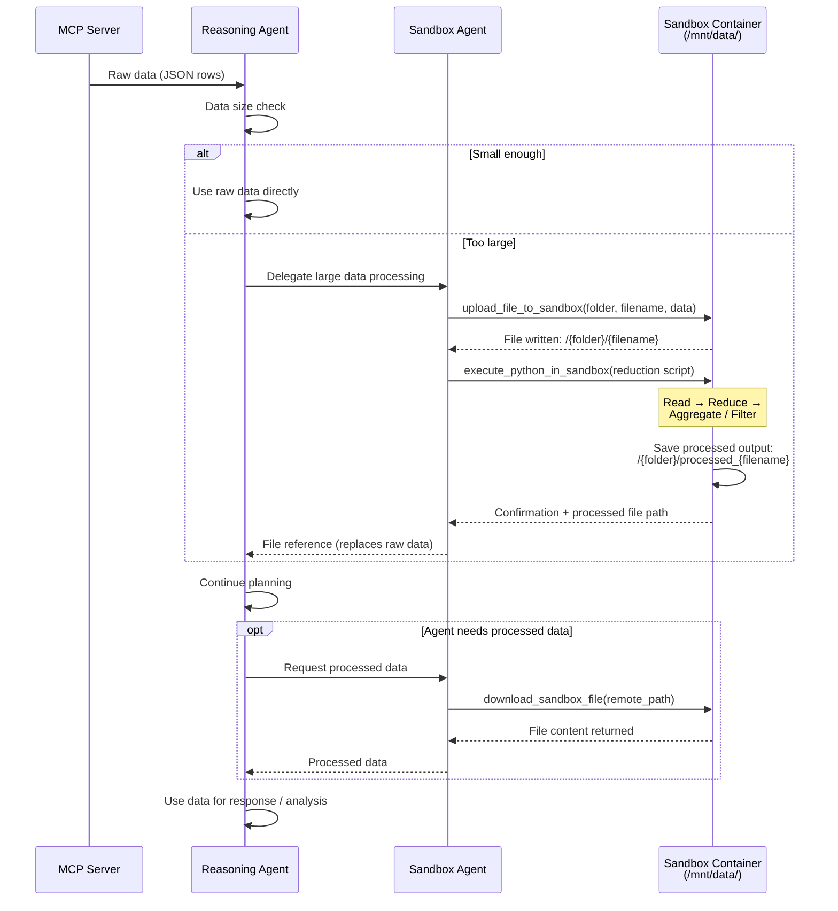

# Sandbox Data Processing Flow

## Tool Sequence

| Step | Tool | Purpose |
|------|------|---------|
| 1 | — | MCP returns raw data (JSON rows) |
| 2 | `upload_file_to_sandbox` | Push large raw data into sandbox `/mnt/data/` |
| 3 | `execute_python_in_sandbox` | Run reduction script that reads uploaded file, processes it, saves output |
| 4 | — | Agent receives file reference instead of raw data |
| 5 | `download_sandbox_file` | Agent fetches processed data when needed for reasoning |
